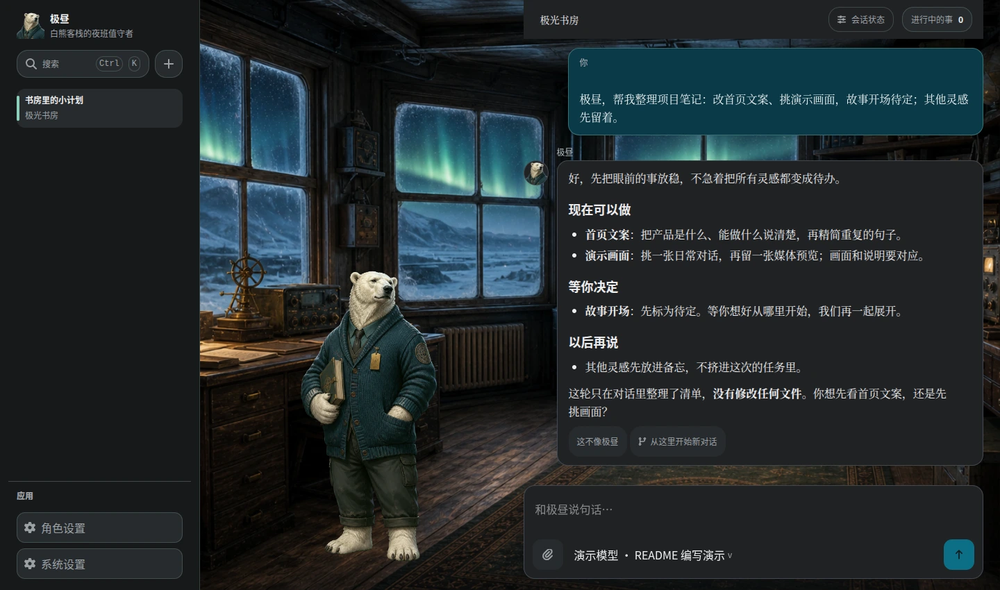
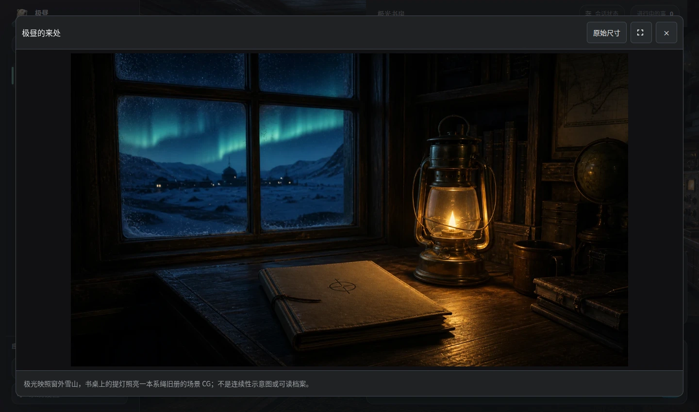
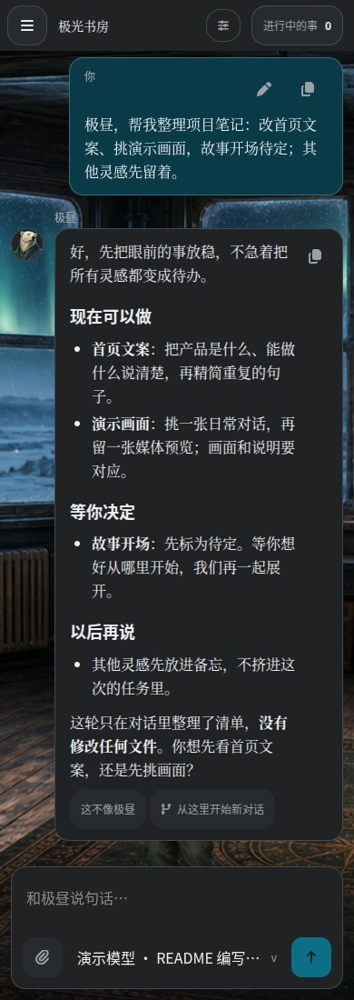

# 白熊客栈 / Bear Harness

**English** | [简体中文](README.zh-CN.md)

**A local-first desktop AI companion, backed by a real agent runtime.**

Meet a character with a place, a voice, and a shared history—without giving up real tools, independent conversations, or your choice of models. Bear Harness brings character-driven interaction to [Pi](https://github.com/earendil-works/pi), the agent runtime underneath.

The bundled character, **极昼 (Jizhou)**, welcomes you into an aurora-lit study. Jizhou is one character package, not the framework itself: you can customize or author packages with their own identity, scenes, media, and behavior.



*Recaptured from the real, isolated WebDev UI at 1440×850, using authored replies from a loopback provider. This is not live-model validation or evidence of file modifications. Jizhou's character dialogue is shown in Chinese.*

## A companion with working tools

- **Character presence, not just a chat label.** Scenes and expressions give conversations a setting; contextual choices and character media make room for interaction beyond text. Character packages own their stories and presentation.
- **Conversations that keep their place.** Run independent Pi sessions concurrently, branch a conversation, edit a message, or retry a reply. Inspect native tool names, arguments, results, errors, and visible custom content, and load older native history without replacing it with a synthetic chat log. Switching the visible conversation does not stop a session running in the background.
- **Memory with clear boundaries.** Keep explicit notes in `MEMORY.md`, and enable relationship recall by configuring embeddings. Relationship memory and its records are isolated per character; embedding configuration and model caches are system-wide. Failed or unavailable retrieval is not reported as a successful search with no hits; diagnostics stay bounded, redacted, and character-local.
- **Optional work, inspectable results.** New delegations use the built-in Pi Worker only. Character-wide current work, paginated history, and task details expose real Run state, activity, evidence, delivery, and Artifacts. Host-supported controls—not invented progress—govern steering, interruption, resumption, cancellation, permission responses, and delivery retries.
- **Your provider, your models.** Configure providers and a model pool, then choose character defaults and conversation model routes. Embedding configuration is optional; using a remote service still means sending it the data needed for that service.

## A closer look

### Character media, in context

Character media appears at its native conversation position as a thumbnail or playback trigger. Select it to open a separate media viewer; CGs preserve their composition and support expanded and original-size viewing. Closing the viewer returns to the conversation without changing an open result workspace.



*Recaptured at 1440×850 in the same isolated app. The media trigger is a genuine native `host_media` tool result driven by the authored loopback provider—not live-model proof or a task Artifact.*

Run Artifacts use their own result buttons. On wide screens, selecting a result creates two main columns—conversation and result—with the standing-character area yielding space. Smaller windows use a drawer or full-screen result view. Run completion alone does not change the layout.

Task selection spans the current character's conversations; Artifact selection belongs to its conversation. Opening a different conversation's Artifact is an explicit navigation action. Background work never steals focus, switches conversations, or opens results by itself. Run completion and result delivery are separate: delivery is acknowledged only when the original Pi session persists the native custom message, not when a follow-up is merely queued. Retrying delivery does not run the task again; requesting another execution sends an ordinary message through Pi.

### The same interface, in a narrower window

<p align="center">

</p>

*Recaptured WebDev viewport at 390×1100 with the same isolated authored provider and Chinese Jizhou dialogue—not a native mobile app or execution proof. Electron is the desktop product shell; WebDev is the local development and acceptance surface.*

## Run from source

Install [fnm](https://github.com/Schniz/fnm), then use the repository-pinned **Node.js `24.19.0`** and **npm `11.17.0`**. From the repository root:

```sh
fnm install
fnm exec --using=.nvmrc npm install
fnm exec --using=.nvmrc npm run dev:web
```

Open the loopback address printed by WebDev. It probes available ports starting at `http://127.0.0.1:3200`; use the address from your own process output.

To launch the Electron desktop development shell instead:

```sh
fnm exec --using=.nvmrc npm run dev --workspace @bear-harness/desktop
```

On first setup, configure your provider credentials and reply model. Optionally configure a local or remote embedding service to enable relationship memory, then complete the character's first meeting and start a conversation.

**Local-first is not an offline guarantee.** Bear stores application data locally, but remote model providers receive the conversation and tool context sent to them; remote embedding services receive text submitted for embedding. Choose and configure those services accordingly.

WebDev binds to loopback and protects Host calls with a process-level token. This is a development boundary, **not internet-facing user authentication**: do not expose the WebDev Host to a network.

## Under the hood

Bear is a character and product layer around Pi, not a second agent state machine:

| Layer | Owns |
| --- | --- |
| **Pi** | Messages, branches, model history, streaming, tool execution, and queues |
| **Bear Host** | Real Pi session handles and resource membership/routing, character packages, scoped state and memory, Run lifecycle and durable result-delivery tracking, Artifacts, and local security boundaries |
| **Shared UI + shells** | The interactive companion interface; Electron supplies desktop integration, while WebDev supplies local browser development and acceptance |

Character packages live in `characters/<companionId>/`; their mutable sessions, memory, Runs, and Artifacts live separately in `companions/<companionId>/`. System settings and shared embedding caches live under `system/`. Updating a character package is not the same operation as deleting its runtime data.

The Renderer, character packages, models, and worker executors are not application-state authorities. Host validates resource ownership and native actions; character presentation cannot declare a Run successful or grant itself permissions. The UI does not optimistically invent Host-backed state: persisted changes come from successful Host responses or refreshed authoritative queries. New delegation has no agent selector, default-executor setting, or automatic Codex fallback; its accepted Pi receipt identifies a Run, not a completed task.

- **Architecture:** [system ownership and data flow](docs/refernece/architecture.md), [Host runtime](docs/refernece/host-runtime.md), and [Character / Display authority](docs/host-state-authority.md).
- **Security and surfaces:** [Electron isolation and native boundaries](docs/refernece/desktop.md), [WebDev transport](docs/refernece/web-dev.md), and [protocol / schema](docs/refernece/protocol-schema.md).
- **Character creation:** [package authoring guide](docs/character-package-authoring.md) and [Jizhou's manifest](config/characters/jizhou/character.yaml).
- **Codebase navigation:** [reference index](docs/refernece/index.md) and [shared companion UI](docs/refernece/companion-ui.md).

## Development and release verification

Useful development commands, using the pinned toolchain:

```sh
fnm exec --using=.nvmrc npm run lint
fnm exec --using=.nvmrc npm run typecheck
fnm exec --using=.nvmrc npm run test:unit
fnm exec --using=.nvmrc npm run test:coverage
fnm exec --using=.nvmrc npm run build
```

<details>
<summary>Acceptance, recovery, and packaging commands</summary>

For interactive acceptance and recovery:

```sh
fnm exec --using=.nvmrc npm run test:e2e:web:required
fnm exec --using=.nvmrc npm run test:e2e:web:live
fnm exec --using=.nvmrc npm run test:e2e:electron
fnm exec --using=.nvmrc npm run test:release:recovery
fnm exec --using=.nvmrc npm run test:e2e:packaged
fnm exec --using=.nvmrc npm run test:diagnostics:crash
fnm exec --using=.nvmrc npm run audit
```

`npm run check` combines lint, typechecking, coverage, builds, and WebDev E2E. `npm run check:electron` covers builds, Electron E2E, and crash diagnostics; run either with the same `fnm exec --using=.nvmrc` prefix.

Packaging targets are `package:mac:arm64`, `package:mac:x64`, `package:win`, and `package:linux`. For example:

```sh
fnm exec --using=.nvmrc npm run package:linux
```

**A local build is not release evidence.** The full `release:gate` runs only in the protected `CI=true` release matrix. Distribution requires verification from the same clean commit, real-provider checks, platform packages and packaged smoke tests, auditable evidence, and GPG-signed checksums. Apple signing/notarization and Windows Authenticode are optional. See [GPG release verification](docs/release-signing.md) and [development and release verification](docs/development-verification.md).

</details>

## Licenses and credits

- **Repository code:** [GNU GPL-3.0](LICENSE).
- **Brand, character writing, and visual assets:** **fltb — 白熊客栈 / Bear Harness Brand Assets**, licensed under [CC BY-SA 4.0](BRAND-LICENSE). Adaptations must credit the creator, disclose changes, and follow the share-alike terms. This license does not grant trademark rights or imply endorsement. Bundled art details: [asset provenance](config/characters/jizhou/assets/PROVENANCE.md).
- **Upstream `@bear-harness/tdai-core` code:** distributed under its recorded [MIT license](packages/tdai-core/LICENSE).
