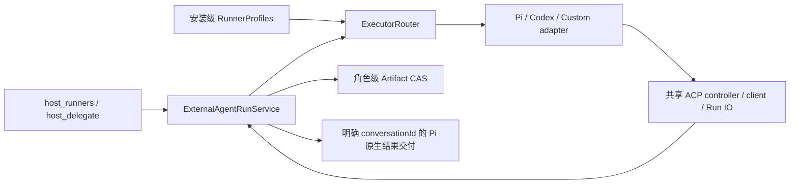

# 通用 ACP runner 实施报告

日期：2026-09-23。分支：`codex/execution-core-audit`。代码未提交；此前核心注册制和 Artifact 改造保持在同一工作区。

本次已实现默认 Pi、外部 Codex、自定义本地 stdio ACP 三类 worker 的完整接线。未指定 runnerId 固定使用 `pi-default`；显式选择不存在、禁用或启动失败的 runner 时报告错误，不替换为其他 runner。

## 架构与归属

- 模型通过 `host_runners` 获取 ID、用途、限制和配置状态，以 `runnerId` 显式选择。目录不含启动路径、命令或密钥。description/useWhen 是配置指导，不是 Host 分类规则或能力证明。
- `executor_profiles.config_json` 属于系统数据库；custom 的 command、args、环境变量、依赖路径和可选认证方式由 Host 验证。secret 环境变量进入 CredentialStore，配置读取不回传其值。旧 profile 表一次转换，保留 ID 和已有配置。
- 三类 adapter 共用 `AcpExecutorController`、`AcpRunClient`、`AcpRunIo`。标准文件和终端回调只获得当前 Run 的授权范围；custom 明确配置的依赖允许读取和执行、禁止写入，普通供应商环境变量不会隐式授权路径；供应商差异留在薄 dialect 中。通用控制器不分支判断 Pi/Codex 名称。
- 只有 Pi worker 获取调用会话的模型和凭据快照；Codex/custom 使用自己的配置。Run 在准入时固定 profile，恢复使用原始 profile 和模型 ID。
- 设置页支持新增 custom、编辑用途/限制/环境、禁用非默认 runner、真实连接测试，以及既有 Codex 发现与连接。连接测试验证握手、建会话和实际协商能力，不承诺当前模型一定能完成任务。
- Codex ACP 适配器转入生产依赖并配置 ASAR unpack；包边界检查要求适配器入口存在且解包。用户安装的 Codex CLI 仍由用户管理，不打包一份隐藏 CLI。

会话核心没有新增 active runner、选择队列或执行状态副本。Registry 仍管理真实 Pi 资源；External Runs 继续拥有执行状态、权限、证据、临时目录、产物与投递。这里的 stateless 指控制分发不维护第二套会话状态，并非进程不持有句柄或 Run 不持久化。

## 协议与恢复

握手后才暴露实际支持的 steering/load/resume。Pi 提供原生 resume，不声明尚未实现的 load 历史重放。正常关闭先释放进程和 Run IO，再写原生 sessionId 与释放凭据；启动恢复为暂停，由 resume 继续，不重新准入或重复执行任务。未确认旧控制器释放的异常崩溃保持 unknown，不凭进程内 map 缺失就启动第二个 worker。

Pi 最终答案使用原生最终回复回执。Codex 使用标准 messageId 与 `_meta.codex.phase=final_answer`，不会把警告、进度或提供方错误拼成结果；没有最终答案时报 `runner_final_result_missing`。通用 ACP 没有统一的最终答案标记时保留 evidence 和 Artifact，不推断阶段。

启动有超时、取消和资源回收。关闭在原生 drain 后对仍持有的进程组执行一次终止，避免在 leader 退出后重复向可能复用的进程组发信号。

## 验证

所有 Node/npm 命令使用 `.nvmrc` 指定的 fnm 环境。

| 检查 | 结果 |
| --- | --- |
| lint / typecheck / 桌面与 Web build | 通过 |
| 全仓库单元测试 | 1,231 通过，3 跳过 |
| Host 最终覆盖率 | statements 79.17%，branches 68.94%，functions 80.62%，lines 82.75% |
| UI 覆盖率 | 80.45% / 70.28% / 80.35% / 83.83%，达到门槛 |
| Desktop 覆盖率 | 86.18% / 76.08% / 92.93% / 89.52%，达到门槛 |
| Web 必选全量 | 67 通过，1 个旧手机导航断言失败，2 跳过；修复后 1920/1280/390 三尺寸导航及 custom 全链路 4 项复测全部通过 |
| Electron E2E | 4 通过 |
| 既有恢复套件 | 75 通过 |
| 最终通用边界专项复测 | 21 通过，1 个非当前平台测试跳过 |
| 新增真实进程恢复 | Pi 原生 transcript 冷恢复、自定义 ACP 原会话恢复通过 |
| Custom 浏览器验收 | 新增配置 → 真实握手 → 显式选择 → 标准文件/终端 → Artifact → 真实下载通过 |

专项测试还覆盖默认 Pi、显式 custom 不解析 Pi 模型、无效/禁用选择不降级、目录不泄露密钥、配置转换、供应商最终消息边界、未确认释放不重复拉起，以及原有 Artifact 归属和回传回归。

## 实测限制与发布决定

外部 Codex CLI 的版本阻塞已解决。旧版 `0.149.1` 曾对当前配置的 `gpt-6-astra` 返回 HTTP 400、要求升级；现按原 Homebrew 安装渠道升级至 `0.156.0`。通过 Bear CodexAdapter 与 `codex-acp 1.2.0` 重新发现并在隔离测试数据库中连接新版二进制，ACP 握手、认证及 load/resume/steering 协商通过。保留原模型配置运行最小真实任务，收到带标准 messageId 和 final_answer phase 的分片，最终事件为 `completed`，summary 精确为 `ACP_RUNNER_OK`；关闭和清理成功。日志 `/private/tmp/bear-acp-live-codex-upgraded.log`。本次没有更改会话核心、用户模型配置或加入降级逻辑。随后已改为稳定 Codex 注册：新安装使用 codex-default，既有注册保留 ID；新 Run/连接测试扫描当前安装版本，版本、真实路径和哈希只记录在 Run 执行证据/恢复快照。旧安装级绑定在数据库初始化时移除，保留用户设置，正常升级不需要重新连接。恢复严格使用旧 Run 快照，原二进制消失或变化时保持 unknown，不自动替换。修改后再次完成真实 ACP 任务，日志 `/private/tmp/bear-acp-live-codex-stable.log`；未直接改写用户产品数据库。

既有真实模型身份/显式记忆测试在纠正路由后通过：使用现有登录态的 `openai-codex / gpt-5.6-terra`，全新会话验证未要求记忆时不调用 explicit_memory、明确要求记忆时调用该工具、身份回答包含极昼。测试 1 项通过，执行耗时 14.8 秒（含启动总计 27.1 秒），日志 `/private/tmp/bear-acp-live-codex-memory.log`。这是一项身份/记忆回归，不等于完整人格质量验收。此前两次尝试误选了 `openai` API 配置，其中出现的 HTTP 502/503 仅属于该路由，不能据此判断 openai-codex 不可用；首次尝试还暴露了原测试仅等待 5 秒流结束的问题，已统一为已有的 liveReplyTimeout。没有改写角色身份、提示词或测试回答。

未按本次任务重新构建各平台安装包或执行 packaged smoke；包边界规则与构建通过不等于包内实机验收。安全 audit/signatures 按用户要求未执行。**发布决定：本次代码改造可交付审查，暂不批准发布**，原因是未提交工作区及缺少同一干净提交的新平台包/packaged smoke；上述身份/记忆回归和外部 Codex 最小真实任务均已通过。

### Codex 稳定注册追加验证

Host 全量 667 通过、2 跳过；升级/迁移/ACP 专项 18 通过；全仓 lint、typecheck 与 Host build 通过。验证覆盖新 Run 自动采用升级后的二进制、runner ID 不变、重复连接不新增记录、旧快照独立校验与旧安装绑定清除。未重跑此前 UI/Electron、覆盖率与平台打包检查，其表中结果属于此前阶段。

## 规模

相对本阶段开始时的工作区快照，本阶段涉及 59 个文件，其中新增 13 个（不含本报告与证据）。当前 executor 模块为 14 文件、3,729 行；RunnerSettings 为 1 文件、280 行；Run service 为 1 文件、1,799 行。这是模块当前规模，不是把此前核心/Artifact 改造混入本阶段的新增行数。

文件清单、SHA256、模块统计和检查结果见 [机器可读证据](evidence/acp-runner-implementation-2026-09-23.json)。

## 1.1.0 发布收尾

本地 `test:ci -- quality upstream-brand recovery web-e2e` 最终通过，Web 68 通过、2 跳过，恢复 75 通过。CI 发现并修复了窗口选择被后台快照刷新取消的竞态：选择意图与快照读次序分离，会话核心不增状态。48 项会话投影测试及两项浏览器用例连续三轮通过。为遵守禁止抢前台焦点的要求，本轮本地没有启动 Electron/Crashpad/安装包 UI；这些检查及四平台打包交由同一提交的远端 CI。此节更新此前阶段性限制，发布仍以远端完整 CI 和签名校验结果为准。
