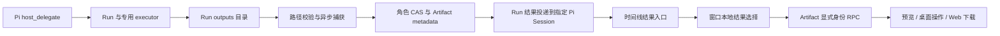

# Artifact 接线审计

日期：2026-09-22。分支：`codex/execution-core-audit`。基线：`bf3cbfb0d94f39acb54e250695a29a47e176c4c3` 加当前未提交的核心整改。

本轮检查接线和执行证据，没有修改产品代码，Codex 执行链保持原状。核心注册制与无状态控制层的结论仍成立，但既有回归通过不能推出所有外围功能无缺陷。

**结论：Artifact 主链已接通，尚未完整闭环。发现 7 项确定性缺陷，以及 manifest 展示、采纳、孤立文件回收 3 项能力缺口。** 不能将这些能力按“无调用代码”整体删除。机器可读范围、摘要与验证记录见 [审计证据](evidence/artifact-wiring-audit-2026-09-22.json)。

## 已接通的链路与权威

| 环节 | 已有实现与边界 |
| --- | --- |
| 生成 | `host_delegate` 传入 Session/entry 身份；Run 创建独立 workspace/outputs，executor 完成后捕获文件。 |
| 捕获 | 异步流式复制/hash，检查路径、symlink、MIME、大小与遍历上限，提交角色自己的 CAS 与数据库，再验证文件。单文件 8 GiB，每 Run 32 GiB，10,000 文件、50,000 遍历项、深度 128。 |
| 归属 | Bear 管理 Run 与 Artifact；Pi 管理消息和执行。RPC 显式携带角色、会话、Run、Artifact 身份，Host 验证 `conversation → run → artifact`。Renderer 不提供权威路径。 |
| 交付 | 终态通过原生 custom-message/follow-up 投递到 `run.conversationId`，包括正在运行的会话；`runId` 去重与接纳回执已接通。 |
| UI | 原始 delegate 卡片、Run 历史详情、结果工作区均有实际读取入口；查看选择为窗口本地状态。Media 使用独立查看器。 |
| 预览 | 分块读取，每块最多 1 MiB；支持文本、图片、音视频、PDF，其他格式明确不支持。预览和 Web 下载上限均为 64 MiB。 |
| 桌面 | Electron 主进程注入实际 presenter；打开/定位使用安全命名的展示副本，另存为使用原生目标选择器。CAS 路径与保存目标不返回 Renderer。展示副本在退出清理；临时作用域副本在访问结束时清理。 |
| Web | 没有桌面 presenter，打开/定位返回 unsupported；另存为回退为分块读取与浏览器下载。浏览器开始下载不等于已确认落盘，因此不写入桌面 `saved` 状态。 |
| 删除 | Session 删除已经接入 Run、manifest、adoption、Artifact metadata 与无引用 CAS 清理。 |

主要实现位置：`host-tool-register.ts:199`、`run-service.ts:279,380,603,1658`、`artifacts/index.ts:225,305`、`character-runtime.ts:284`、`pi-runtime.ts:449,535`、`composition.ts:1052,1223,1256`、桌面 `artifact-presenter.ts` 与 `main/index.ts:167,404`。

## 确认的缺陷

### A1 · P2 · 进入空会话作用域时遗留旧 Artifact 选择

`packages/companion-ui/src/stores/shell-workflows.tsx:240–255` 用 `activeConversationId ?? previous` 保留上一会话，并没有依赖角色 id。当前架构中的空选择已经是权威的 UI 状态，不再只是异步查询的加载间隙。切到没有会话的新角色，或删除当前会话后选择变空，仍可能保留旧结果；历史 Run 的局部对象也会继续提供旧 metadata。

`tests/run-api.spec.ts:276–279` 甚至断言空会话必须保留旧 Artifact，是应随旧模型一起删除的过时行为。此处发现的是 UI 作用域残留；Host 的归属校验仍会阻止用新角色身份读取旧文件。

修复：用角色与会话共同界定本地选择作用域，显式空选择立即清空；重建这条旧断言，并覆盖空角色、当前会话删除和切换期间迟到导航。

### A2 · P2 · 历史 Run 的多文件切换丢失结果工作区

`shell-workflows.tsx:292–298` 打开不在近期列表中的历史 Run 时保存 `{ runId, artifactId, run }`，依赖 `run` 提供详情。文件标签调用 `selectArtifact`，但 `277–280` 只写入两个 id，丢掉详情对象；近期列表中又没有这个 Run，`selectedArtifact` 随即变成空。

修复：标签切换维持相同 Run 的详情来源，或统一使用按 id 查询的 Run 详情投影。覆盖“历史 Run 不在近期列表、至少两个文件、连续切换”。现有测试只覆盖首次打开。

### A3 · P2 · 预览期间另存为会把正常文件误报为损坏

`packages/companion-ui/src/WorkPanel.tsx:86–98` 将每一块响应的 `status` 与首块比较；`composition.ts:1054` 每次读取新的 metadata，而 `1278–1280` 在桌面保存完成时把状态改为 `saved`。预览读取独立启动，保存按钮仅由 `actionBusy` 禁用，没有排除分块读取中的保存；另一窗口同样可以改变状态。

只读执行实际比较函数：两个分块的身份、字节数、hash 等完全相同，`verified → verified` 成功，`verified → saved` 稳定触发 `artifact_metadata_changed_during_read`，被 UI 显示为 `corrupted`。这证明比较缺陷；未执行真实双窗口时序 E2E。

修复：读取一致性约束只检查不可变内容身份，单独处理可变使用状态；不能通过禁用跨窗口操作来掩盖比较错误。

### A4 · P2 · 桌面保存完成后元数据投影不刷新

`composition.ts:1278–1280` 仅执行 `markSaved`，没有发布相应失效通知。`stores/companion.tsx:1740–1744` 的 Artifact API 仅转发，`WorkPanel.tsx:513–529` 只设置本地操作结果。数据库已经是 `saved`，现有 Run 卡片/结果 metadata 仍可显示 `verified`，直到其他读取刷新。

修复：沿既有角色级失效机制通知所属 Run 的列表与详情投影，覆盖当前窗口和另一窗口。不要新增持久事件流或另一套状态源。

### A5 · P2 · 冷读取同步校验整个文件，阻塞 Host

`packages/host-runtime/src/artifacts/index.ts:571–573` 在文件版本没有校验缓存时调用 `verifyOpenCas`；`679–699` 使用同步读取与 hash 遍历全部内容。重启后缓存为空，即使请求 1 byte，也先同步校验整个文件；打开/定位/另存为也经过这条入口。

隔离复现的 64 MiB 样本：冷读 1 byte 用时 23.884 ms，热读 0.264 ms，零延时计时器直到调用返回后才运行，延后 25.514 ms。这是本机微测，不是性能验收；真实大文件下会占住同一 Host 的事件循环。

修复：首次完整性校验使用异步 IO/hash，并按文件版本去重并发校验；维持打开句柄、文件版本变化和关闭清理的正确性，不能跳过完整性校验。

### A6 · P2 · 部分捕获失败后，首次交付与重试使用不同附件集合

`run-service.ts:455–458` 捕获失败后以空数组调用终态处理，但此前成功文件已经写入 CAS/metadata，没有批次回滚。`603–608` 首次优先使用传入数组，重试则从数据库读取。复现第二个文件捕获失败后：Run 投影包含 `a.txt`，首次终态回调附件为 `[]`，重试终态回调附件为 `[a.txt]`，两次 Run 状态都为 failed。

修复：明确保留已验证的部分成果，并让列表、首次投递和重试从同一个已提交输出集合产生。失败仍报告失败，不能把部分成果当成整个任务成功。

### A7 · P2 · 超出近期 Run 列表的结果消息失去文件入口

`packages/companion-ui/src/ConversationPanel.tsx:849–852` 对 `host_external_agent_result` 仅在 `store.runs` 中查找。旧 Run 不在近期列表时，消息退回普通文本/details，无法展示其中的 Artifact 操作卡片。`WorkPanel.tsx:411–430` 的 delegate 卡片已有 `observeDetail` 补查，结果消息没有接入。

修复：复用按 Run id 的显式详情查询。历史 Run 面板和原始 delegate 卡片仍可能打开文件，不能把本问题描述为文件整体不可访问。

## 保留但尚未接通的能力

| 能力 | 现状 | 接通要求 |
| --- | --- | --- |
| Manifest | Pi 在 `executors/pi-adapter.ts:78–92` 真实启动前写入 schema/executor/profile/Run/entry/worker 路径/时间。Codex 也独立记录。Run 详情 `run-service.ts:944–979` 与协议没有对外返回 manifest。 | 将已有记录安全投影为执行溯源信息；不能把内部路径、凭据直接返回 UI，也不能宣称 Pi 记录了实际不存在的 executor 版本/hash。 |
| 采纳 | `artifacts/index.ts:487–494` 的 `markAdopted` 无生产调用，RPC 只有 read/open/reveal/saveAs；UI 只有 adopted 状态标签。 | 先明确采纳的用户效果。原始方法缺少归属、完整性与幂等检查；重复调用会插入多条记录，`markSaved` 又会覆盖 adopted 单一枚举。接通前要明确保存与采纳是否并存。当前不可触达，不能当成已暴露的 RPC 漏洞。 |
| 孤立文件 GC | `ArtifactStore.gc()` 仅测试调用；普通 Session 删除清理已经接通。 | 定义启动/维护时机，回收崩溃遗留的孤立 CAS/临时文件，同时避开在途捕获。无需据此引入新的产品运行状态机。 |

## 验证与范围

本轮重新执行的定向测试共 **72 项通过**：

- Host Artifact RPC/完整性：2 文件、22 项。
- 桌面 Artifact presenter：1 文件、16 项。
- UI Run API/工作区/壳层契约：3 文件、34 项。

所有 Node/npm 执行均通过 `fnm exec --using=.nvmrc`。通过的既有测试没有覆盖上述组合路径，其中 A1 还有过时断言；不得把 72 项通过当成这些新问题已解决。A5/A6 有隔离运行复现，A3 有实际比较函数复现，其余根据真实调用链及现有 fixture 确认；本轮没有新增或宣称完整浏览器/双窗口/发布验收。

检查范围按完整生产文件计数，包含文件中非 Artifact 代码，因此**不代表 Artifact 独占代码量或每行都完成审阅**。Codex adapter 只读取 manifest 写入位置，没有审改执行链。

| 模块组 | 文件数 | 行数 |
| --- | ---: | ---: |
| Artifact 存储与呈现 | 2 | 925 |
| Run 与执行器 | 3 | 2,536 |
| Host 装配与会话 | 5 | 3,636 |
| 协议与数据结构 | 2 | 3,211 |
| UI 与客户端投影 | 7 | 6,313 |
| 桌面与 Web 入口 | 3 | 1,455 |
| 合计 | 22 | 18,076 |

## 修复顺序与发布判断

先修 A1/A2/A3/A4/A7 的作用域、历史详情与响应式接线，再修 A5/A6 的读取与交付一致性；为每条真实故障补针对性回归。Manifest 的安全展示可以在明确投影字段后补齐；采纳须定义产品语义后接通；GC 单独完成维护闭环。以上均不要求修改 Codex adapter 执行链。

**发布判断：本轮仅完成审计，不批准发布，也不宣称 Artifact 已完整完成。** 残留风险是上述尚未修复的问题和未接通能力；先前核心报告中的真实模型、视觉基线、干净提交打包等验证边界仍有效。安全审计按用户最新指示暂不继续。
