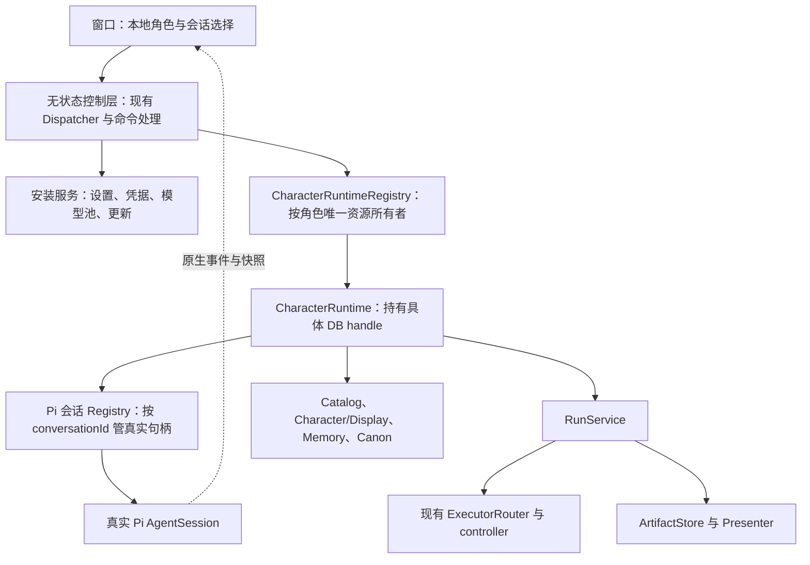

# Bear 核心注册制：现状与收敛方案

状态：已获授权并实施；本文保留设计依据，不替代 AGENTS.md。日期：2026-09-22。基线：`bf3cbfb0d94f39acb54e250695a29a47e176c4c3`，分支 `codex/execution-core-audit`。实施范围、实际规模和验证见 [实施报告](core-registry-implementation-2026-09-22.md)。

用户范围：完整实施本方案；保留 Codex 执行链供后续修复；保留 Artifact 产品能力，不能仅凭没有调用删除采纳、manifest 或相关数据模型。用户进一步希望核心保证 stateless，下面将其落实为无跨请求可变状态的控制层，与集中管理真实资源的 Host 宿主。

## 设计结论

核心适合采用 **无状态控制层 + 两级资源注册宿主 + Pi 原生执行**。路由显式，执行器保留专用注册点。现有 RPC 契约与 Dispatcher 继续使用，注册表在启动装配完成后作为固定配置使用。

注册制在这里解决四件事：某个资源是谁、同一资源是否已经打开、谁负责其关闭、一个操作应该交给哪个真实实例。Pi 继续拥有会话和执行状态；Registry 只管理实际资源及其打开/关闭排斥。

主要工作是收拢已有注册点的所有权，删除全局当前角色/会话对执行路由的控制。无需新建通用服务容器、插件发现框架、全局 reducer 或执行事件日志。

### Stateless 的具体约束

可以要求命令处理、作用域解析、上下文/事件投影不保存跨请求的可变业务状态。它们接收明确参数和固定作用域的依赖，调用 Pi/存储服务后返回结果。无状态不等于无副作用：发送消息、持久化 Character 或删除资源仍是有副作用的操作，不能冒称纯函数。

| 内容 | 唯一归属 | 控制层的使用方式 |
| --- | --- | --- |
| handler/adapter 注册定义 | 启动期固定配置 | 按显式目标查找，不根据当前选择改注册 |
| 消息、分支、模型历史、执行/队列 | Pi AgentSession | 直接调用/读取原生权威，不留副本 |
| 实际 Pi/worker/DB 句柄、订阅、打开去重和关闭排斥 | Host 资源宿主 | 在有界作用域内取得并使用具体资源 |
| Catalog、Character/Display、Run、Artifact、许可、Memory | 各自权威存储 | 通过领域服务读取/提交，不缓存另一份权威 |
| 当前选择、草稿、分页、媒体/结果展开与临时投影 | Renderer 窗口 | 不作为 Host 执行路由来源 |
| 必需的传输请求去重回执 | 明确、受限的入口/资源操作层 | 只证明请求接纳，不代表 Pi turn 完成 |

因此，整个 Host 进程不可能完全无状态：真实 AgentSession 和 OS 资源本身就有状态。不能把它们全部重新打开、搬进数据库或重建会话状态来追求表面 stateless。目标是让核心控制逻辑没有隐式当前对象或长期业务缓存，让剩下的状态都有唯一、可验证的所有者。

落实方式：核心 handler 不持有跨请求可变 Map/Set、selected/active/current-turn 字段；不在闭包里留下消息/队列/完成状态。状态性资源必须通过显式依赖传入，scope 在请求开始时固定。保留的回执、任务跟踪或锁逐项写明用途、所有者、释放条件；不能仅把原有业务状态移到名为 Registry 的文件就算完成。

验收采用结构检查和行为测试：核心层禁止引用窗口选择/全局 active 与 Pi 状态存储副本；A/B 请求交错不污染作用域；替换无状态处理函数实例不影响进行中的 Pi 会话；重连能够从权威状态重新投影。保留必要 per-key 资源排斥，不为所有命令增加全局队列，也不建立新的 command/effect DSL。

## 改造前现状（基线提交）

| 当前模块 | 已有机制 | 判断 |
| --- | --- | --- |
| `Dispatcher` | `channel -> handler`，请求/响应校验，拒绝重复注册 | 保留，按系统/角色作用域整理装配 |
| `HostEventLoop` | `characterId:generation -> resource`，另存 active/retiring/closing 和请求数 | 角色视图切换、资源存续、路由混在一起 |
| `CompanionStorageRegistry` | `characterId -> database handle` | 与上层 generation 身份不一致，存在第二个关闭权威 |
| `CharacterRuntime` | 组合角色 DB、Pi、Catalog、Memory、Run、Artifact、diagnostics | 角色资源归属已有合理基础 |
| `PiRuntime` | 真实 AgentSession、打开去重、删除排斥、命令 admission | 保留并收紧生命周期，不重建 Pi 执行层 |
| `SessionCatalog` | membership/archive 加持久 active、选择队列和回滚 | 保留前两项，删除后面的窗口选择职责 |
| `ExecutorRouter` | `executor type -> controller`，按 profile 分发 | 保留专用扩展点和 Codex 实现 |
| Renderer store | per-session 投影和独立 active detail 缓存并存 | 合并内容权威，选择留在窗口 |

关键源码位置：

- [runtime.ts](../packages/host-runtime/src/runtime.ts) 221–237：所有 RPC 先进入当前角色的 resource，再做分发。
- [host-event-loop.ts](../packages/host-runtime/src/host-event-loop.ts) 65–83：路由隐式读取 `activeRuntimeId`；100–123：切换创建新 generation 并使旧角色 retiring。
- [runtime.ts](../packages/host-runtime/src/runtime.ts) 476–498 与 [companion-storage.ts](../packages/host-runtime/src/storage/companion-storage.ts) 38–66：实例按 generation 存续，DB 却按角色 ID 复用/关闭。
- [composition.ts](../packages/host-runtime/src/composition.ts) 1342–1346：处理请求时仍重新读取系统全局 active character。
- [session-catalog.ts](../packages/host-runtime/src/companion/session-catalog.ts) 38、62–98、221–301：选择队列和持久选择。
- [pi-runtime.ts](../packages/host-runtime/src/companion/pi-runtime.ts) 95–100：现有真实会话资源注册基础。
- [router.ts](../packages/host-runtime/src/executors/router.ts) 101–114：已有执行器注册入口。

现有 HostEventLoop 只串行资源路由/激活，实际 Pi 工作在队列外。问题不是“全部模型执行被串行化”，而是全局选择参与资源路由，且多个层次用不同身份决定何时释放同一资源。

## 目标结构

### 1. 角色：一个 ID、一个 live owner

增加专用 `CharacterRuntimeRegistry`，取代 HostEventLoop 的选择驱动生命周期。一个角色同时最多存在一个有效 CharacterRuntime；A→B→A 复用 A 的原 owner。

对外最小操作：

| 操作 | 语义 |
| --- | --- |
| `use(characterId, operation)` | 校验并去重打开资源，操作始终绑定拿到的具体实例 |
| `close(characterId)` | 禁止新操作，关闭该角色资源，保留持久数据 |
| `deleteRuntime(characterId)` | 排斥新操作，成功关闭资源后删除角色运行目录 |
| `shutdown()` | 统一阻止新操作，清理已打开及正在打开的资源 |

内部只维护资源句柄、构造中的 Promise 和关闭/删除排斥及清理回调。对象身份足以验证迟到提交，不需要用全局 generation 表示“哪个角色被选中”。

`use` 保护已接纳 Host 操作期间的资源有效性，不能等待或镜像完整 assistant turn。send 已被 Pi 接纳后，生成仍由 AgentSession 自己负责。每个角色可拥有多个并发 Pi 会话。

CharacterRuntime 持有自己的具体 DB handle。Storage 收敛为受控的打开/布局帮助层，失去独立按角色 ID 关闭任意当前数据库的权限。系统批量检查角色库也必须经同一所有权入口：已有 owner 时使用已有句柄，临时打开的资源只由实际创建者释放。

切换窗口视图不关闭资源。资源按需打开；初版保留到显式 close、角色删除或 Host shutdown。Memory 等继续惰性初始化。暂不增加自动 LRU 回收；资源回收政策以后单独设计，避免把“不可见”当成“未运行”。

### 2. 会话：保留 Pi 管理器，删除窗口选择权威

现有 PiRuntime 中的 Registry 与原生操作适配继续存在，不必先改名字。它负责同一 Session 的打开去重、实际句柄、订阅释放、删除排斥和必要的命令 admission。读状态时从真实 Pi 实例取 snapshot；不存消息、分支、队列或 running/streaming 的另一份 Host 状态。

Catalog 只保存角色 membership、archive 和必要资源定位。create/fork 注册 membership；open/get 按 ID 读取；rename/archive/delete 明确目标。移除 `active_conversations`、`activeGet/select`、`selectionTail` 和选择回滚；保留 membership 创建失败的事务回滚。

后台标题等工作由所属资源管理。结果提交前验证 exact handle 仍有效且未进入删除；可取消时取消，不可取消时观察 Promise 并丢弃迟到结果。首轮关闭必须等待 Pi abort 持久化，再判断是否是真正未形成的空会话。

### 3. 路由：每次请求明确指定作用域

协议中沿用一个明确的角色 ID 名称，并在改动的运输契约中一次性统一；不增加 characterId/companionId 双读别名。概念上，请求分为安装级、角色级、会话级：

| 请求 | 需要的目标 | Host 校验 |
| --- | --- | --- |
| Provider、系统设置、embedding 配置 | 安装级 | 不依赖或打开某个当前角色 |
| 角色设置、onboarding、Canon、Memory | 角色 ID | 角色身份、库及路径归属 |
| 会话命令、Character/Display | 角色 ID + conversationId | Catalog membership |
| Run 操作 | 角色 ID + conversationId + runId | 会话与 Run 归属 |
| Artifact 操作 | 上述 ID + artifactId | conversation→run→artifact，内容完整性 |

Renderer 提供的 ID 只是路由请求，归属仍由 Host 验证，不能提供权威文件路径。Handler 获取已绑定不可变角色身份的 context；异步等待后仍使用这个 context，不再调用全局 `getActiveCharacterId()` 找执行目标。

现有 Dispatcher 保留，安装 handler 在 Host 装配一次，角色 handler 使用请求解析出的资源。清晰的类型和显式参数已经足够，无须可动态注入任意服务的容器。

窗口初次显示使用产品默认角色。核实后确认 `active_character` 没有需要保留的独立产品偏好用途，已与 `active_conversations` 一并从新库定义和现有 v1 数据库中删除；没有双读或旧路由兼容。Host 不持久化选中的会话。

### 4. Renderer：选择与内容分离

窗口持有 `selectedCharacterId` 和 `selectedConversationId`。每个 `{characterId, conversationId}` 只有一份会话内容/原生实时状态投影；active detail 由这两个 ID 查询得到，删除独立 active 内容缓存。

导航代数只约束窗口选择提交；每 Session 的读取代数、Pi 实例/事件版本约束该 Session 的投影。历史分页、草稿、滚动、媒体/结果选择等 UI 状态继续存在。请求回执和重复点击保护不得成为会话执行状态的判据。

Pi 事件外层标记角色、会话和现有瞬时版本，保留原生事件语义。安装失效通知与角色失效通知明确分域。实现采用每个窗口内按角色固定的 store/QueryClient 隔离缓存，不另加角色键前缀。窗口共享原生事件与产品失效的各一条物理订阅，再向角色投影分发。

重连先建立订阅，再用需要的权威快照替换投影，并处理读取期间瞬时事件。快照失败进入现有恢复流程，释放失败尝试的订阅；快照成功后才能宣布同步完成。切换其他会话不能废弃背景会话的完成快照。Bootstrap 只提供安装信息，角色详情显式获取，不能全量拉取所有角色的会话内容。

### 5. 执行器与 Artifact：保留领域边界

沿用 `ExecutorRouter.register(type, controller)`。Registry 中有实现、配置满足可用条件、产品允许选用，是三件不同的事。当前 Pi 准入保持现状；Codex 的代码、契约、界面、依赖及后续接通能力保留，本轮不自动启用，也不添加 Pi/Codex fallback。

controller 真实句柄归角色 runtime；系统 profile/连接配置仍属安装。RunService 负责 Run 生命周期和权限，Pi 负责会话执行。完成结果仍按 `run.conversationId` 和 `runId` 原生投递，以 Pi transcript 确认幂等；超时不等于原生队列已撤销。

Artifact 继续承担角色内 CAS、元数据、预览、打开、定位、另存为、完整性和溯源。Manifest/采纳能力保留并登记接通缺口；不按引用数量机械删表。无需为每个 Artifact 新建 live registry。

## 关闭与删除的必要规则

1. 同 ID 构造去重；构造失败释放部分资源。关闭/删除覆盖正在打开的 Promise，直到旧 owner 完全退出前禁止新 owner 进入。
2. 先排斥新命令、Run admission、结果交付及新文件工作，再对真实 Pi/worker 发停止信号；必须允许已接纳操作完成停止阶段所需的 transcript/Run 状态持久化和 flush。停止不能排在等待模型自然完成的任务后面。
3. 管理本资源的标题、capture、投递和文件工作，撤销订阅/临时文件能力，关闭实际句柄。真实数据库和文件 IO 必须完成并释放句柄，才能移动目录；只有已经撤销写入能力的不可取消外部请求可以丢弃迟到结果。关闭失败必须保留排斥与清理依据，不能宣告资源已经消失。
4. 删除会话时，校验 Catalog→阻断新路由→停止/释放该 Session 及其写入者→处置 exact transcript→清关联数据/Catalog。重复删除幂等；角色 Memory 不删。
5. 删除角色 runtime 时，先停完该角色 Sessions/Runs/Memory/后台工作、flush diagnostics/audit，最后关闭 exact DB，确认后再处置目录。包删除独立处理。
6. executor 的 unknown 保持 unknown；无法证明已停止时不能删除仍可能被写入的目录。确认不可恢复后才能 forced_termination，不能为清注册表伪造终态。

## 首批整改与后续设计分界

**确定可以做、无需删产品能力的部分：**

- 修已复现的首轮关闭丢 Catalog、迟到标题写回、背景快照被导航丢弃、重连失败伪恢复。
- 建角色唯一 owner，统一数据库释放身份；取代 Host 的全局选择路由及 generation/retiring 管理。
- 去掉 Host 会话选择表、两个选择 RPC、选择队列，合并 UI active/detail 缓存；协议、Host、客户端、UI、旧测试同步切换。
- 修长任务结果摘要：从原生最终响应取最终结论，进度 evidence 保留，停止累计整个 Run 正文充当最终结果。

**保留的产品边界：**

- Codex 接通、产品准入和设置入口。
- Artifact 采纳、manifest 展示及额外 API 的产品用途。
- executor 恢复沿用现有协议能力；无法确认的控制器保留 Run 并阻止破坏性删除，不伪造 forced_termination。

**完整方案中一并补齐的能力：**

- Artifact 捕获改为可取消、可等待真实 IO 的流式路径，增加单文件/Run 总字节、文件数、遍历数和深度上限；保留 manifest 和采纳 API。
- 角色自动记忆 consent 保存到角色库，默认关闭；角色首次配置与设置页均可配置，缺系统 embedding 时链接系统设置。
- Pi 原生 transcript 按精确文件定位；会话列表分页限制 transcript 读取数量，搜索使用原生标题，不存 title/messages/counts 副本。大历史性能仍应随真实用户规模持续观测。

## 实施顺序与验收

第一批把已复现的四种局部生命周期/投影故障转成回归并修复。第二批做角色唯一 owner、显式作用域和窗口本地选择的完整纵向收敛，在同一版本同步删除旧契约，避免两套路由/双读双写并存。第三批处理 Run 最终结果与已明确的接口重复，再逐项设计上述后续能力。

数据格式变更须同步核对现有 v1 schema、恢复导入白名单和持久格式门禁。删除 active 选择记录不能删除 transcript、membership、Run、Artifact 或 memory；不得为旧选择模型增加兼容权威。这里不能把“改了 SQL 定义”视为完成已有数据验证。

核心验收至少覆盖：

- 同角色并发打开只构造一次；不同角色和同角色不同会话可以并行。
- A→B→A 保持同一 A owner；两个窗口的选择独立，切换不改变背景 Pi 执行。
- open 与 close/delete 交错、构造失败、关闭失败、shutdown 时仍在打开，均没有双 owner 或漏资源。
- 首轮关闭后已落盘会话可再次列出；删除后标题/投递/文件回调不能复活旧资源。
- 重连首个快照失败后能恢复；背景完成快照不受无关导航影响；事件和 invalidation 角色隔离。
- Run 结果只投递给所属会话且幂等；长任务交付最终结论；Artifact 预览与各项动作、归属及完整性回归不退化。

执行相关结构基线：7 组、53 个生产文件、21,609 行；Host 整体 73 文件、26,693 行。实施收益以消除重复权威、通过交错回归及实际 diff 为准；保留 Codex/Artifact 后，不沿用先前包含删链假设的净行数估算。实际测试和实现统计记录在实施报告中。

发布决定维持审计结论：当前基线不予批准。实现后按 AGENTS.md 运行相关真实模型回归及完整发布门禁，不能用设计评审或旧测试结果替代发布证据。
