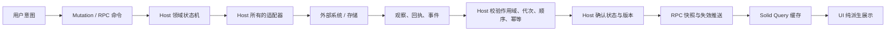

# Host 状态总管理与外接权威接入

## 结论

**Host 是应用的状态总管理，也是前端唯一的状态入口；各领域的原始权威可以是 Host，也可以是外部系统。** Pi 是会话、消息、分支和生成状态的原始权威，上层必须是 Pi 的投影，不能新增竞争时间线或生成状态机。SQLite、Pi session 文件、CAS 和 manifest 是存储实现；Solid Query 是 Host 投影的客户端缓存；UI 输入草稿、选择和焦点是本地交互状态。

外部服务仍拥有其自身的实际状态。Host 不声称控制远端现实，而是负责确认“应用目前知道什么、是否过期、操作是否已确认”。网络失败不能被解释为远端操作失败或成功。

## 现有入口盘点

以下按接入职责分为 **8 类入口**。每个具体事实必须指定一个原始权威；入口分类不是权威实例数量，前端始终只面对 Host。

| 入口 | 当前实现位置 | 应用状态由谁确认 |
| --- | --- | --- |
| Host 本地业务数据 | storage/database.ts、角色/设置/对话/模型/Run 服务 | Host 事务与领域服务 |
| Pi 会话与生成 | companion/supervisor.ts、pi-session-store.ts、conversations/repository.ts | Host 会话适配器；Pi 提供时间线和生成观察 |
| Provider、模型目录、OAuth | providers/catalog.ts、models/registry.ts | Host Provider 领域服务；远端凭据只留在 Host |
| 记忆后端与检索 | memory/backend.ts、tencentdb-runtime.ts、composition.ts | Host 记忆适配器；后端响应不能直接成为 UI 状态 |
| 外部代理与权限 | external-agents/run-service.ts、executors/* | Host Run 状态机；代理只能报告事件/结果 |
| 文件、角色包、附件与上传 | character-loader.ts、conversation-attachments/service.ts、artifacts/* | Host 校验所有权、内容和持久化完成情况 |
| 模型下载任务 | composition.ts、tdai-core 下载适配器 | Host 任务状态机；下载器只报告进度/结果 |
| 系统、桌面与更新能力 | Host 注入能力、Desktop shell、HostUpdateService | Host 能力/任务投影；shell 是受控适配器 |

Web-dev bootstrap token、传输连接和调试输出属于传输/诊断机制，不是新增业务权威。原生文件选择是用户输入；导入完成、归属和附件内容仍由 Host 确认。

## 统一的数据路径

**禁止**外部回调直接写 Query、UI signal/store，或用外部事件序号冒充 Host revision。

### 读取

1. Renderer 只读取 Host RPC 投影。
2. Host 对外返回已确认状态，不把任意远端请求结果在返回时补上当前 revision，冒充同一提交快照。
3. 本地同步仓库可由 Host 在同一读取边界内投影；跨 await 的外部读取先作为观察交给 Host 接受，再发布应用投影。
4. 检索等按请求执行的结果也要带作用域和 Host 接受版本；不得覆盖较新的同键结果。
5. Host 投影不等于把所有原始内容再复制进 SQLite。大文件留在 CAS，Pi 时间线可由 Host 所有的 session 仓库提供；Host 必须拥有其访问、生命周期和版本确认边界。

### 写入与确认

- 命令具有明确作用域。需要跨重启恢复的外部副作用/长任务记录 operationId、适配器代次和恢复状态；普通只读请求不创建操作日志，Host 本地写入沿用现有事务。
- 外接系统响应只是证据。Host 校验后确认状态转移；没有确认时保持 pending/unknown，不乐观宣称 completed。
- 重复回调幂等；旧连接/旧任务/旧会话的迟到回调丢弃；外部序号仅用于适配器去重和补齐。
- Host 确认版本与通知必须对应同一次确认。数据库域用同事务 journal；外接域需要 Host 接受记录/恢复协议，不能只依赖“外部写完后发一条通知”。
- 外部调用超时后先按 operationId 对账；不盲目重发可能已执行的副作用。

### 断线、重启与无推送服务

- 断线保留最后确认值，但标记 stale/reconciling；重连由适配器对账，Host 再确认新状态并通知 Query。
- 启动重建 Host 投影，旧 epoch 和旧适配器代次不能重新进入当前状态。
- 支持 push/webhook/进程事件的系统优先使用这些入口；缺少推送时仅在连接、显式刷新或命令完成后读取。禁止暗中增加定时业务轮询。
- 不能及时确认的外部状态应如实显示 unknown/stale，而不是维持一个假装实时的本地副本。

## 已落地的接受与恢复边界

| 领域 | 接受边界 | 关闭、断线与恢复 |
| --- | --- | --- |
| Host 本地数据 | 同步事务与同事务 journal；跨提交查询重读，命令不重试 | 新 Host epoch；全部 Query 重读 |
| Pi | Host 所有的 session handle，同步读取原生投影；事件仅触发失效 | 每个会话使用 AbortSignal；停止/替换后拒绝迟到初始化和事件；恢复读取 Pi 文件及现有 pending-turn 协议 |
| 记忆后端 | 选库与操作在同一个 Host 队列中执行，避免 singleton backend 串角色；成功或不确定写入后失效 | 关闭取消等待；迟到结果不入当前投影；错误后重读，不自动重发写入；新 Host 重新打开原始持久库 |
| 后台记忆采集 | Tdai capture、L1/L2/L3 和索引完成通知进入 Host journal，包括部分失败 | 只有当前 core 实例的通知有效；关闭/替换后的回调丢弃 |
| OAuth | 复用 Pi 交互，Host 持有当前登录会话；每次回调检查身份及取消信号 | 取消拒绝 pending prompt；旧回调不能修改新会话；不存在的会话投影为 idle；重启不恢复一次性 PKCE 交互，凭据状态重新从 Pi 读取 |
| 下载 | 单任务所有者、字节进度和阶段由 Host 接受，完成验证后才保存启用设置 | Host 关闭取消下载；重启从已有事件记录恢复终态，将遗留进行中任务标记取消，显式操作重试 |
| 外部代理 | 沿用 Host Run、权限与结果确认状态机，输出绑定到所属对话 | 沿用持久 Run 恢复与终态结果对账；不新增第二套任务状态机 |
| 附件/上传 | Host 校验作用域，manifest/CAS 完成后确认；进度由实际分片长度读取 | 重建 manifest 投影；浏览器刷新后可查看/取消，重新发送仍需用户提供 File |

Renderer 只有 RPC/Mutation、共享 Query 和一个 Host 推送恢复入口。静态门禁禁止业务轮询、外部 SDK、组件网络访问、绕过版本门禁的缓存写入和 effect 修改应用状态。

这些边界不承诺跨 SQLite、Pi 文件、记忆存储和远端服务的分布式 ACID。Host 崩溃后以原始权威重建投影；未确认的外部副作用不能仅凭网络错误自动重发。新增支持远端写入的适配器必须提供该服务的幂等/对账机制，不能套用“重试即恢复”。

## 复杂度控制：薄的公共机制，领域内保留语义

### 固定三层，不增加平行状态管理器

1. **领域服务/适配器**：沿用会话、记忆、Provider、Run、附件等现有服务。每个事实只有一个指定权威，适配器负责读取权威投影、执行命令、接收变化和恢复连接。
2. **Host 公共同步机制**：只统一作用域、Host 投影版本、失效通知、生命周期和恢复调度。不保存第二份业务模型，不理解 OAuth 提示或 Pi 消息结构，也不解释通用业务流程 DSL。
3. **Renderer**：RPC 读进入 Solid Query，写进入 Mutation。组件只认识 Host 的领域 API；不得创建外部 SDK、订阅外部事件或重建外部状态机。

### 每个领域只回答四件事

- **谁是原始权威？** 按事实指定，不允许同一消息/任务状态存在两个独立写入者。
- **如何读取？** 给出 scope 和一致读取边界；能同步从受控仓库投影就直接投影，只有需要异步接入/恢复时才维护可重建的 Host 投影。
- **何时发生变化？** 接受权威变化后，使用现有 Host journal/EventBus 发布失效；不能靠前端猜测哪些外部状态改变了。
- **如何恢复？** 适配器管理连接代次、去重和必要的对账，复用统一的 Host 生命周期。只对确实存在副作用的不确定结果增加 pending/unknown/reconciling 语义。

### 不为统一而复制

- Pi 消息、分支和生成状态直接保留其原生语义，Host 仅做作用域、权限、版本和读取边界处理。
- 不把所有外部原始数据复制进 Host SQLite；只持久化 Host 自有事实、引用，以及必要的恢复记录。
- 不为每个页面创建订阅器/恢复循环；一个 Host 实例为每个连接或任务代次持有唯一适配器订阅，组件卸载不拥有它。
- UI 本地未保存草稿不是同步副本，不需要搬入 Host；禁止 effect 将同步 DTO 镜像到本地状态。
- 不新增事件总线、客户端状态库、通用 reducer 注册系统或通用工作流引擎。扩展现有 EventBus、RPC 和 Query 基础设施。

### 版本和错误只承担各自职责

- Host 对外投影使用统一的 epoch/revision 约定；SQLite revision 不能未经外接变化接受就代表外部内容版本。
- eventSeq 是传输补齐游标，不是业务版本；外部 cursor/generation 留在 Host 适配器内部。
- 连接错误、命令结果未知、已有投影过期是不同情况；前端根据 Host 的状态展示，不推断外部结果。
- 领域依赖集中声明，用于失效对应 Query；不在组件中写跨领域刷新链。

### 可执行的验收标准

新增外接系统只应增加适配器、必要的领域协议/依赖声明和契约测试；不应修改通用 Query 同步算法，也不应让其他页面新增外部服务判断。测试复用同一组场景：重复/迟到事件、切换 scope、断线恢复、Host 重启，以及有副作用时的超时对账。

自动化验证与需要真实账号/文件的交互验收分别记录在同步数据台账中。
