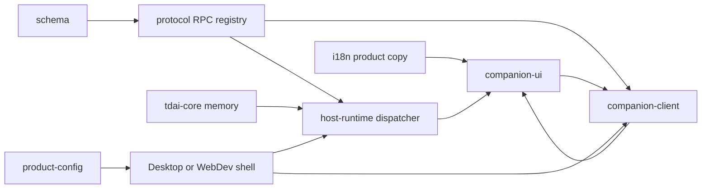
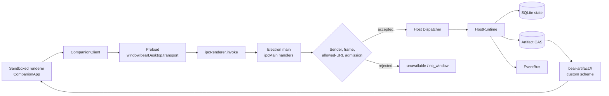
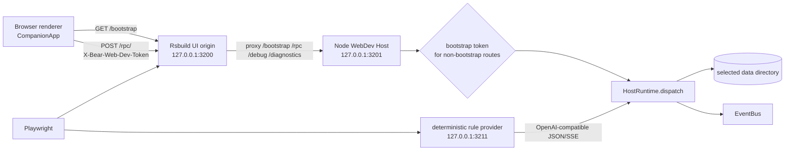
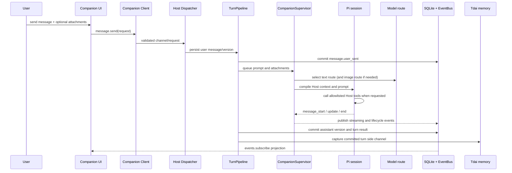
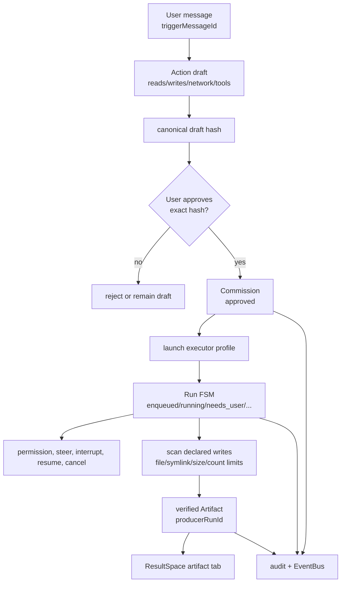
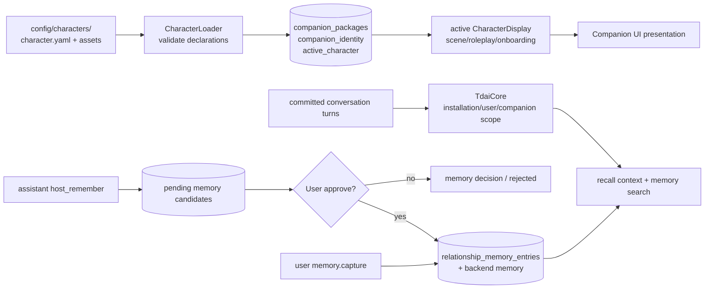

# System architecture

This document is the cross-package map for the current Bear Harness implementation. It describes the code and contracts documented in the nine module references; it is not a proposal for a second runtime architecture. The directory name `docs/refernece/` is intentional. Cross-module implementation observations are tracked separately in [issues and findings](./issues-and-findings.md).

## 1. System shape

Bear Harness is a local companion application with one authoritative Host and two delivery shells:

- **Desktop:** Electron main process, preload bridge, and sandboxed renderer.
- **WebDev:** a browser renderer served by Rsbuild and a separate Node Host bound to loopback.

Both shells use the same protocol registry, Host runtime, companion client, and companion UI. Only the transport and shell capabilities differ. The Host owns durable state and decisions; the renderer presents Host projections and sends typed requests.

At a high level, a user action follows this direction:



The arrows describe dependency/injection direction, not authority. In particular, the UI and client can request or display state but cannot become the source of truth for conversations, permissions, artifacts, memory, or character behavior.

## 2. Package dependency layers

The package graph is easiest to maintain in layers. Each layer has a narrow owner and a documented extension seam.

### Layer 1: shared contracts and product inputs

- [`@bear-harness/schema`](./protocol-schema.md#shared-schema-package) provides the small Zod/JSON-Schema utility surface.
- [`@bear-harness/protocol`](./protocol-schema.md) owns runtime validators and the nested `RPC` registry. Its root entry is type-oriented; runtime consumers use the `/schema` subpath.
- [`@bear-harness/product-config`](./product-config.md) provides the compile-time release identity, brand metadata, default character ID, data-directory name, icon, and optional update feed.
- [`@bear-harness/i18n`](./i18n.md) provides product catalogs and locale lifecycle. Character-package language is deliberately outside this layer.

The protocol package depends on the shared schema utility, not on Electron, the DOM, or Node. Product configuration is injected into application boundaries, while i18n catalogs are bundled product inputs; neither is loaded from an arbitrary product-configuration file.

### Layer 2: host services

- [`@bear-harness/tdai-core`](./tdai-core.md) is host-neutral memory infrastructure: L0 capture, L1 extraction, L2 scenes, L3 persona, stores, embeddings, checkpoints, and recall.
- [`@bear-harness/host-runtime`](./host-runtime.md) composes the database, EventBus, character/package services, conversation and turn pipeline, provider/model services, Tdai memory, commission/executor services, artifacts, audit, and the protocol dispatcher.

Host Runtime adapts Tdai to a scoped active companion and supplies the Host authority that memory algorithms intentionally do not own. A host integration should pass stable runtime identity and a stable data directory to Tdai; it should not put host-specific imports into Tdai algorithms.

### Layer 3: renderer contract and presentation

- [`@bear-harness/companion-client`](./companion-client.md) maps the protocol registry into a frozen, typed client and validates requests and response envelopes.
- [`@bear-harness/companion-ui`](./companion-ui.md) composes the Solid application, reactive store, conversation/composer, onboarding, settings, roleplay, message work timeline, and ResultSpace.

The client is transport-neutral and has no Electron, DOM, Solid, or Node imports. The UI receives a read-only product configuration and an injected client; it does not read Host files or create a transport.

### Layer 4: delivery shells

- [`@bear-harness/desktop`](./desktop.md) supplies Electron lifecycle, preload/context isolation, IPC admission, native credential storage, diagnostics, artifact URLs, updates, and packaging.
- [`@bear-harness/web-dev`](./web-dev.md) supplies a loopback Node Host server, browser bootstrap, HTTP transport/proxy, debug routes, process-scoped data directories, and deterministic Playwright support.

A new domain capability normally crosses Layers 1–3 and is then reached by both shells. A native-only capability belongs in the Desktop adapter or an injected Host option; it should not be imported into shared client/UI or Host-domain code.

## 3. Protocol boundary and transport topology

### 3.1 One registry, two adapters

`packages/protocol/src/schema.ts` is the runtime source of truth. Each endpoint has a versioned channel, request schema, and response payload schema. `RPC`, `CHANNEL_CONTRACTS`, and `REQUEST_SCHEMAS` are derived from that tree; transport code must not maintain a parallel channel list. The type facade in `src/index.ts` mirrors inferred public types.

The payload schema is not the envelope schema. A transport returns the complete strict envelope:

```text
success = { ok: true, data: <endpoint response> }
failure = { ok: false, error: { kind, reason } }
```

The Host dispatcher validates requests, looks up handlers, maps safe domain errors, and validates handler responses. The companion client validates the returned envelope again before UI code receives it. Error reasons are bounded/localizable and must not expose raw paths, SQL, secrets, or provider error text. See [protocol envelopes](./protocol-schema.md#envelopes-and-error-boundary) and the [client validation pipeline](./companion-client.md#protocol-contract-and-validation-pipeline).

### 3.2 Electron topology



The preload exposes only the frozen `bearDesktop` bridge. The main-process router registers protocol channels from the shared request registry and checks the registered window, main-frame identity, and exact allowed URL before dispatch. Renderer code has no Node integration and does not read the artifact CAS. The custom artifact scheme is a separate host-shell capability, not an `RPC` endpoint; its URL/referrer checks and response headers are owned by [Desktop](./desktop.md#artifact-protocol).

### 3.3 WebDev topology



WebDev generates a random in-memory token once per Host process. `/bootstrap` is intentionally unauthenticated so a fresh browser can obtain the token; subsequent RPC, debug, and diagnostics routes require the exact token and remain loopback-bound. This is local development authorization, not account authentication. The HTTP adapter sends parsed requests and returns JSON; successful RPC domain failures remain HTTP 200 envelopes, while transport-level non-2xx responses reject outside the RPC envelope.

The browser server is not a production web deployment. WebDev's data-directory helper follows the desktop platform convention, while an explicit E2E directory receives a launcher-process scope for isolation. The deterministic provider is a test-only loopback service, and its fixed port is part of the E2E harness rather than an application service.

## 4. Host authority and protocol boundaries

The authority order is deliberate:

1. **Host code owns application state and policy.** It validates protocol input/output, persists canonical state, checks active-companion ownership, controls model/provider routes, and decides which tools and side effects are allowed.
2. **Character packages own declarations.** A package supplies identity, scenes, expressions, onboarding, roleplay media/events/choices, skills, canon/package copy, and optional work-presentation labels. Host validation rejects undeclared scene, expression, media, and choice IDs.
3. **Models own only generated output and explicit requests.** A model can request an allowlisted Host tool, but Host validates the request, package declarations, lock state, and resulting state transition.
4. **Users own explicit approvals.** Work cannot launch until the exact displayed draft hash is approved. Assistant-suggested memories remain candidates until a user decision; direct user capture is explicit.
5. **Executors are workers.** They emit lifecycle/evidence events; `CommissionService` validates those events against the run state machine and writes canonical status/evidence.

This boundary prevents a renderer, character label, model string, or executor callback from becoming an implicit permission or persistence authority. The Host reference describes the [authority split](./host-runtime.md#responsibility-and-authority) and the [RPC ownership map](./host-runtime.md#rpc-composition-and-error-boundary).

Protocol validation is necessary but not sufficient for security. The schemas enforce strict objects, bounded strings/arrays, IDs, enums, and discriminated unions, but path strings are not roots/traversal checks, URL-like strings are not scheme policy, event payloads are intentionally `unknown`, and plugin trust fields are descriptive until Host/package policy interprets them. Those checks belong at the handler, storage, package-loader, and shell boundaries.

## 5. Conversation, model, and roleplay flow

### 5.1 Conversation and turn lifecycle

The Host stores a compact conversation projection separately from Pi session files: conversations and branches identify narrative state; messages and message versions hold visible content; turns hold pending/streaming/completed/failed/aborted state; scene state and directives hold presentation/correction context. A normal send follows this path:



`TurnPipeline` enforces one active turn per conversation and writes the user message before sending the prompt. `CompanionSupervisor` serializes prompts, initializes one Pi session per conversation, compiles package/canon plus memory context, selects the configured model, and streams updates. Capture failure is diagnostic-only after a reply has been persisted. Abort, regenerate, edit, continue, correction, version switching, and branch operations are explicit Host transitions rather than renderer-local edits to canonical history.

### 5.2 Explicit image routing

The selected conversation reply route remains the reply route. If attachments contain images and that route lacks image support, Host/UI use the configured multimodal route only to produce an explicitly untrusted image observation; the main model then replies using the normal conversation route. The composer makes the route visible, disables send when no image-capable fallback exists, preserves the draft while the user changes settings, and surfaces failure with retry/change/remove-images choices. There is no silent image fallback or automatic text-only send. See [model routing in Companion UI](./companion-ui.md#composer) and the interaction plan's [image-model contract](../role-first-work-interaction-plan.md#8-图片模型显式路由与失败恢复).

### 5.3 Roleplay and presentation authority

Roleplay has two paths that must not be conflated:

- **Host lifecycle reactions:** `CharacterBehaviorService` maps committed Host events such as user-sent/message-end/abort to package-declared visual states. This is deterministic Host presentation state, not a model tool call.
- **Model-decided tools:** allowlisted Host tools can get state, set a declared scene/expression, play declared media, or present declared choices. Host validates declarations and lock state, persists/publishes the result, and applies roleplay event effects under their defined commit rules.

User-driven roleplay RPCs are canonical, conversation-scoped operations. The model cannot invent package declarations or write roleplay tables directly. Character-specific prose and work labels remain package data; neutral product labels and fallback UI copy remain in [i18n](./i18n.md).

## 6. Message-scoped work execution and ResultSpace

The interaction plan establishes a non-negotiable association chain:

```text
triggerMessageId -> commissionId -> runId -> artifactId[]
```

`conversationId` alone is not sufficient because one conversation can contain multiple independent work requests. The Host records the trigger message when creating a commission; the renderer must not infer it from recency, text similarity, or timestamps. The current UI filters each message timeline item by exact trigger ID and keeps ResultSpace selection keyed by conversation, trigger message, commission, run, and artifact.

### 6.1 Approval and execution



A model `host_propose_work` call still requires a real trigger user message and creates a draft; it does not launch work. Approval stores the exact hash, launch creates a run, and `CommissionService` owns the finite-state transitions. Permission requests stay inside the originating run's action line. On completion, Host scans declared writes, stores valid files in the content-addressed artifact store, verifies hash/MIME/size, and links artifacts to the run. Executors never directly mutate Host status or evidence.

### 6.2 Timeline and ResultSpace

`ConversationPanel` renders work beside the user message that caused it: proposal, run state, permission, completion/failure, and optional tool evidence. The right-side `ResultSpace` is a per-conversation layout state, not a global task panel or modal. Its selection contains:

```ts
{
  conversationId,
  triggerMessageId,
  commissionId,
  runId,
  artifactId,
}
```

The selected run supplies the artifact list; the trigger message supplies the source summary; the commission supplies the result title. Artifact tabs change only `artifactId`, and the last viewed artifact is remembered per run. `locate` moves focus back to the source message without changing the selected artifact. If a result is unavailable, the UI falls back to another accessible artifact from the same run or keeps the evidence/action line visible.

Closing `×` or pressing `Esc` only closes the current conversation's result view. It must not cancel a run, delete an artifact, undo a file change, delete a conversation, or affect another conversation's selection. The work plan's [close semantics](../role-first-work-interaction-plan.md#6-关闭逻辑) and [ResultSpace rules](../role-first-work-interaction-plan.md#5-双列-resultspace) are the product contract; Host remains authoritative for every real side effect.

### 6.3 Artifact presentation

Host artifact metadata is the safe input to presentation: logical name, MIME, byte count, hash, status, producer run, and creation time. The UI reads text/Markdown as bytes and renders text nodes; media uses a Host-issued safe URL or Host-returned bytes with a temporary Blob URL; unknown types get a metadata/download page. The renderer never constructs a filesystem URL or reads the CAS directly.

Desktop can provide `bear-artifact://artifact/<id>` after main-process scheme/referrer admission. Web-like hosts may have no URL factory, so `artifact.url` returns an empty URL and the UI uses `artifact.read`/Blob fallback. A future presentation hint may classify primary/supporting and preview mode, but it must be generated by Host from real artifact facts; character packages and workers cannot assert completion or preview safety.

## 7. Persistence, character packages, and relationship memory

### 7.1 Host storage map

Host Runtime constructs the canonical database at `<dataDir>/storage`, artifact CAS at `<dataDir>/artifacts`, provider runtime state at `<dataDir>/companion-runtime`, character/session state, and audit storage. The schema includes conversation/turn, character, onboarding, roleplay, story/canon, provider/model, memory, commission/run/evidence, artifact, settings, and migration tables. EventBus writes committed events before notifying listeners, assigns a monotonic sequence, and supports replay from `afterSeq`. `snapshot.get` composes projections plus the current event sequence; the UI refetches on sequence gaps.

### 7.2 Character package storage is not relationship memory



A character package is declarative product/role content: identity, scenes, expressions, onboarding, roleplay declarations, package canon, assets, and optional labels. Host loads and validates it, persists package/active-character metadata, and converts approved assets into renderer-safe projections. Package-managed canon is not a translation catalog and is not a user relationship record.

Relationship memory is user/session-scoped durable data. Explicit user capture records provenance and writes the scoped backend. Assistant suggestions become pending candidates in Host SQLite; approval writes the relationship entry and backend record, while rejection records a decision. Tdai's memory scope includes installation, user, and active companion identifiers, and its durable material is separate from package files: sanitized L0 conversations, L1 records, L2 scene blocks/navigation, L3 `persona.md`, checkpoints, and vector-store indexes. The Host supplies the scope and turn hooks; Tdai owns the capture/extraction/recall pipeline.

### 7.3 Snapshot and reactive projection

The companion store boots from `snapshot.get`, seeds its event cursor, then polls `events.subscribe(afterSeq)`. It narrows event payloads before projecting them, skips duplicates, and refetches when a sequence gap or snapshot failure makes the projection stale. Store-owned state includes messages, streaming, tool activity, run presence, onboarding, character runtime, roleplay IDs, and domain lists; query caches cover settings/providers/models. Host-owned truth remains the persisted database and event sequence.

## 8. Security, audit, and update seams

### Renderer and transport security

- **Electron:** `contextIsolation`, sandbox, no Node integration, web security, exact allowed renderer URL, denied navigation/window creation, denied permission prompts, and main-frame/sender checks form the shell boundary. The generic preload bridge is not an unrestricted Node API.
- **WebDev:** loopback binding and possession of the process bootstrap token protect non-bootstrap routes. There is no account identity, TLS, CORS policy, CSRF protection, or rate limiting; exposing the ports beyond loopback would invalidate the intended trust model.
- **Protocol:** strict bounded schemas and safe error envelopes reduce malformed input and data leakage, but do not authorize paths, URLs, plugins, or credentials by themselves.

### Credentials, files, and artifacts

Host receives a platform-injected `CredentialVault`. Desktop normally delegates to Electron `safeStorage`; WebDev uses its AES-GCM credential vault. Credentials stay out of renderer bridge methods, diagnostics, evidence, run manifests, and audit payloads. Linux's explicit weak-storage path is a deployment/security decision, not equivalent to OS-backed encryption.

File tools and artifact completion enforce declared paths and file/symlink/size/count limits at Host boundaries. Desktop artifact responses use `default-src 'none'`, `no-store`, `nosniff`, recorded MIME, and actual byte length. The renderer consumes Host URLs/bytes only. See the [desktop security boundary](./desktop.md#main-window-and-renderer-security-boundary), [WebDev security model](./web-dev.md#bootstrap-and-security-model), and [Host audit/security section](./host-runtime.md#persistence-events-snapshot-audit-and-security).

### Audit and diagnostics

Host audit wiring appends commission, run, permission, filesystem, memory, and configuration events to a hash-chained JSONL store. `audit.list` and `audit.export` expose entries and chain verification. EventBus projections and diagnostics are distinct: EventBus is committed application state delivery, while renderer/process diagnostics are sanitized operational signals. Desktop additionally rate-limits and allowlists renderer faults and normalizes crash-process reasons; WebDev renderer-fault reporting is best-effort stderr logging rather than durable telemetry.

### Updates

Product config's current `updateFeedUrl` is empty, so Desktop update checks are disabled. If enabled, `UpdateService` selects a newer semver-like entry, bounds feed/archive size, stages under `<userData>/updates/<version>/`, and optionally verifies SHA-256. `ready` means staged/downloaded (and digest-checked when a digest is supplied), not installed or publisher-trusted: there is no apply, rollback, code-signature, or notarization step, HTTP download URLs are accepted, and explicit `sha256: null` skips digest verification. A production release must add a signing/authenticated trust gate before treating the feed as automatic update authority.

## 9. Test, build, and release topology

The root [`package.json`](../../package.json) defines workspace orchestration. Build order matters at shared boundaries: [`schema`](./protocol-schema.md#build-declaration-and-compatibility-workflow) must emit before `protocol`. The Desktop build and WebDev launcher/build scripts rebuild `product-config`, `protocol`, `companion-client`, `host-runtime`, and `companion-ui`; the Desktop development launcher builds `product-config`, `protocol`, `companion-client`, and `host-runtime` before starting its main/preload watchers and Rsbuild, while Rsbuild compiles the UI source.

### Focused package checks

| Area | Declared checks and evidence |
| --- | --- |
| Schema/protocol | Build and typecheck `@bear-harness/schema` before `@bear-harness/protocol`; exercise runtime `safeParse`/registry paths for contract changes. |
| Tdai | Package typecheck/build; a temporary-data-dir smoke should initialize, recall, capture a completed turn, end a session, and destroy cleanly. |
| Host Runtime | Package typecheck/build/unit/coverage; focused changes should assert RPC envelopes plus persisted event/snapshot transitions, and executor changes should cover permission/terminal states. |
| Companion client/UI/i18n | Package build/typecheck; UI unit/coverage covers store projection, onboarding, composer/image routing, work timeline, ResultSpace, roleplay, accessibility, and locale behavior. i18n catalog tests enforce locale shape/language parity. |
| Desktop | Development/build, Electron E2E, packaged E2E, crash diagnostics, and platform packaging scripts. Packaged E2E requires a platform package first; crash smoke requires its Crashpad build. |
| WebDev | Development/build/typecheck/unit data-directory checks and Playwright Web E2E. Playwright starts isolated WebDev plus a deterministic loopback rule provider. |

### Root orchestration

The root scripts expose:

- `npm run typecheck` across product-config, i18n, schema, protocol, companion-client, Host Runtime, companion UI, Desktop, and WebDev;
- `npm run test:unit`, `npm run test:coverage`, and `npm run test:e2e:web` for the corresponding workspace suites;
- `npm run test:e2e:electron`, `npm run test:e2e:packaged`, and `npm run test:diagnostics:crash` for Electron paths;
- `npm run build` for Desktop and WebDev assets;
- `npm run package:mac`, `npm run package:win`, and `npm run package:linux` for Electron Builder targets;
- `npm run audit` for dependency audit/signature checks.

The broad `check` and `check:electron` scripts compose these gates with lint/build/E2E steps. Package references remain the source for focused commands and boundary-specific smoke expectations.

### Release path

Desktop production build compiles the shared product/protocol/client/Host/UI layers, validates product configuration, emits main/preload/renderer output, and then Electron Builder packages platform targets. Product config is the release identity source for app ID, executable, artifact name, icon, Linux metadata, default character, and generated brand attribution. Packaging includes only the intended `dist` output plus configured resources and licenses. The repository's macOS configuration is intentionally unsigned; a fork's release CI must supply signing/notarization policy rather than treating a successful package as trusted distribution.

WebDev `build` produces browser assets after rebuilding its five workspace dependencies; it does not package or deploy the Node Host as a public service. This distinction is important when using WebDev as a browser/E2E harness: it exercises the same Host contract without creating a production web topology.

## 10. Maintainer decision table

| If the requested change is… | Make the authoritative change in… | Then inspect… |
| --- | --- | --- |
| A new wire shape/channel | [Protocol and schema](./protocol-schema.md) | Host handler, companion client call, store guards/projection, and both shell routes. |
| A state transition or permission rule | [Host runtime](./host-runtime.md) | Database migration, EventBus event, snapshot projection, audit entry, and UI action line. |
| A memory algorithm/backend | [Tdai core](./tdai-core.md) | Host scope/config merge, capture hook, recall compiler, and data-directory lifecycle. |
| A role declaration or package asset | Character package plus Host package loader | Character schema/display projection, onboarding/roleplay UI, and package-vs-product copy boundary. |
| A work/result interaction | [Companion UI](./companion-ui.md) and the [work plan](../role-first-work-interaction-plan.md) | Host `triggerMessageId`/commission/run/artifact relationships and audit behavior. |
| A native transport/security capability | [Desktop](./desktop.md) or [WebDev](./web-dev.md) | Preserve `HostTransport`, envelope semantics, shared registry, and Host authority. |
| Product identity or product copy | [Product configuration](./product-config.md) or [i18n](./i18n.md) | Every injected consumer and the character-package copy boundary. |

When the owner is unclear, follow the first authoritative persisted decision in the flow: protocol defines the accepted shape, Host defines the accepted operation and durable result, and UI/shell layers only transport or present that result.
