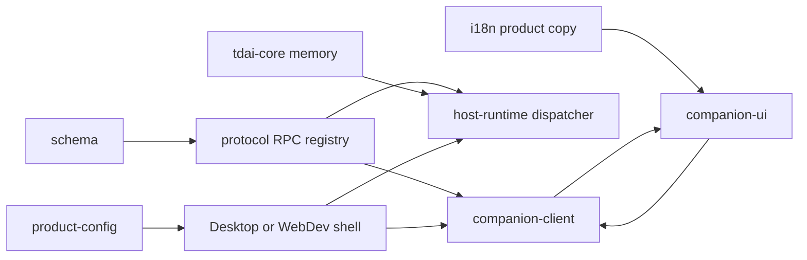
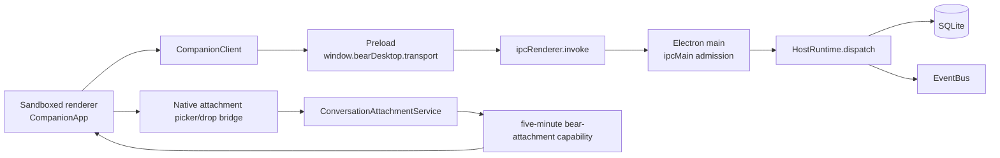
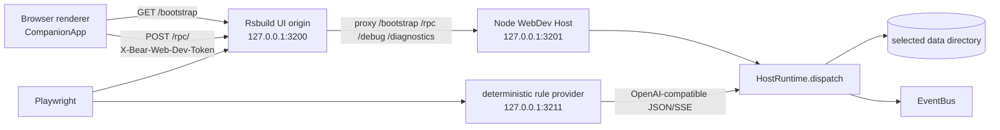
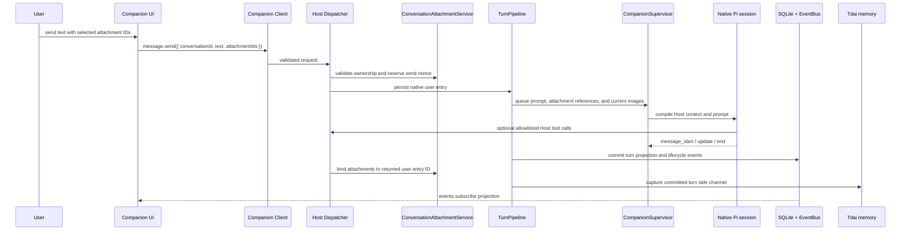
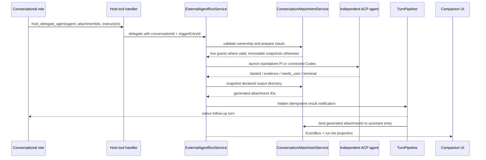
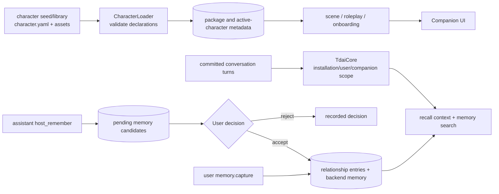

# System architecture

This document is the cross-package map for the current Bear Harness implementation. The directory name `docs/refernece/` is intentional. It describes the shipping runtime rather than a future interaction design.

## 1. System shape

Bear Harness is a local companion application with one Host state-management boundary and two delivery shells:

- **Desktop:** Electron main process, preload bridge, and sandboxed renderer.
- **WebDev:** a browser renderer served by Rsbuild and a separate Node Host bound to loopback.

Both shells use the same protocol registry, Host runtime, companion client, and companion UI. The Host owns durable state and policy. Renderers receive projections, submit typed requests, and hold only presentation state.



These arrows show dependency and injection direction, not authority. The UI and client cannot become the source of truth for conversations, attachments, runs, memory, character declarations, or provider credentials.

## 2. Package dependency layers

### Layer 1: shared contracts and product inputs

- [`@bear-harness/schema`](./protocol-schema.md#shared-schema-package) provides shared Zod/JSON-Schema utilities.
- [`@bear-harness/protocol`](./protocol-schema.md) owns runtime validators and the nested `RPC` registry. Runtime consumers use its `/schema` subpath.
- [`@bear-harness/product-config`](./product-config.md) provides compile-time release identity, brand metadata, the default character ID, data-directory name, icons, and update-feed configuration.
- [`@bear-harness/i18n`](./i18n.md) provides product catalogs and locale lifecycle. Character-package language is not product UI copy.

The protocol layer has no Electron, DOM, or Host-service dependency. Product configuration is injected at application boundaries instead of being loaded from an arbitrary runtime file.

### Layer 2: Host services

- [`@bear-harness/tdai-core`](./tdai-core.md) is host-neutral relationship-memory infrastructure: capture, extraction, scenes, persona, stores, embeddings, checkpoints, and recall.
- [`@bear-harness/host-runtime`](./host-runtime.md) composes SQLite, EventBus, character/package services, the conversation and Pi turn pipeline, provider/model routing, Tdai memory, immutable conversation attachments, direct external-agent runs, audit/moderation, and the protocol dispatcher.

Host Runtime supplies stable installation/user/companion scope to Tdai and owns application policy that memory algorithms intentionally do not own.

### Layer 3: renderer contract and presentation

- [`@bear-harness/companion-client`](./companion-client.md) maps the registry into a frozen typed client and validates complete response envelopes.
- [`@bear-harness/companion-ui`](./companion-ui.md) composes the Solid application, reactive store, conversation/composer, attachment tray and previews, onboarding, settings, roleplay, and message-scoped run presentation.

The client is transport-neutral and has no Electron, DOM, Solid, or Node imports. The UI receives a read-only product configuration and an injected client; it does not read Host files, resolve local paths, or create a transport.

### Layer 4: delivery shells

- [`@bear-harness/desktop`](./desktop.md) supplies Electron lifecycle, context-isolated preload APIs, IPC admission, native file/folder selection, short-lived attachment capabilities, native credential storage, diagnostics, updates, and packaging.
- [`@bear-harness/web-dev`](./web-dev.md) supplies a loopback Node Host, browser bootstrap, HTTP transport/proxy, upload transport, debug routes, isolated data directories, and deterministic Playwright support.

A shared domain capability normally crosses protocol, Host, client, and UI. A native-only capability belongs in Desktop or in an injected Host option; it must not leak Node or Electron APIs into shared client/UI code.

## 3. Protocol boundary and transport topology

### 3.1 One registry, two adapters

`packages/protocol/src/schema.ts` is the runtime wire source of truth. Each endpoint has a versioned channel, strict request schema, and response payload schema. `RPC`, `CHANNEL_CONTRACTS`, and `REQUEST_SCHEMAS` are derived from that tree, so transports do not maintain a second channel list.

Every transport returns the complete strict envelope:

```text
success = { ok: true, data: <endpoint response>, sync: { epoch, revision } }
failure = { ok: false, error: { kind, reason } }
```

`Dispatcher` validates requests, invokes a registered handler, maps safe domain errors, and validates response data. The companion client validates the envelope again. Error reasons are bounded and must not expose paths, SQL, credentials, provider responses, or external-agent process details.

### 3.2 Electron topology



The preload exposes a frozen bridge. Main-process routing admits only the registered window, its main frame, and its exact allowed URL before dispatching shared RPC or native attachment-import calls. Renderer code has no Node integration and never receives a source filesystem path.

Desktop selection/drop is a shell capability: trusted main resolves the selected file or folder, creates an immutable conversation-owned snapshot, and retains any live-source grant only in Host process memory. Preview/download URLs are opaque `bear-attachment://cap/<operation>/<token>` capabilities, not stable identifiers. They expire after five minutes, are bound to the invoking renderer and operation, require the registered renderer referrer, and are revoked when that renderer is removed. The protocol handler re-resolves attachment ownership and bytes before responding.

### 3.3 WebDev topology



WebDev creates one random in-memory bootstrap token per Host process. `/bootstrap` is intentionally open so a fresh local browser can obtain it; RPC, debug, and diagnostics routes require the exact token and remain loopback-bound. This is local-development authorization, not an account boundary.

Browser file/folder ingestion uses `conversationAttachment.startUpload`, `appendChunk`, `completeUpload`, and `cancelUpload`. The Host validates a bounded manifest and chunks, then creates the same immutable conversation-owned attachment representation used by Desktop. WebDev has no native source grant and no attachment URL factory; previews use semantic or bounded byte reads.

## 4. Authority boundaries

**Host is the application's state manager and the renderer's only state interface.** A domain's original authority may be Host or an external system. Pi remains the authority for its conversations, messages, branches and generation state; all upper layers are projections, never competing timelines or state machines. Host manages scoped access, projection versions, notifications and adapter lifecycle. Solid Query only caches Host projections. See [the ingress inventory, authority boundaries and complexity constraints](../host-state-authority.md).

The responsibility boundaries below are managed through Host:


1. **Host code owns application state and policy.** It validates protocol input/output, enforces conversation and companion ownership, persists canonical state, chooses model/provider routes, and controls tools and side effects.
2. **Character packages provide declarations for Host validation.** A package supplies identity, scenes, expressions, onboarding, roleplay media/events/choices, skills, canon, assets, and character-specific copy. Host rejects undeclared IDs.
3. **Models provide generated output and explicit tool requests.** The conversational role can invoke only installed Host tools; Host validates every request and resulting state transition.
4. **Users provide attachment selection, memory decisions, and explicit agent choice.** Selecting a local source creates an immutable attachment and an ephemeral source grant. Selecting Codex requires an explicit verified connection; otherwise delegated work uses the bundled Pi ACP agent.
5. **The Host-owned `ExternalAgentRunService` confirms run state.** Executor controllers report lifecycle, permission, evidence, and terminal events. They cannot write canonical run rows or attachment ownership directly.
6. **Renderers own presentation only.** A renderer can request imports, sends, reads, run controls, or capability URLs, but cannot assert completion, invent ownership, or construct a local-file URL.

Strict schemas are necessary but not sufficient. Path/root checks, symlink policy, capability admission, package declarations, credential access, live-source grants, and executor profile trust are enforced at Host or shell boundaries.

## 5. Conversation, attachments, models, and roleplay

### 5.1 Conversation and turn lifecycle

The Host stores a compact projection separately from native Pi session files: conversations and branches identify narrative state; message/version and turn rows support Host transitions; session files remain the native timeline source. A normal send follows this path:



`TurnPipeline` enforces one active turn per conversation and returns an asynchronous receipt. `CompanionSupervisor` serializes prompts, initializes one native Pi session per conversation, compiles package/canon and memory context, chooses the configured route, and streams updates. Abort, regenerate, edit, continue, correction, version switching, and branch operations are Host transitions, not renderer-local changes to canonical history.

### 5.2 Attachment ownership and message binding

Attachments are immutable, conversation-scoped roots of kind `file`, `folder`, or `generated`. Each root owns normalized entries and immutable file bytes. User-selected roots initially have no timeline owner. `message.send` carries attachment IDs, and `beginSend` atomically reserves those exact IDs with a nonce. Success binds them to the returned native user entry; failure clears the nonce so the draft remains usable. An attachment cannot be sent across conversations, sent twice as a new user attachment, or rebound by the renderer.

The conversational role receives attachment IDs and names, never local paths. Its attachment/work surface is:

- `host_list_attachments` for conversation-owned metadata;
- `host_read_attachment` for bounded semantic list/read/search/page operations;
- `host_delegate_agent` to start independent work on selected attachment IDs.

Image files selected for the current message are additionally routed as image content. If the reply route lacks image support, the configured vision route produces explicitly untrusted observations for the normal reply route. There is no silent text-only fallback.

### 5.3 Roleplay and presentation authority

Roleplay has two paths:

- **Host lifecycle reactions:** `CharacterBehaviorService` maps committed Host events to package-declared visual states. These are deterministic presentation reactions, not model tool calls.
- **Model-decided tools:** allowlisted tools can read roleplay state, set declared scene/expression IDs, play declared media, present declared choices, or trigger declared events. Host validates lock and package state before persistence.

User roleplay RPCs are canonical conversation operations. Models cannot invent package declarations or write roleplay tables. Character prose stays in package data; neutral product/fallback copy stays in i18n.

## 6. Message-scoped direct work

Direct work has a small durable association:

```text
triggerEntryId -> runId
runId -> inputAttachmentIds + optional workspaceAttachmentId
a completed run -> generated conversation attachment IDs
```

`conversationId` alone is insufficient: multiple user entries in one conversation can start independent runs. `triggerEntryId` is captured from the current native user entry by the Host role-tool handler; neither UI recency nor text matching establishes ownership.



There is no pre-launch draft state. A successful role-tool call means the run started or was enqueued, not that it completed. Pi is the default and is launched as a dedicated ACP child with its own session and native tools; it never reuses the conversational Pi session. Codex is available only after discovery and explicit connection of a version/hash-verified local installation. `externalAgent.*` RPCs manage that connection, while `run.*` RPCs list and control already-created runs.

Input preparation always materializes immutable snapshots. For a Desktop-selected file/folder whose in-memory grant is still valid, the agent may instead receive the real source path. That grant is ephemeral, is never persisted or exposed to the renderer, and is deliberately unsandboxed: the agent may change the selected source, and the product provides no rollback. After restart or grant invalidation, the immutable snapshot is the fallback. Generated attachments are never live workspaces.

Executors write reportable output beneath the run output directory. Host captures that directory with file/count/byte/symlink limits as a generated conversation attachment. Terminal delivery is idempotent: the Host sends a hidden run-keyed custom message to the active conversational role, the role produces the user-visible assistant follow-up, and generated attachments are bound to that assistant entry. If delivery or memory capture cannot occur immediately, reconciliation retries when the runtime starts or the conversation becomes active without rewriting the settled run result.

## 7. Persistence, packages, and relationship memory

### 7.1 Host storage map

Host Runtime uses one SQLite database at `<dataDir>/storage` plus dedicated directories for native Pi sessions, external-agent run state, attachment uploads, immutable bytes, installed character packages, provider runtime data, and audit segments. Relevant current tables include conversations/session mappings, message/turn projections, events, character/onboarding/roleplay/story/canon state, provider/model settings, relationship-memory decisions, `runs`, `run_manifests`, `evidence`, `conversation_attachments`, and `conversation_attachment_files`.

`ConversationAttachmentService` is the attachment ownership boundary. The internal `ArtifactStore` exists only as content-addressed bytes and provenance beneath that ownership; renderers and role tools never address it directly.

EventBus persists each event before notifying listeners, gives it a monotonic sequence, and supports replay after a sequence. `snapshot.get` composes the current active-character, onboarding, conversation/native timeline, run, roleplay, model, settings, and event-sequence projections. Attachment summaries travel on their bound native timeline entries.

### 7.2 Character packages are not relationship memory



Character packages are declarative role content: identity, scenes, expressions, onboarding, roleplay declarations, canon, assets, skills, and optional trusted plugins. Host validates and projects them. Package canon is neither product localization nor a user relationship record.

Relationship memory is scoped durable data. Explicit user capture records provenance. Assistant `host_remember` creates a pending candidate; the user's decision controls whether it becomes a relationship entry and backend record. Tdai owns capture/extraction/recall and its own durable structures; Host owns scope, consent state, and turn hooks.

### 7.3 Reactive projection

The UI store boots from `snapshot.get`, seeds its event cursor, and opens one persistent `client.events.stream(afterSeq, signal)` subscription. It narrows event payloads, skips duplicates, and refetches after a sequence gap. Store state is a projection of native timelines, live assistant state, attachment summaries, runs, onboarding, character runtime, roleplay, and settings. SQLite, native session files, attachment ownership, and EventBus sequence remain authoritative.

## 8. Security, audit, moderation, and updates

### Renderer and transport security

- **Electron:** context isolation, sandboxing, disabled Node integration, exact allowed renderer URL, denied navigation/window creation/permission prompts, and main-frame/sender checks protect shared RPC and native import channels.
- **WebDev:** loopback binding and the per-process bootstrap token protect non-bootstrap routes. It is not a production web security model.
- **Protocol:** strict bounded schemas and safe envelopes reject malformed wire input but do not authorize paths, credentials, capabilities, package declarations, or executor profiles by themselves.

### Attachments, credentials, and external agents

Attachment ingestion rejects unsupported roots and path changes, bounds root/file count and bytes, snapshots content before use, and resolves ownership on every read. Semantic reads expose bounded extracted/list/search content; byte reads are offset/length bounded. Desktop capabilities use `no-store`, `default-src 'none'`, `nosniff`, recorded MIME, actual byte length, operation scoping, and a preview MIME allowlist.

The Host receives an injected `CredentialVault`; Desktop normally uses Electron `safeStorage`, while WebDev uses its local vault implementation. Credentials are not returned to renderers or persisted in run manifests. Pi model-route credentials are injected into the child process only. External-agent evidence and failure reasons are sanitized to remove local run/source paths.

### Audit and moderation

`AuditStore` is append-only hash-chained JSONL with bounded segments and best-effort retention. Current automatic wiring records run/evidence lifecycle, roleplay events, and protected-root deletion sentinel hits. `audit.list` returns bounded records; `audit.export` returns lines plus chain verification. Audit is a side channel: an append failure does not roll back canonical EventBus state.

`ModerationService` always applies deterministic local rules and can call an optional remote policy service. Remote failures fail open by configuration. Provider secrets remain behind `CredentialVault` and are not sourced from ambient environment by `ProviderCatalog`.

### Updates

The Host accepts an optional shell-owned update lifecycle adapter for `update.check`, `update.discard`, and `update.apply`; absent adapters return a disabled result. Update transport and installation authority remain shell responsibilities.

## 9. Verification, build, and release topology

The root workspace builds shared dependencies before Host/UI/shell consumers. Focused verification should follow the observable boundary changed:

| Area | Required evidence |
| --- | --- |
| Protocol/client | Registry and envelope validation for the changed request/response shape. |
| Host conversation attachments | Ownership, immutable snapshot, send nonce/binding, semantic/byte reads, and generated-output binding. |
| Direct agents | Dedicated Pi/Codex launch, live-grant versus snapshot input, permission/control FSM, terminal reconciliation, and sanitized evidence. |
| Companion UI | Composer import/send, message-bound attachment presentation, preview/download recovery, and run result notification. |
| Desktop | Main-frame IPC admission, picker/drop import, five-minute renderer capability checks, Electron E2E, and packaged E2E. |
| WebDev | Chunk upload through shared RPC, loopback token admission, and browser E2E. |

Root scripts expose typecheck, unit/coverage, WebDev E2E, Electron E2E, packaged E2E, crash smoke, builds, and platform packaging. The two attachment journeys are shell-specific end-to-end gates: browser upload/send/read and Desktop native selection/send/capability preview.

Windows packaging runs `stage-windows-runtime.mjs` before the build, pins the PortableGit release asset and SHA-256, extracts a bounded inventory, and stages executable paths plus license/source notices. Windows CI then runs `verify-windows-runtime.mjs` against unpacked resources and smokes the bundled Git executables. `PiAcpAdapter` receives the verified shell/path entries from Desktop; it does not discover an ambient Git installation for the packaged runtime.

Desktop production builds shared product/protocol/client/Host/UI layers, emits main/preload/renderer output, stages platform resources, and packages Electron targets. WebDev builds browser assets as a local browser/E2E harness; it does not become a public Node Host deployment.

## 10. Extension seams and maintainer decisions

- Implement `CredentialVault` at the platform secure-storage boundary.
- Inject `systemProxyResolver`, `conversationAttachmentUrlFactory`, `bundledGit`, `updateService`, audit logging, remote moderation, or Tdai configuration through `HostRuntimeOptions`.
- Add an executor profile/controller through `ExecutorRouter`; keep `ExternalAgentRunService` as the only run-state writer.
- Extend attachment ingestion/read behavior inside `ConversationAttachmentService`; keep conversation ownership above internal CAS/provenance.
- Add a shared RPC only by updating the protocol registry, Host handler, companion client, UI projection, and both transport adapters as applicable.
- Add work-facing role capabilities through the supervisor's explicit allowlist and Host handler; never expose raw local paths or executor controllers to the conversational model.
- Subscribe to EventBus with replay/snapshot recovery instead of assuming listeners never miss events.

| Requested change | Authoritative owner | Inspect next |
| --- | --- | --- |
| Wire shape or channel | [Protocol/schema](./protocol-schema.md) | Host handler, client, UI guards, both shell routes. |
| Conversation or run transition | [Host runtime](./host-runtime.md) | SQLite migration, EventBus event, snapshot, audit, UI projection. |
| Attachment import/read/ownership | `ConversationAttachmentService` plus shell adapter | Composer, timeline binding, direct-agent inputs, capability policy. |
| External-agent implementation | `ExternalAgentRunService` and executor controller | Profile trust, manifests, permission/control events, output capture. |
| Memory algorithm/backend | [Tdai core](./tdai-core.md) | Host scope, capture hook, recall compiler, lifecycle. |
| Character declaration/asset | Character package and Host loader | Display projection, onboarding/roleplay UI, package-vs-product copy. |
| Native transport/security | [Desktop](./desktop.md) or [WebDev](./web-dev.md) | Preserve envelope semantics and Host authority. |
| Product identity/copy | [Product configuration](./product-config.md) or [i18n](./i18n.md) | Injected consumers and character-package copy boundary. |

When ownership is unclear, follow the first authoritative durable decision: protocol defines accepted wire shape, Host defines the accepted operation and persisted result, and UI/shell layers transport or present it.

### Renderer state updates: RPC and Host push

All renderer state updates use the shared companion client: commands and snapshots
are request/response RPC; subsequent changes arrive over the Host event stream.
Web-dev streams authenticated NDJSON on the events RPC route; Electron uses a
trusted-frame IPC subscription. Neither transport periodically requests events.
Disconnects may retry the connection, then recover from an authoritative snapshot.
`events.subscribe` remains a one-shot replay/debug RPC, not a subscription loop.

Business UI must not use timers or query `refetchInterval` to read status. The
`check-renderer-push.mjs` lint gate enforces this; only the connection recovery
helper is exempt. OAuth events contain provider IDs only, never authorization
URLs, codes, or credentials. Embedding byte progress is pushed at meaningful
progress boundaries. Timers required inside third-party device OAuth protocols
are separate from renderer-to-Host communication.

Dynamic Select options retain identity across equal Host DTO snapshots. Required
choices have a default and cannot be cleared by reselecting the selected option.
