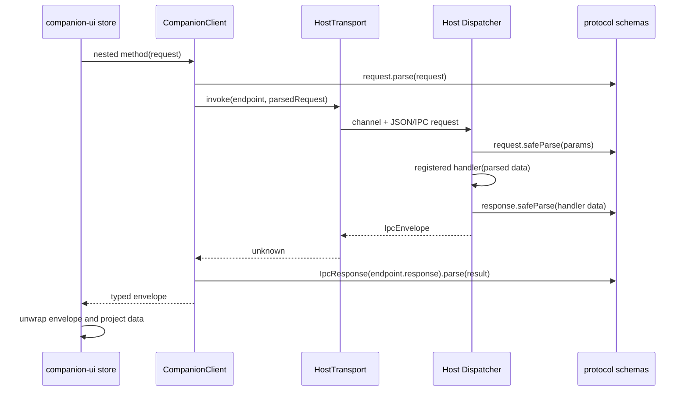

# Companion client module reference

## Responsibility and boundaries

`@bear-harness/companion-client` is the transport-neutral renderer-side facade for the Host RPC contract. It does three things:

1. It turns the protocol's nested `RPC` endpoint tree into a matching, typed client object.
2. It validates request data before handing it to a transport and validates the returned response envelope before exposing it to callers.
3. It provides a small `unwrap` helper for consumers that want to turn a successful envelope into data or a failed envelope into a user-facing `Error`.

The package deliberately has no Electron, DOM, Solid, or Node imports. Its package dependency is only `@bear-harness/protocol` (`packages/companion-client/package.json`). The package is therefore suitable for both the Electron renderer and WebDev browser bundle; the environment-specific transport is supplied by the caller.

This module is not the Host runtime and does not register handlers, persist state, subscribe to events, or authenticate HTTP requests. Those responsibilities remain in the selected transport and Host runtime/server.

Primary sources:

- [`packages/companion-client/package.json`](../../packages/companion-client/package.json)
- [`packages/companion-client/src/index.ts`](../../packages/companion-client/src/index.ts)
- [`packages/companion-client/src/client.ts`](../../packages/companion-client/src/client.ts)
- [`packages/companion-client/src/unwrap.ts`](../../packages/companion-client/src/unwrap.ts)
- [`packages/protocol/src/index.ts`](../../packages/protocol/src/index.ts)
- [`packages/protocol/src/schema.ts`](../../packages/protocol/src/schema.ts)

## Public API and typed surface

The package export is the `.` entry, with declaration output at `dist/index.d.ts` and ESM output at `dist/index.js`. Its source entry exports:

- `HostTransport` (type): the transport interface.
- `CompanionClient` (type): a recursive mapped type derived from `typeof RPC`.
- `createCompanionClient(transport)`: the runtime client factory.
- `unwrap(result)`: a generic envelope helper.
- Selected protocol types: `IpcError`, `MemoryCaptureCreatedBy`, `MemoryCaptureRequest`, `MemoryCaptureResponse`, `MemoryEditRequest`, and `MemoryForgetRequest`.

The complete wire model remains in `@bear-harness/protocol`. The companion-client entry does not re-export the protocol's `RPC` value or every protocol type; import runtime endpoint definitions from `@bear-harness/protocol/schema` and type-only request/response models from `@bear-harness/protocol` when implementing a transport or Host handler.

### `HostTransport`

```ts
export interface HostTransport {
  invoke<E extends AnyRpcEndpoint>(
    endpoint: E,
    request: RequestOf<E>,
  ): Promise<unknown>;
}
```

The endpoint object, rather than only a string channel, is passed to `invoke`. It contains `kind: "rpc"`, a versioned `channel`, and the request/response schemas. The transport normally uses `endpoint.channel` to address the remote Host and returns the untrusted wire result as `unknown`; the client factory owns response parsing after the transport resolves.

A transport may reject its promise for transport-level failures (for example, an HTTP status outside the successful range). RPC/domain failures should normally be returned as the protocol envelope so the caller can handle the protocol error consistently.

### `CompanionClient`

`CompanionClient` is not hand-written and is not a separately generated file. `ClientNode<typeof RPC>` recursively maps objects in the protocol registry to nested client nodes and maps each RPC endpoint leaf to an async method. The method's request and response types are inferred from the endpoint schemas:

```ts
type RpcMethod<E extends AnyRpcEndpoint> =
  Record<string, never> extends RequestOf<E>
    ? (request?: RequestOf<E>) => Promise<EnvelopeOf<E>>
    : (request: RequestOf<E>) => Promise<EnvelopeOf<E>>;
```

Consequently, an endpoint whose request schema is an empty strict object can be called with no argument or `{}`; an endpoint with required request fields requires its request argument. Every method resolves to `IpcEnvelope<ResponseOf<E>>`, not directly to response data. The UI layer normally calls `unwrap` around the method.

The endpoint groups currently come from `RPC` in [`packages/protocol/src/schema.ts`](../../packages/protocol/src/schema.ts): `snapshot`, `character`, `roleplay`, `events`, `onboarding`, `conversation`, `message`, `memory`, `story`, `canon`, `provider`, `model`, `commission`, `run`, `artifact`, `settings`, `update`, and `audit`. The exact method and channel list is owned by that `RPC` value; do not duplicate it in a transport.

At runtime, `createCompanionClient` recursively walks the same `RPC` object, creates one function per endpoint, recursively creates nested groups, and freezes every node with `Object.freeze`. The walk recognizes an endpoint by `kind === "rpc"`. This means the facade follows additions/removals in the protocol tree mechanically, without a second client method registry.

## Protocol contract and validation pipeline

The protocol schema is the single source of truth for channel contracts. Each endpoint has a versioned channel name ending in `:v1`, a request Zod schema, and a response Zod schema. `RPC` is the nested canonical endpoint registry and `CHANNEL_CONTRACTS` is its flattened channel-to-endpoint map; both carry the complete endpoint metadata, including request and response schemas. `REQUEST_SCHEMAS` is a compatibility view containing only request schemas for transport-boundary enumeration and must not be used for response validation or endpoint lookup. `@bear-harness/protocol/src/index.ts` mirrors the runtime schemas with erased type aliases:

- `RpcRegistry` and `ChannelContractRegistry` describe the complete nested and flattened runtime registries, while `RequestSchemaRegistry` describes the request-only compatibility view.
- `RequestOf<E>` and `ResponseOf<E>` infer the endpoint's request and response data.
- `EnvelopeOf<E>` is `IpcEnvelope<ResponseOf<E>>`.
- `IpcEnvelope<T>` is `{ ok: true; data: T } | { ok: false; error: IpcError }`.

A normal call has this sequence:



There are intentionally two request-validation boundaries: the client protects the caller before transport, while the Host dispatcher protects the process boundary. A new transport must not remove either expectation, and it must not send a raw domain object around the client-side parse. The Host dispatcher still validates because transports, debug tools, tests, and non-renderer callers can bypass this client.

The client response parse validates both envelope branches and the endpoint-specific data schema. A malformed response rejects before it reaches the store. The Host dispatcher also validates handler output. Its `responseValidation: "throw"` mode (selected by `HostRuntime`'s `protocolViolationMode: "throw"`) raises `ProtocolResponseValidationError` after invoking `onProtocolViolation`; its `responseValidation: "isolate"` mode reports the violation through the callback and returns `{ ok: false, error: { kind: "internal", reason: "response_validation_failed" } }`. This is Host-runtime configuration, not a client or transport setting; client validation still runs after the transport resolves.

### Adding an RPC without bypassing contracts

1. Define the request and response schemas in [`packages/protocol/src/schema.ts`](../../packages/protocol/src/schema.ts).
2. Add the endpoint to the appropriate branch of `RPC` with a new `:v1` channel. `CHANNEL_CONTRACTS` and `REQUEST_SCHEMAS` are derived from this tree; do not edit either derived registry directly. `REQUEST_SCHEMAS` carries request schemas only, while `RPC`/`CHANNEL_CONTRACTS` are required for full request/response metadata.
3. Add the corresponding inferred aliases to [`packages/protocol/src/index.ts`](../../packages/protocol/src/index.ts) if consumers need named static types.
4. Register a typed handler with Host `Dispatcher.registerHandler(endpoint, handler)`. Registration rejects an endpoint whose channel is absent from `CHANNEL_CONTRACTS` and rejects a second handler for an already-registered channel, so stale or duplicate endpoint wiring fails during setup rather than invocation.
5. Call the new nested method through `CompanionClient`; do not construct a parallel hand-written client method or send an unvalidated channel/request pair.
6. For UI behavior, add store action/query projection and narrow payload guards in [`packages/companion-ui`](../../packages/companion-ui), rather than projecting arbitrary transport data directly.

The Electron router automatically registers every key in `REQUEST_SCHEMAS` for request-boundary enumeration, while the dispatcher resolves full request/response contracts from `CHANNEL_CONTRACTS`. The WebDev server accepts every decoded channel before delegating to that dispatcher. These derived views only contain a channel when the endpoint is present in `RPC`.

## Transport implementations

### Electron IPC adapter

The production desktop renderer creates the client in [`apps/desktop/src/renderer/index.tsx`](../../apps/desktop/src/renderer/index.tsx). Its `HostTransport` delegates the endpoint channel and parsed request to the sandbox preload bridge:

```ts
const client = createCompanionClient({
  invoke: (endpoint, request) =>
    window.bearDesktop.transport.invoke(endpoint.channel, request),
});
```

The preload exposes only a frozen `bearDesktop` object and frozen `transport` object. `transport.invoke` calls `ipcRenderer.invoke(channel, request)`; runtime contract parsing intentionally stays in the renderer client bundle ([`apps/desktop/src/preload/index.cts`](../../apps/desktop/src/preload/index.cts)).

[`apps/desktop/src/main/ipc-router.ts`](../../apps/desktop/src/main/ipc-router.ts) wires the main-process side:

- It loops over `Object.keys(REQUEST_SCHEMAS)` and calls `ipcMain.handle(channel, ...)` for each public protocol channel. This is request-schema enumeration only; response validation and endpoint metadata remain in `CHANNEL_CONTRACTS`/`RPC`.
- It verifies that the sender has a registered window, that its `WebContents` still maps to a `BrowserWindow`, that the sender frame is the main frame, and that the frame URL equals the window's registered `allowedUrl`.
- An unauthorized or unavailable sender receives `{ ok: false, error: { kind: "unavailable", reason: "no_window" } }` and never reaches `dispatcher.dispatch`.
- An authorized call delegates `(channel, params)` to the Host `Dispatcher`; the dispatcher owns request validation, handler lookup, handler-error mapping, and response validation.
- It also exposes `desktop:artifactProtocol:v1`, a host-shell availability check that is not an endpoint in `RPC` and therefore is not part of `CompanionClient`.

The router's sender check is the security boundary for renderer-to-main RPC routing. A new IPC handler should not be added outside the registry unless it is intentionally a non-RPC host-shell channel with its own validation and authorization review.

### WebDev HTTP adapter

WebDev uses the same client factory and a different transport in [`apps/web-dev/src/http-client.ts`](../../apps/web-dev/src/http-client.ts). `createHttpTransport(token)` sends:

- `POST /rpc/${encodeURIComponent(endpoint.channel)}`
- `content-type: application/json`
- `x-bear-web-dev-token: <bootstrap token>`
- JSON-encoded parsed request body

The server in [`apps/web-dev/server/index.ts`](../../apps/web-dev/server/index.ts) binds to loopback, creates a per-process random token, serves that token from `GET /bootstrap`, requires the token for all non-bootstrap routes, decodes the channel, reads a bounded JSON body (with a larger limit for `character.import:v1`), and delegates to `runtime.dispatch(channel, params)`. RPC responses—including domain failures—are JSON envelopes with HTTP 200. Invalid JSON/body parsing is converted to HTTP 400 with an `invalid_request` envelope. Authentication failures are HTTP 401 and are therefore rejected by the HTTP transport before the client response-envelope parser runs.

WebDev's renderer follows the same composition as Electron: `loadBootstrap()` obtains the product config/token, `createHttpTransport(bootstrap.token)` creates the transport, and `createCompanionClient(transport)` supplies `CompanionApp` ([`apps/web-dev/src/index.tsx`](../../apps/web-dev/src/index.tsx)). The WebDev debug panel uses the same transport and endpoint registry, explicitly parses a selected endpoint's request schema before invoking it ([`apps/web-dev/src/DebugPanel.tsx`](../../apps/web-dev/src/DebugPanel.tsx)).

The two adapters must remain semantically equivalent at the client boundary: invoke a versioned endpoint, return the complete envelope, and let `createCompanionClient` parse the response. Their security mechanisms differ (Electron sender/window validation versus WebDev loopback plus token), but neither should move business validation into an adapter-specific implementation.

## Error envelope and caller behavior

The protocol error kind is one of `invalid_request`, `not_found`, `conflict`, `unavailable`, or `internal`; `reason` is a bounded localizable string. The protocol schema deliberately does not expose raw paths, SQL, secrets, or provider error text in the wire error shape. The dispatcher maps:

- unknown channel or missing handler → `unavailable / handler_not_registered`;
- request-schema failure → `invalid_request / request_validation_failed`;
- handler-thrown `{ kind, reason }` → the allowlisted protocol kind and reason; unknown or missing kinds normalize to `internal` while preserving a bounded string reason;
- response-schema failure in isolate mode → `internal / response_validation_failed`.

At the client boundary, a non-envelope or schema-invalid response causes the endpoint method to reject with the Zod parse error. A valid failure envelope remains a value (`ok: false`) until a caller unwraps it.

There are two unwrapping helpers:

- [`packages/companion-client/src/unwrap.ts`](../../packages/companion-client/src/unwrap.ts) exports a generic helper that returns `data` for `ok: true` and throws a plain `Error` with a generic English message selected by `error.kind` for failures.
- [`packages/companion-ui/src/lib/ipc.ts`](../../packages/companion-ui/src/lib/ipc.ts) exports the UI helper used by the store. It throws `IpcInvocationError`, preserves the error kind, and localizes the user-facing message through `i18n`.

The UI's [`invoke`](../../packages/companion-ui/src/stores/ipc.ts) helper awaits a typed envelope and delegates to the UI unwrap helper. Components and store actions therefore receive response data or a user-facing exception; they do not need to repeat envelope branching.

## Integration with companion-ui

`CompanionApp` takes `{ product, client }`, creates a `CompanionStore` once per client identity, and provides that store through `DesktopProvider` ([`packages/companion-ui/src/App.tsx`](../../packages/companion-ui/src/App.tsx) and [`packages/companion-ui/src/stores/companion.tsx`](../../packages/companion-ui/src/stores/companion.tsx)). The store is the reactive facade consumed by panels and sheets; the client remains the only Host call dependency.

Store lifecycle:

1. `createCompanionStore(client)` uses a `WeakMap` keyed by the client object. Re-running the component due to locale changes does not create a second store, duplicate event loop, or lose in-flight state.
2. A `snapshot.get` resource bootstraps the domains and initializes the event sequence cursor.
3. An effect polls `events.subscribe(afterSeq)` at the store's interval and projects domain events. Duplicate events are skipped; sequence gaps mark the projection stale and cause a snapshot refetch.
4. All domain actions (conversation/message, onboarding, memory, settings, provider/model, commission/run, artifact/story, character/canon) invoke nested client methods through the shared helper. Successful calls clear errors; failures set the store error/presence state.
5. Values crossing into reactive state are checked by narrow guards in `stores/ipc.ts`; malformed payloads are dropped rather than projected.
6. `CompanionClient` is a required input; there is no supported missing-client branch. Transport failures are handled as store errors, and an unavailable host state is represented as `problem` rather than an idle missing-client state.

This separation means a transport change should be invisible to UI components if it preserves `HostTransport` and envelope semantics. If a new RPC returns data that the store projects, update the protocol types and store guard/projection together; a TypeScript method appearing on `CompanionClient` alone does not make the data safe for reactive UI state.

## Configuration and lifecycle

The companion-client package has no runtime configuration, environment variables, process startup, or shutdown hook. Its only build-time contract is the package's TypeScript ESM build (`npm run build` / `npm run typecheck` in the package). Transport lifecycle belongs to the host:

- Electron registers IPC handlers from the main process and exposes the preload bridge before renderer startup.
- WebDev starts the Host runtime and loopback HTTP server, then the UI obtains a bootstrap token before creating the client.
- The client itself is stateless and has no `close`, `connect`, retry, timeout, or cancellation API. A transport that needs those behaviors must implement them without changing the RPC envelope contract or silently retrying mutating calls.

## Extension points and review checklist

When introducing a transport:

- Implement only `HostTransport.invoke`; do not import Electron, Solid, or Host internals into [`packages/companion-client`](../../packages/companion-client).
- Address by `endpoint.channel` and send the already parsed request.
- Return the complete `{ ok, data/error }` value; do not return only `data`, translate protocol failures to ad-hoc JSON, or rely on HTTP status as the RPC error model.
- Preserve unknown/malformed responses for the client parser to reject; do not coerce them into success.
- Add authentication/authorization and request-size limits at the transport boundary appropriate to the environment.
- Use `RPC`/`CHANNEL_CONTRACTS` for endpoint lookup and protocol schemas for validation; never maintain a second channel list.
- Register Host handlers through `Dispatcher.registerHandler` so both request and response validation remain active.
- If a UI feature consumes the method, use `stores/ipc.ts`'s invocation path and add narrow guards for event/snapshot payloads.

When introducing an RPC:

- Version the channel (`:v1`), define strict bounded schemas, add it to `RPC`, expose inferred types in the protocol type entry, and register a dispatcher handler.
- Confirm both adapters enumerate/reach it through the derived registry.
- Keep protocol error reasons localizable and free of implementation-sensitive data.
- Decide whether it is a regular RPC (client-visible) or a host-shell channel (separate from `RPC`, separately authorized and validated).

## Verification commands

These commands are the module's declared checks; they are listed for maintainers and are not run as part of this reference update:

```sh
npm run typecheck --workspace @bear-harness/companion-client
npm run build --workspace @bear-harness/companion-client
```

For integration verification, exercise both compositions with the repository's existing scripts:

```sh
npm run dev:web
npm run test:e2e:web
npm run test:e2e:electron
```

A focused manual smoke should confirm that a valid endpoint reaches the Host and returns a typed envelope, an invalid request is rejected, an unknown/missing handler returns `unavailable / handler_not_registered`, a handler response-schema violation is isolated or thrown according to runtime configuration, and unauthorized Electron/WebDev calls do not execute domain handlers.

## Known issues / findings

- **Transport failures are outside the RPC envelope.** WebDev rejects HTTP statuses such as 401 with `web-dev transport failed: <status>`, while the RPC server returns domain failures as HTTP 200 envelopes. Callers must handle rejected transport promises separately from `IpcEnvelope` failures; a new transport should document the same distinction rather than wrapping every network failure as a fabricated domain error.
- **Timeout/cancellation and retry behavior are transport-owned.** The client intentionally adds no timeout, cancellation, or retry policy; rejected transport failures pass through unchanged. A transport must not retry mutations unless an endpoint-specific idempotency contract exists.
- **Protocol response validation mode is Host-runtime configuration, not client configuration.** `HostRuntime` maps `protocolViolationMode` to the dispatcher's explicit `responseValidation: "throw"` or `"isolate"` mode. Both modes invoke `onProtocolViolation`; throw rejects with `ProtocolResponseValidationError`, while isolate returns an `internal / response_validation_failed` envelope. The client rejects malformed envelopes only after a transport resolves.
