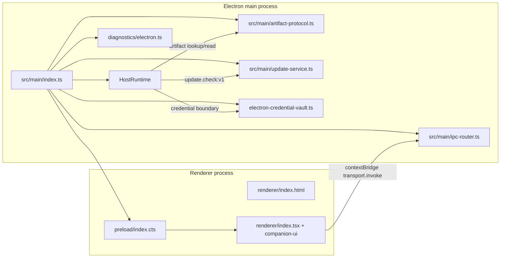

# Desktop module reference

This module is the Electron shell for the SolidJS companion UI. The main process owns Chromium lifecycle, the injected HostRuntime, native diagnostics, credential encryption, IPC admission, and the artifact URL scheme. The renderer receives only a narrow preload bridge and uses the transport-neutral companion client. The package is private and its production entry is `dist/main/index.js` ([`apps/desktop/package.json`](../../apps/desktop/package.json)).

## Module map and process topology



The preload is compiled as CommonJS (`dist/preload/index.cjs`), while main uses NodeNext ESM output and renderer uses Rsbuild. The renderer does not import Electron or Node APIs: it calls `window.bearDesktop.transport.invoke`, and reports normalized faults through `window.bearDesktop.diagnostics.reportRendererFault` ([`src/preload/index.cts`](../../apps/desktop/src/preload/index.cts), [`src/renderer/index.tsx`](../../apps/desktop/src/renderer/index.tsx)).

## Startup and shutdown

### Startup sequence

`src/main/index.ts` executes important setup at module load, before `app.whenReady()`:

1. Register `bear-artifact` scheme privileges. Electron requires this before readiness ([`src/main/artifact-protocol.ts`](../../apps/desktop/src/main/artifact-protocol.ts)).
2. Decide whether the renderer is loaded from packaged/source-E2E HTML or the development server. Packaged and source-E2E runs use `src/renderer/index.html` as emitted under `dist/renderer`; normal unpackaged development uses `http://127.0.0.1:3100/`. Source E2E is enabled only when `NODE_ENV=test` and `BEAR_E2E_SOURCE=1`.
3. For every unpackaged run, append Chromium `use-mock-keychain` and `disable-gpu`, and disable hardware acceleration. This avoids development/test keychain prompts and first-launch GPU startup problems; it is not applied to packaged builds.
4. Derive the product data directory from Electron's `appData` and `productConfig.dataDirectoryName`. Source E2E may override the base with an absolute `BEAR_E2E_APP_DATA`. Create the directory and its `Chromium` session directory with mode `0700`, then set Electron's `userData` and `sessionData` paths.
5. Packaged builds request a single-instance lock. A second packaged launch exits and the `second-instance` handler restores/focuses the existing window. Unpackaged instances intentionally do not use the lock so parallel development/E2E roots are possible.
6. Construct diagnostics with a per-launch UUID and a root at `<userData>/diagnostics`, or an absolute `BEAR_DIAGNOSTICS_ROOT` for source E2E. The diagnostics reporter is adapted to Electron's `crashReporter`.
7. Register process-level shutdown and fault handlers, then register Electron diagnostics IPC/process listeners.
8. Inside `diagnostics.runInSession`, wait for Electron readiness. Create `UpdateService` from `productConfig.updateFeedUrl`, app version, and `<userData>/updates`; initialize and start HostRuntime; register the artifact protocol against the runtime's artifact store; start the six-hour update timer; and create the main window. A renderer can also request an update check through the HostRuntime RPC.

Host initialization is deliberately before window creation, so the renderer cannot issue RPCs against a partially initialized host. `initializeHost` wires IPC before `runtime.start()`, but stores the runtime in the module variable only after `start()` succeeds. Startup failures print an error, set `exitCode=1`, and call `app.exit(1)` through `failInit`.

### HostRuntime construction

`initializeHost` calls `createHostRuntime` with:

- `dataDir`: the product-scoped `userData` directory;
- `characterRoot`: packaged `process.resourcesPath/config/characters` when present, otherwise `../../config/characters` from the current working directory. HostRuntime still gives `BEAR_CONFIG_DIR` precedence internally;
- `productConfig`, including the default character id;
- `electronCredentialVault` in normal/packaged runs, or the deterministic AES-GCM `e2eCredentialVault` only for source E2E;
- `protocolViolationMode: "isolate"` in packaged builds and `"throw"` otherwise;
- an artifact URL factory producing `bear-artifact://artifact/<URL-encoded-id>`;
- an update service adapter whose `check()` delegates to the desktop `UpdateService`.

The runtime constructor creates/migrates the canonical database at `<dataDir>/storage`, the artifact CAS at `<dataDir>/artifacts`, provider runtime state at `<dataDir>/companion-runtime`, character/session state, and the audit store at `<dataDir>/audit` by default. It builds a dispatcher, registers host handlers, and validates requests/responses against the shared protocol. `start()` resolves the active character/configuration and starts the companion supervisor; `close()` is the lifecycle counterpart ([`packages/host-runtime/src/runtime.ts`](../../packages/host-runtime/src/runtime.ts)).

The desktop shell injects platform capabilities rather than putting Electron imports in HostRuntime. To add a desktop capability, prefer an injected option/adapter and a protocol endpoint over importing Electron into shared runtime code.

### Shutdown sequence

`requestShutdown` records the highest requested exit code and calls `app.quit()` once. The `before-quit` handler prevents the first quit, clears the update timer, ends outstanding window spans as cancelled, closes HostRuntime, shuts down diagnostics, marks shutdown complete, and calls `app.quit()` again. SIGINT, SIGTERM, uncaught main-process exceptions, failed main-frame loads, and non-macOS `window-all-closed` all feed this path. On macOS, closing the last window leaves the application alive, and `activate` recreates a window when needed.

## Main window and renderer security boundary

`createMainWindow` creates a hidden `1200×800` window with minimum size `1050×680`, then shows it on `ready-to-show`. Its web preferences are the principal Electron boundary:

- preload is the compiled `dist/preload/index.cjs`;
- `contextIsolation: true`;
- `sandbox: true`;
- `nodeIntegration: false`;
- `webSecurity: true`;
- a per-window traceparent is passed as a process argument to preload.

The main frame is admitted only at the exact `allowedUrl`: the development URL with trailing slash or the packaged renderer `file://` URL. `will-navigate` prevents any other URL. `setWindowOpenHandler` denies all new windows; HTTPS requests that would open a new window are explicitly handed to the OS via `shell.openExternal`. Both permission checks and permission requests always deny. The window registry stores the webContents id, allowed URL, traceparent, and renderer-fault rate-limit state; destruction removes the registration and closes its span.

The renderer's CSP is injected by Rsbuild. Development allows only local WebSocket/HTTP connections to port 3100 in `connect-src`; production allows same-origin connections. Scripts are same-origin, fonts are same-origin, and images are same-origin or `data:`. Assets use relative paths in production so the HTML works from `file://` ([`apps/desktop/rsbuild.config.ts`](../../apps/desktop/rsbuild.config.ts)).

Preload exposes a frozen object containing only `platform`, diagnostics reporting, and a generic `transport.invoke(channel, request)`. `reportRendererFault` validates an exact fault shape (`kind`, `errorType`, optional bounded integer line/column) before sending it over the one-way diagnostics channel. The generic transport is intentionally not an unrestricted Node bridge: main-process sender and frame checks, shared request schemas, handler lookup, and response envelopes remain authoritative.

## IPC routing and validation

`wireElectronIpcHandlers` iterates `Object.keys(REQUEST_SCHEMAS)` and registers one `ipcMain.handle` per protocol channel. Each handler:

1. checks that the sender webContents still corresponds to a `BrowserWindow`;
2. requires the sender to be the registered main frame, not a child frame;
3. requires the sender frame URL to equal that window's registered `allowedUrl`;
4. returns `{ ok: false, error: { kind: "unavailable", reason: "no_window" } }` on admission failure;
5. otherwise delegates the raw params to `dispatcher.dispatch(channel, params)`.

The dispatcher performs shared request validation, handler lookup, and response envelope/response validation. In development, protocol violations throw; packaged runtime uses isolation to turn protocol defects into safe RPC errors while publishing a protocol-violation diagnostic. The separate `desktop:artifactProtocol:v1` channel has no request payload and uses the same sender admission checks; it returns whether the protocol handler has been registered in this process ([`src/main/ipc-router.ts`](../../apps/desktop/src/main/ipc-router.ts)).

The renderer wraps this generic bridge in `createCompanionClient`, which maps typed protocol endpoints to channel strings. This keeps the renderer independent of Electron while making the protocol package the contract source ([`src/renderer/index.tsx`](../../apps/desktop/src/renderer/index.tsx), [`packages/protocol/src/schema.ts`](../../packages/protocol/src/schema.ts)).

## Credential vault

Normal desktop HostRuntime construction injects `electronCredentialVault`, a thin adapter over Electron `safeStorage`:

- availability delegates to `safeStorage.isEncryptionAvailable()`;
- encryption/decryption delegate to `safeStorage.encryptString`/`decryptString`;
- the renderer may submit provider API keys through the typed provider RPC, but it receives no vault methods or persisted plaintext credential values.

HostRuntime passes the vault to `CredentialStore`. Provider credentials are serialized and encrypted before persistence in the `provider_accounts` table when encryption is available. If encryption is unavailable on non-Linux platforms, the store keeps API-key material in a process-local session map and writes no plaintext blob. If encryption throws after initially reporting available, the store downgrades to session-only for the rest of that process. Linux can use the explicit weak-storage path. Credential APIs return status metadata and keep secrets out of renderer diagnostics, run manifests, evidence, and audit payloads ([`apps/desktop/src/main/electron-credential-vault.ts`](../../apps/desktop/src/main/electron-credential-vault.ts), [`packages/host-runtime/src/providers/credential-store.ts`](../../packages/host-runtime/src/providers/credential-store.ts)).

Source E2E substitutes a fixed key derived from the literal `bear-harness-source-e2e-only` and AES-256-GCM. That path exists to avoid macOS Keychain prompts in throwaway test data roots and must never be selected for a packaged build ([`apps/desktop/src/main/e2e-vault.ts`](../../apps/desktop/src/main/e2e-vault.ts)).

## Artifact protocol

The renderer obtains artifact metadata through `artifact.list:v1`, asks HostRuntime for `artifact.url:v1`, and receives either an empty string when the protocol is unavailable or a `bear-artifact://artifact/<id>` URL. It never reads the CAS directly. Main startup registers scheme privileges before readiness and registers the handler after HostRuntime has started and exposed its artifact store.

The custom scheme is deliberately non-standard (`standard: false`), secure, Fetch API capable, and streaming. `parseArtifactUrl` accepts only the exact `bear-artifact://artifact/<single-id>` shape. The handler first validates the request referrer against the allowed renderer URL, then returns:

- `403 forbidden` for an untrusted sender or unknown scheme content/path shape;
- `404 not found` for an invalid artifact ID, unknown ID, or missing CAS blob;
- `200` with the artifact bytes for a known record/blob.

Successful responses use the recorded MIME type (falling back to `application/octet-stream`), actual byte length, `default-src 'none'`, `Cache-Control: no-store`, and `X-Content-Type-Options: nosniff`. The protocol does not turn an artifact into a navigable page ([`src/main/artifact-protocol.ts`](../../apps/desktop/src/main/artifact-protocol.ts)).

## Diagnostics and crash handling

`createDiagnostics` receives a unique launch id, the diagnostics root, packaged state, and an adapter that starts Electron `crashReporter`. `registerElectronDiagnostics` handles renderer faults and Electron process events:

- renderer-fault payloads must be a plain object with exactly `traceparent` and `fault` keys;
- sender registration, main-frame identity, exact allowed URL, and fault shape are checked in order;
- traceparent grammar and equality with the window registration are checked. A mismatch restarts the trace rather than accepting forged parentage;
- renderer faults are rate-limited per webContents using the diagnostics policy, with at most one rate rejection per minute;
- rejected input emits fixed-field `diagnostics.input_rejected` reasons;
- `render-process-gone` and `child-process-gone` values are normalized to allowlisted reasons/types;
- per-window hooks emit `window.unresponsive`, `window.responsive`, and `preload.failed`, carrying only the webContents id.

The main process emits `main.uncaught_exception` and enters orderly shutdown on uncaught exceptions. Main-frame load failure emits `window.load_failed`, destroys the window, and requests exit code 1. The crash smoke script separately configures Crashpad, forces `process.crash()`, requires a non-empty dump and non-zero child termination within 30 seconds, and removes its temporary root afterward ([`apps/desktop/src/main/diagnostics/electron.ts`](../../apps/desktop/src/main/diagnostics/electron.ts), [`apps/desktop/scripts/crash-smoke.mjs`](../../apps/desktop/scripts/crash-smoke.mjs)).

## Updates

`UpdateService` is a check/download/verify staging pipeline, not an installer. The current product configuration sets `updateFeedUrl: ""`, so the service is disabled in this repository ([`packages/product-config/src/index.ts`](../../packages/product-config/src/index.ts)). A release can provide a feed URL without changing the service.

The feed is either one object or an array of `{ version, url, sha256 }` entries. Versions use numeric `major.minor.patch` comparison; malformed versions and entries without a string URL are skipped, while an empty URL is selected and then rejected during staging. Only a version strictly newer than the current app version is selected. `check()` coalesces concurrent calls and returns a staged `ready` state without downloading again when already ready.

For a selected entry, the service fetches JSON with a 30-second timeout and a 1 MiB feed-size limit, requires an HTTP(S) download URL, streams the archive into `<userData>/updates/<version>/`, and caps the archive at 2 GiB both from `content-length` and observed bytes. It transitions through `checking`, `available`, `downloading`, `downloaded`, `verifying`, and `ready`; failures become a sanitized, length-capped `error` state. A missing `sha256` field rejects staging. An explicit `sha256: null` skips digest verification. A supplied digest must be 64 hex characters and is compared against a streamed SHA-256 digest with constant-time equality. There is no install, apply, rollback, signature, code-signing, or notarization step in this service ([`src/main/update-service.ts`](../../apps/desktop/src/main/update-service.ts)).

The renderer can trigger `update.check:v1`; the main timer invokes the same service every six hours and keeps running after an error because the state machine carries the failure. The update handler returns disabled when no service is injected ([`packages/host-runtime/src/composition.ts`](../../packages/host-runtime/src/composition.ts)).

## Development, build, package, and release workflow

### Development

`npm run dev --workspace @bear-harness/desktop` runs the development launcher. It first builds the product-config, protocol, companion-client, and host-runtime workspaces, validates product config, then starts main and preload TypeScript watch builds plus Rsbuild dev on `127.0.0.1:3100`. TypeScript emits main files under `dist/main/src/main`; a 250 ms mirror loop flattens that tree so Electron can launch `dist/main/index.js`. The launcher waits up to 30 seconds for main/preload outputs and the TCP port, starts Electron with `BEAR_RENDERER_URL=http://127.0.0.1:3100`, and tears down all children on signals or child failure ([`apps/desktop/scripts/dev.mjs`](../../apps/desktop/scripts/dev.mjs)).

The main process rejects any development renderer URL other than the exact loopback URL. Do not point `BEAR_RENDERER_URL` at an arbitrary host; doing so violates the IPC/artifact admission model.

### Production build

`npm run build --workspace @bear-harness/desktop` removes `dist`, builds product-config, protocol, companion-client, host-runtime, and companion-ui, validates product config, compiles main, flattens main output, compiles preload, and runs the Rsbuild production renderer build. Main and preload have no source maps and emit no declarations. Renderer output is `dist/renderer` with relative asset prefix and no source maps ([`apps/desktop/scripts/build.mjs`](../../apps/desktop/scripts/build.mjs), [`apps/desktop/tsconfig.main.json`](../../apps/desktop/tsconfig.main.json), [`apps/desktop/tsconfig.preload.json`](../../apps/desktop/tsconfig.preload.json), [`apps/desktop/tsconfig.renderer.json`](../../apps/desktop/tsconfig.renderer.json), [`apps/desktop/rsbuild.config.ts`](../../apps/desktop/rsbuild.config.ts)).

### Packaging and release artifacts

The package scripts run `build` and then Electron Builder:

- `npm run package:mac --workspace @bear-harness/desktop`: DMG and ZIP, universal macOS target;
- `npm run package:win --workspace @bear-harness/desktop`: NSIS and ZIP, x64 target;
- `npm run package:linux --workspace @bear-harness/desktop`: AppImage and deb, x64 target.

Electron Builder writes to `apps/desktop/release`, uses the product-config app id/name/executable/artifact naming, enables ASAR, includes only `dist/**` (excluding `dist/.runtime-build/**`), and unpacks `@napi-rs/canvas` native files. It adds the project licenses, generated brand attribution, and config directory as extra resources. The macOS configuration is intentionally unsigned (`identity: null`); there is no `afterSign` or notarization hook. Fork release CI must inject its own standard Electron Builder signing credentials. Linux desktop metadata synchronizes the app id and product name ([`apps/desktop/electron-builder.config.ts`](../../apps/desktop/electron-builder.config.ts)).

`test:e2e:packaged` resolves the platform-specific unpacked binary under `release` using product-config's executable name, rejects missing/empty binaries, and launches Playwright with `BEAR_PACKAGED_BINARY`. Crash diagnostics can be checked independently with `test:diagnostics:crash` after the host-runtime Crashpad module is built ([`apps/desktop/scripts/resolve-packaged-binary.mjs`](../../apps/desktop/scripts/resolve-packaged-binary.mjs), [`apps/desktop/scripts/crash-smoke.mjs`](../../apps/desktop/scripts/crash-smoke.mjs)).

## Extension and maintenance points

- **New renderer capability:** add a shared protocol endpoint/schema and HostRuntime handler; the desktop IPC router automatically registers channels present in `REQUEST_SCHEMAS`. Keep the renderer-facing call behind companion-client rather than exposing new Electron APIs.
- **New native capability:** inject it through `HostRuntimeOptions` or add a narrowly scoped main-process adapter. Preserve sender/frame/URL checks in both RPC and non-RPC channels.
- **Credential behavior:** modify the `CredentialVault` adapter or CredentialStore policy, never persist plaintext credentials from the renderer. Keep source-E2E vault selection gated by `isSourceE2E`.
- **Artifact serving:** update scheme privileges, URL parsing, sender checks, and response headers together. Scheme privileges must remain registered before readiness; handler registration must wait until the runtime artifact store exists.
- **Diagnostics:** extend allowlists and validation in `diagnostics/electron.ts`; do not forward renderer error messages, preload paths, URLs, or arbitrary child-process fields.
- **Updates:** change the product config feed URL and feed contract deliberately. A `ready` archive is only staged; an installer/signature/apply layer must be added before calling this an automatic updater.
- **Packaging identity/resources:** use `productConfig` as the single release identity source and update extra-resource or ASAR rules when adding packaged files.

## Known issues / findings

1. **Official packages and staged updates are unsigned.** Electron Builder explicitly sets macOS `identity: null`, and `UpdateService` performs only optional/declared SHA-256 verification; it accepts HTTP download URLs and does not verify code signatures or notarization. The update module itself calls out that production must add a signing trust gate. Treat `ready` as “downloaded and digest-checked,” not trusted-to-install ([`electron-builder.config.ts`](../../apps/desktop/electron-builder.config.ts), [`src/main/update-service.ts`](../../apps/desktop/src/main/update-service.ts)).
2. **The feed can deliberately bypass digest verification.** A missing `sha256` is rejected, but `sha256: null` is an explicit opt-out and still reaches `ready`. This is part of the documented feed contract, but it weakens the update boundary and should be disallowed for a production feed unless another authenticated trust mechanism is added ([`src/main/update-service.ts`](../../apps/desktop/src/main/update-service.ts), [`packages/product-config/src/index.ts`](../../packages/product-config/src/index.ts)).
3. **HTTP update transport is accepted.** `stage()` allows both `http:` and `https:` URLs. A feed fetched over HTTPS can therefore direct the client to an HTTP archive. Production feed validation or the service should enforce HTTPS before enabling automatic staging ([`src/main/update-service.ts`](../../apps/desktop/src/main/update-service.ts)).
4. **Linux safe-storage fallback is plaintext at rest.** The Electron vault leaves `securityLevel` unset; when `safeStorage` is unavailable on Linux, CredentialStore's Linux branch stores the serialized credential as a raw UTF-8 blob and labels it `weak_storage`. This is intentional in the current cross-platform policy but must be surfaced in product/security decisions rather than mistaken for OS-backed encryption ([`electron-credential-vault.ts`](../../apps/desktop/src/main/electron-credential-vault.ts), [`packages/host-runtime/src/providers/credential-store.ts`](../../packages/host-runtime/src/providers/credential-store.ts)).
5. **Artifact referrer checking is less exact for packaged file pages than IPC checking.** IPC requires the frame URL to equal the registered `file://…/renderer/index.html`, while the artifact handler accepts any `file:` referrer when the configured allowed URL is a file URL (and accepts an empty referrer for file URLs). Navigation and window creation are locked down, and artifact IDs are opaque, but this is a defense-in-depth asymmetry to revisit if the renderer gains additional local navigation paths ([`src/main/ipc-router.ts`](../../apps/desktop/src/main/ipc-router.ts), [`src/main/artifact-protocol.ts`](../../apps/desktop/src/main/artifact-protocol.ts)).
6. **The update service has no apply/cleanup lifecycle.** It creates versioned staging directories and reports `ready`, but no code installs, launches, rolls back, or removes archives. Disk retention and release migration remain outside this module ([`src/main/update-service.ts`](../../apps/desktop/src/main/update-service.ts)).
7. **Window-hook disposal is not retained by the main window owner.** `registerWindowHooks` returns a disposer, but `createMainWindow` calls it without retaining or invoking the disposer on webContents destruction. Electron will tear down the object, yet explicit disposal would make the lifecycle contract clearer and avoid retaining listeners during unusual teardown paths ([`src/main/index.ts`](../../apps/desktop/src/main/index.ts), [`src/main/diagnostics/electron.ts`](../../apps/desktop/src/main/diagnostics/electron.ts)).
8. **The single-instance comments contain two overlapping descriptions.** The behavior is packaged-only, but adjacent comments describe both “one window per user data dir” and “one window per install.” Maintainers changing development/E2E identity behavior should rely on the actual `app.isPackaged` guard and `BEAR_E2E_APP_DATA` handling, not the duplicated prose ([`src/main/index.ts`](../../apps/desktop/src/main/index.ts)).

## Verification commands

These are the package's existing integration points; run them from the repository root unless noted:

```sh
npm run dev --workspace @bear-harness/desktop
npm run build --workspace @bear-harness/desktop
npm run test:e2e --workspace @bear-harness/desktop
npm run test:e2e:packaged --workspace @bear-harness/desktop
npm run test:diagnostics:crash --workspace @bear-harness/desktop
npm run package:mac --workspace @bear-harness/desktop
npm run package:win --workspace @bear-harness/desktop
npm run package:linux --workspace @bear-harness/desktop
```

`test:e2e:packaged` requires a platform package under `apps/desktop/release` first. `test:diagnostics:crash` requires the host-runtime Crashpad module, normally produced by the workspace build. The desktop package also exposes `test:unit`, `test:coverage`, `typecheck`, and `lint`; these are useful gates but are intentionally not part of this documentation task's verification run.
