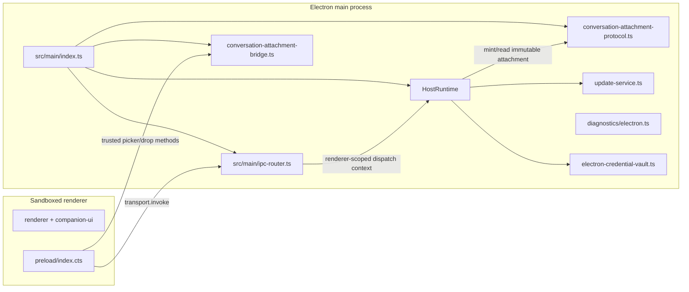

# Desktop module reference

This module is the Electron shell for the SolidJS companion UI. Main owns Chromium lifecycle, the injected HostRuntime, native diagnostics, credential encryption, IPC admission, trusted attachment picker/drop import, and short-lived attachment capabilities. The renderer receives a narrow frozen preload bridge and uses the transport-neutral companion client for ordinary RPC. The package is private and its production entry is `dist/main/index.js` ([`apps/desktop/package.json`](../../apps/desktop/package.json)).

## Module map and process topology



The preload is CommonJS (`dist/preload/index.cjs`); main is NodeNext ESM; the renderer is bundled by Rsbuild. Renderer UI does not import Electron or Node. Ordinary RPC goes through `window.bearDesktop.transport.invoke`; native attachment selection/drop goes through `window.bearDesktop.attachments`; normalized faults go through diagnostics.

## Startup and shutdown

### Startup sequence

At module load, before `app.whenReady()`, main registers `bear-attachment` as a privileged secure, Fetch-capable, streaming custom scheme. It then determines the packaged/source-E2E file renderer versus the fixed `http://127.0.0.1:3100/` development origin, configures unpackaged mock-keychain/GPU switches, establishes product-scoped `userData`/`sessionData`, acquires the packaged single-instance lock, and starts diagnostics.

After readiness, main creates the update service and HostRuntime, registers ordinary protocol IPC plus the trusted picker/drop bridge, starts HostRuntime, stores the running runtime, registers the attachment capability handler, starts the six-hour update timer, and only then creates the main window. A renderer therefore cannot call a partially initialized Host.

Shutdown disposes ordinary IPC, attachment bridge handlers, diagnostics handlers, and window hooks before closing HostRuntime and diagnostics. Renderer destruction revokes that renderer's attachment capabilities.

### HostRuntime construction

`initializeHost` supplies:

- product-scoped `dataDir` and packaged `character-seeds`;
- the OS credential vault, or the deterministic source-E2E-only vault;
- `protocolViolationMode: "isolate"` for packaged builds and `"throw"` otherwise;
- `conversationAttachmentUrlFactory`, which mints a renderer-scoped `bear-attachment` capability inside admitted IPC dispatch;
- update check/discard/apply adapters;
- on packaged Windows, the verified bundled Git shell descriptor.

HostRuntime creates its canonical database, internal `ArtifactStore` CAS/provenance directory, provider/session state, attachment service, audit store, and executor router. `ArtifactStore` is not a renderer API: conversation attachments own all user-visible file identity and access.

External-agent execution is direct. The runtime seeds `pi-default` and starts each Pi delegation as a separate native ACP worker/session with its selected model route. A connected Codex binary is an explicit alternative and is re-verified by version and SHA-256 at launch. The desktop injects PortableGit only into packaged Windows Pi worker environment (`BEAR_PI_SHELL_PATH` plus Git directories at the start of `PATH`).

### Shutdown sequence

`requestShutdown` records the highest requested exit code and calls `app.quit()` once. The `before-quit` handler prevents the first quit, clears the update timer, ends outstanding window spans as cancelled, closes HostRuntime, shuts down diagnostics, marks shutdown complete, and calls `app.quit()` again. SIGINT, SIGTERM, uncaught main-process exceptions, failed main-frame loads, and non-macOS `window-all-closed` all feed this path. On macOS, closing the last window leaves the application alive, and `activate` recreates a window when needed.

## Main window and renderer security boundary

`createMainWindow` creates a hidden `1200×800` window with minimum size `1050×680`, then shows it on `ready-to-show`. Its web preferences are the principal Electron boundary:

- preload is the compiled `dist/preload/index.cjs`;
- `contextIsolation: true`;
- `sandbox: true`;
- `nodeIntegration: false`;
- `webSecurity: true`;
- a per-window traceparent is passed as a process argument to preload.

The main frame is admitted only at the exact `allowedUrl`: the development URL with trailing slash or the packaged renderer `file://` URL. `will-navigate` prevents any other URL. `setWindowOpenHandler` denies all new windows; HTTPS requests that would open a new window are explicitly handed to the OS via `shell.openExternal`. Both permission checks and permission requests always deny. The window registry stores the webContents id, allowed URL, traceparent, and renderer-fault rate-limit state; destruction removes the registration and closes its span.

The renderer's CSP is injected by Rsbuild. Development allows only local WebSocket/HTTP connections to port 3100 in `connect-src`; production allows same-origin connections. Scripts are same-origin, fonts are same-origin, and images are same-origin or `data:`. Assets use relative paths in production so the HTML works from `file://` ([`apps/desktop/rsbuild.config.ts`](../../apps/desktop/rsbuild.config.ts)).

Preload exposes a frozen object containing `platform`, diagnostics reporting, generic `transport.invoke`, and a frozen attachment bridge. The generic transport rejects desktop attachment-channel prefixes; it cannot be used to smuggle native paths. `reportRendererFault` validates an exact bounded shape before sending it over the one-way diagnostics channel.

## IPC routing and validation

`wireElectronIpcHandlers` derives one main-process handler per `REQUEST_SCHEMAS` channel. Every invocation requires a live owning `BrowserWindow`, the registered main frame, and exact allowed URL before delegating raw params to `Dispatcher`. Admitted dispatch runs inside `attachmentProtocol.runForRenderer(webContentsId, ...)`, which binds later `conversationAttachment.url` minting to that renderer.

The separate native channels `desktop:attachmentPickFiles:v1`, `desktop:attachmentPickFolder:v1`, and `desktop:attachmentImportDrop:v1` are not protocol RPCs. They have their own strict plain-object validation and the same window/frame admission:

- picker handlers invoke `dialog.showOpenDialog` with the owning window;
- preload converts dropped `File` objects to native paths with `webUtils.getPathForFile`;
- main accepts at most ten bounded absolute paths and calls `runtime.attachments.importPaths`;
- the attachment service validates/canonicalizes paths, snapshots them into immutable CAS-backed attachments, then retains only an in-memory live-source grant.

The generic preload transport refuses these channel prefixes. Web content therefore cannot supply arbitrary source paths through `CompanionClient`.

## Credential vault

Normal desktop HostRuntime construction injects `electronCredentialVault`, a thin adapter over Electron `safeStorage`:

- availability delegates to `safeStorage.isEncryptionAvailable()`;
- encryption/decryption delegate to `safeStorage.encryptString`/`decryptString`;
- the renderer may submit provider API keys through the typed provider RPC, but it receives no vault methods or persisted plaintext credential values.

HostRuntime passes the vault to `CredentialStore`. Provider credentials are serialized and encrypted before persistence in the `provider_accounts` table only when the vault reports an encrypted backend. Electron exposes `securityLevel: "os"` for strong OS backends and `"session"` when safeStorage is unavailable or selects `basic_text`; the latter keeps credentials in a process-local session map and writes no blob. A machine-local encrypted vault, such as WebDev's AES-GCM vault, reports `securityLevel: "machine"` and is the only source of `weak_storage`. If encryption throws after initially reporting available, the store downgrades to session-only for the rest of that process. Credential APIs return status metadata and keep secrets out of renderer diagnostics, run manifests, evidence, and audit payloads ([`apps/desktop/src/main/electron-credential-vault.ts`](../../apps/desktop/src/main/electron-credential-vault.ts), [`packages/host-runtime/src/providers/credential-store.ts`](../../packages/host-runtime/src/providers/credential-store.ts)).

Source E2E substitutes a fixed key derived from the literal `bear-harness-source-e2e-only` and AES-256-GCM. That path exists to avoid macOS Keychain prompts in throwaway test data roots and must never be selected for a packaged build ([`apps/desktop/src/main/e2e-vault.ts`](../../apps/desktop/src/main/e2e-vault.ts)).

## Conversation attachment capabilities

`conversationAttachment.url:v1` requests either `preview` or `download` for one conversation-owned attachment file. The Host resolves ownership and MIME first; desktop then mints `bear-attachment://cap/<operation>/<random-token>` within the admitted renderer's async dispatch context.

Capabilities:

- expire after five minutes;
- are bound to the minting renderer webContents ID and exact registered referrer URL;
- encode no conversation, attachment, filesystem, or CAS identifier;
- are revoked when that renderer is destroyed;
- require the URL operation to match the minted operation.

Preview minting is allowlisted to PDF, plain text, and AVIF/GIF/JPEG/PNG/WebP. Download accepts other MIME types but responds with a sanitized RFC 5987 attachment filename. The handler re-resolves the exact conversation/attachment/relative path at use time and rejects changed paths or unsupported preview MIME.

Malformed URLs and sender/operation mismatches return locked `403`; missing, expired, or unreadable capabilities return `404`. Success returns exact bytes and MIME with `Content-Disposition`, `Content-Length`, `Cache-Control: no-store`, `Content-Security-Policy: default-src 'none'`, and `X-Content-Type-Options: nosniff`.

Semantic text/tree/search and exact byte ranges remain available through `conversationAttachment.read:v1`; the capability is only the media/PDF/download delivery path.

## Diagnostics and crash handling

`createDiagnostics` receives a unique launch id, the diagnostics root, packaged state, and an adapter that starts Electron `crashReporter`. `registerElectronDiagnostics` handles renderer faults and Electron process events:

The minimum level is `BEAR_LOG_LEVEL` or `info`. Source builds may use `trace` for a redacted, size-bounded manual-test transcript; packaged builds clamp a requested `trace` level to `debug`, so release artifacts cannot persist conversational content. Business spans cover each Companion turn, model route/request, Context Pack, Skill/tool execution, Host-rule decision/state transition, and direct external-agent lifecycle. Local JSONL can be queried by trace id and exported atomically; it is never uploaded.

- renderer-fault payloads must be a plain object with exactly `traceparent` and `fault` keys;
- sender registration, main-frame identity, exact allowed URL, and fault shape are checked in order;
- traceparent grammar and equality with the window registration are checked. A mismatch restarts the trace rather than accepting forged parentage;
- renderer faults are rate-limited per webContents using the diagnostics policy, with at most one rate rejection per minute;
- rejected input emits fixed-field `diagnostics.input_rejected` reasons;
- `render-process-gone` and `child-process-gone` values are normalized to allowlisted reasons/types;
- per-window hooks emit `window.unresponsive`, `window.responsive`, and `preload.failed`, carrying only the webContents id.

The main process emits `main.uncaught_exception` and enters orderly shutdown on uncaught exceptions. Main-frame load failure emits `window.load_failed`, destroys the window, and requests exit code 1. The crash smoke script separately configures Crashpad, forces `process.crash()`, requires a non-empty dump and non-zero child termination within 30 seconds, and removes its temporary root afterward ([`apps/desktop/src/main/diagnostics/electron.ts`](../../apps/desktop/src/main/diagnostics/electron.ts), [`apps/desktop/scripts/crash-smoke.mjs`](../../apps/desktop/scripts/crash-smoke.mjs)).

## Updates

`UpdateService` is a check/download/verify staging pipeline, not an installer. The current product configuration sets `updateFeedUrl: ""`, so the service is disabled in this repository ([`packages/product-config/src/index.ts`](../../packages/product-config/src/index.ts)). A non-empty feed requires a matching `updatePublisher` policy (`{ algorithm: "ed25519", publicKey }`, a PEM-encoded Ed25519 public key); product-config validation enforces that pairing.

The feed is a signed envelope: `{ payload, signature }`, with unpadded base64url and canonical JSON payload bytes (sorted object keys, no whitespace). Ed25519 verification runs before metadata parsing or entry selection. Unsigned, tampered, non-canonical, wrong-key, and policy-less feeds are rejected.

The verified payload contains `{ version, url, sha256 }` entries. Only a version newer than the current app version is selected. Both the feed and archive URL must use HTTPS, and every archive must declare a valid 64-hex-digit SHA-256 digest. The archive is streamed under `<userData>/updates/<version>/<name>.partial`, capped at 2 GiB, hashed before it can become visible, then atomically renamed to its final name. Therefore no unauthenticated, non-HTTPS, checksumless, or digest-mismatched archive can reach `ready`.

Staging has an explicit retention lifecycle. Startup and every retry remove stale `.partial` files; selecting a new version removes superseded version directories; download, verification, size-limit, error, and cancellation paths remove the entire unsafe target directory. `update.discard:v1` (or `UpdateService.discard()`) removes all staged and partial update data and returns to `idle`. `update.apply:v1` (or `UpdateService.apply()`) always returns the typed `applyUnsupported: true` boundary: `ready` means verified and staged only, never installed. A platform-specific external installer must own installation.

The renderer can trigger `update.check:v1`, `update.discard:v1`, or `update.apply:v1`; the main timer invokes the same check every six hours and keeps running after an error because the state machine carries the failure. Update handlers return disabled when no service is injected ([`packages/host-runtime/src/composition.ts`](../../packages/host-runtime/src/composition.ts)).

## Development, build, package, and release workflow

### Development

`npm run dev --workspace @bear-harness/desktop` runs the development launcher. It first builds the product-config, protocol, companion-client, and host-runtime workspaces, validates product config, then starts main and preload TypeScript watch builds plus Rsbuild dev on `127.0.0.1:3100`. TypeScript emits main files under `dist/main/src/main`; a 250 ms mirror loop flattens that tree so Electron can launch `dist/main/index.js`. The launcher waits up to 30 seconds for main/preload outputs and the TCP port, starts Electron with `BEAR_RENDERER_URL=http://127.0.0.1:3100`, and tears down all children on signals or child failure ([`apps/desktop/scripts/dev.mjs`](../../apps/desktop/scripts/dev.mjs)).

The main process rejects any development renderer URL other than the exact loopback URL. Pointing `BEAR_RENDERER_URL` elsewhere violates both ordinary IPC admission and attachment-capability renderer binding.

### Production build

`npm run build --workspace @bear-harness/desktop` removes `dist`, builds product-config, protocol, companion-client, host-runtime, and companion-ui, validates product config, compiles main, flattens main output, compiles preload, and runs the Rsbuild production renderer build. Main and preload have no source maps and emit no declarations. Renderer output is `dist/renderer` with relative asset prefix and no source maps ([`apps/desktop/scripts/build.mjs`](../../apps/desktop/scripts/build.mjs), [`apps/desktop/tsconfig.main.json`](../../apps/desktop/tsconfig.main.json), [`apps/desktop/tsconfig.preload.json`](../../apps/desktop/tsconfig.preload.json), [`apps/desktop/tsconfig.renderer.json`](../../apps/desktop/tsconfig.renderer.json), [`apps/desktop/rsbuild.config.ts`](../../apps/desktop/rsbuild.config.ts)).

### Packaging and release artifacts

Electron Builder emits:

- `package:mac:arm64` and `package:mac:x64`: DMG and ZIP;
- `package:win`: NSIS and ZIP, x64;
- `package:linux`: AppImage and deb, x64.

Artifacts use product-config identity, ASAR, staged platform-native bindings, generated brand attribution, licenses, and packaged character seeds.

After the clean desktop build, Windows packaging runs `stage-windows-runtime.mjs` before native-binding staging and Electron Builder. The script downloads the pinned Git for Windows PortableGit `v2.55.0.windows.5` x64 release asset, verifies SHA-256 `5aa8a20f6e9abb2c755f0e73c91c687701a46b309ad84a0ca6509380fa4ae290`, extracts it, inventories every runtime file, and stages Git/GPL/component notices plus source pointers. Builder includes it under `resources/git` with `git-runtime-manifest.json`; `.windows-runtime` itself is excluded from ASAR.

`verify-windows-runtime.mjs` runs on Windows against unpacked package resources. It checks the pinned manifest/inventory/notices, verifies `bash.exe` and `git.exe` are PE x64, executes both version probes, and launches the packaged Electron executable as Node for a real Pi `createBashTool` smoke. The smoke requires the bundled shell descriptor, verifies bundled Git leads `PATH`, writes through Bash in a temporary workspace, and observes `git version 2.55.0.windows.5`.

`test:e2e:packaged` resolves and launches an already-produced unpacked platform binary. Crash diagnostics have a separate smoke command.

## Extension and maintenance points

- Add ordinary renderer capabilities through strict shared protocol endpoints and Host handlers; keep native path access in the separately admitted preload/main bridge.
- Update attachment scheme privilege registration, renderer dispatch scoping, capability minting, MIME policy, token revocation, and response headers together.
- Keep internal CAS/provenance behind `ConversationAttachmentService`; renderer-visible outputs must be generated attachments.
- Change executor behavior in Host adapters. Pi remains independent native ACP by default; Codex remains explicit, connected, pinned, and launch-verified.
- Any PortableGit version change must update stage and verifier pins, archive digest, inventory/notices, packaged resource wiring, and the real packaged Pi/Bash/Git smoke together.
- Modify credentials through `CredentialVault`/CredentialStore, diagnostics through validated allowlists, and updates through the signed-feed/staging policy.

## Current findings

1. **Attachment URLs are capabilities, not identifiers.** Tokens are random, renderer-bound, operation-bound, revocable, and five-minute limited; no local path or CAS key appears in the URL.
2. **Native source grants are ephemeral.** Desktop picker/drop imports snapshot first. The canonical live path stays only in Host memory and disappears on restart; delegation falls back to the immutable snapshot when the grant is absent or invalid.
3. **Direct agents are unsandboxed.** An independent Pi or explicitly connected Codex uses native filesystem/terminal behavior. A selected live workspace can be modified without Bear rollback; outputs written under the assigned output directory are snapshotted back as generated attachments.
4. **Packaged Windows Pi has a verified shell runtime.** PortableGit staging is digest-pinned and license/inventory tracked, while the Windows verifier exercises Bash and Git from the unpacked application.
5. **The update service stages but does not install.** Signed metadata and SHA-256 protect staged archives; `update.apply:v1` still reports `applyUnsupported`.

## Verification commands

These are the package's existing integration points; run them from the repository root unless noted:

```sh
npm run dev --workspace @bear-harness/desktop
npm run build --workspace @bear-harness/desktop
npm run test:e2e --workspace @bear-harness/desktop
npm run test:e2e:packaged --workspace @bear-harness/desktop
npm run test:diagnostics:crash --workspace @bear-harness/desktop
npm run package:mac:arm64 --workspace @bear-harness/desktop
npm run package:mac:x64 --workspace @bear-harness/desktop
npm run package:win --workspace @bear-harness/desktop
npm run package:linux --workspace @bear-harness/desktop
```

`test:e2e:packaged` requires a platform package under `apps/desktop/release` first. `test:diagnostics:crash` requires the host-runtime Crashpad module, normally produced by the workspace build. The desktop package also exposes `test:unit`, `test:coverage`, `typecheck`, and `lint`; these are useful gates but are intentionally not part of this documentation task's verification run.
