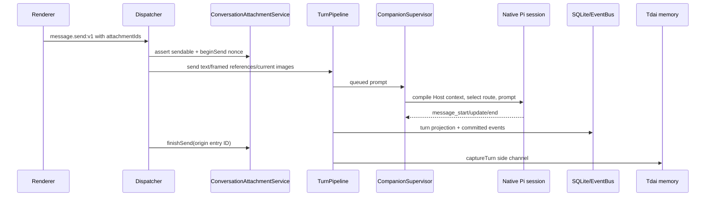

# Host runtime reference

## Responsibility and authority

`@bear-harness/host-runtime` is the instance-scoped Host for one active Companion character. It owns canonical SQLite state, native Pi conversation sessions, shared RPC dispatch, provider/model routing, roleplay and presentation state, Tdai memory integration, immutable conversation attachments, direct external-agent runs, EventBus projections, audit, and moderation. The package has no Electron, browser, or app-shell imports; platform capabilities are injected.

Authority is deliberately split:

- **Host code owns application state and policy.** `Dispatcher` validates protocol requests and responses, and `composition.ts` maps endpoints to services. The conversational Companion receives only explicitly installed Host tools; built-in filesystem, shell, edit, and write tools are not installed in its session.
- **Character packages own declarations.** `CharacterLoader` supplies valid scenes, expressions, onboarding, roleplay events/media/choices, skills, canon, assets, and plugin trust declarations. Host rejects undeclared IDs.
- **Models own only generated content and explicit tool requests.** Host validates every requested state transition and side effect.
- **Users own source selection, memory decisions, and external-agent choice.** A selected source becomes an immutable conversation attachment. A Desktop source grant is ephemeral and gives an agent unsandboxed access only when that selected source is used for work. Codex must be explicitly discovered and connected; otherwise delegated work uses the first-party Pi ACP profile.
- **`ConversationAttachmentService` owns attachment identity and bytes.** IDs are conversation-scoped and immutable. Renderers, role tools, and executor controllers cannot claim ownership or address internal byte records directly.
- **`ExternalAgentRunService` owns run state.** Executor controllers report events; the service validates the FSM, persists evidence/status, captures generated outputs, and publishes events.

## Public entrypoints and exports

The package root [`src/index.ts`](../../packages/host-runtime/src/index.ts) exports:

- `HostRuntime`, `createHostRuntime`, `HostRuntimeOptions`, and `RuntimeProductConfig` for construction and lifecycle.
- `Dispatcher`, `RpcError`, `RpcHandler`, and `RpcResponse` for validated shared-protocol dispatch.
- Character and Companion services/types including `CharacterLoader`, `CharacterBehaviorService`, `CompanionSupervisor`, `FirstMeetingMachine`, and `TurnPipeline`.
- `ConversationAttachmentService`, `AttachmentKind`, `ConversationAttachmentSummary`, and `ConversationAttachmentUrlFactoryRequest` for Host/shell attachment integration.
- `ExternalAgentRunService`, `RunSummary`, direct-run contracts, `ExecutorRouter`, `AcpRunClient`, `AcpExecutorController`, `PiAcpAdapter`, `CodexAdapter`, and their profile/manifest/controller contracts.
- `MemoryBackend` contracts, `ModelRegistry`, `ProviderCatalog`, and the `CredentialStore`/`CredentialVault` boundary.
- Diagnostics/trace contracts and factories, `Database`, `EventBus`, `HostEvent`, and listener types.
- Materials, codec, and filesystem-operation services as direct Host-side APIs; they are not renderer RPC groups.

Attachment files use an internal `ArtifactStore` only for content-addressed bytes and provenance beneath `ConversationAttachmentService` ownership. It is not a renderer domain, role-tool identifier space, or external-agent result API.

The package export map points consumers to built `dist/index.js` and `dist/index.d.ts`; source paths are not package-root API.

## Construction and dependency composition

`new HostRuntime(options)` and `createHostRuntime(options)` are equivalent. Required options are:

- `dataDir`: root for SQLite, immutable bytes, installed characters, provider runtime data, native sessions, direct runs, uploads, and audit data;
- `characterSeedRoot`: injected seed/library directory containing character packages;
- `productConfig.defaultCharacterId`;
- `credentialVault`: platform encryption boundary passed to `CredentialStore`.

Optional options are `protocolViolationMode`, installation/user `memoryScope`, partial Tdai configuration, a platform proxy resolver, `conversationAttachmentUrlFactory`, verified `bundledGit`, a shell update service, protected deletion roots, remote moderation settings, an audit directory, and logger. `BEAR_CONFIG_DIR` can override `characterSeedRoot` for the existing compatibility path.

Construction in [`runtime.ts`](../../packages/host-runtime/src/runtime.ts) performs these steps:

1. Open one `Database` at `<dataDir>/storage`, apply `MIGRATIONS`, and assert the schema contract.
2. Create `EventBus`, the attachment byte/provenance backend, `CredentialStore`, `ProviderCatalog`, `CharacterLoader`, `ConversationRepository`, `CompanionSupervisor`, roleplay/draft/behavior services, story/canon, onboarding/settings/model services, and the Tdai-backed memory runtime.
3. Build `TurnPipeline` with a committed-turn memory side channel. Capture failures publish diagnostics and do not undo an already-settled reply.
4. Build `ContextPackCompiler` for package/canon context, memory recall, and best-effort system context; inject it into the supervisor.
5. Seed the `pi-default` profile, register `PiAcpAdapter` under profile type `pi` and `CodexAdapter` under `codex`, then create `ConversationAttachmentService` and `ExternalAgentRunService`.
6. Install the supervisor Host-tool handler. History/canon/memory requests are handled by Host services; character/roleplay requests are delegated to `CharacterBehaviorService`; attachment/work requests use list, read, and delegate handlers.
7. Create `AuditStore` and deterministic-plus-optional-remote `ModerationService`, subscribe audit to EventBus, and create the `Dispatcher` with a protocol-violation diagnostic callback.
8. Assemble `HostCompositionContext` and call `wireHostHandlers` to register shared RPC handlers.

`HostCompositionContext` is the explicit internal composition seam. Its current domain services include ORM/EventBus, onboarding, turns, models/settings, memory, direct runs and external-agent discovery, attachments, canon, supervisor/providers/character services, draft/roleplay services, conversation repository, and optional attachment URL/update/audit integrations.

## Lifecycle

### Construction

Construction is synchronous apart from later service work. Database migration/schema assertion, character-library bootstrap, Pi profile seeding, handler registration, and audit subscription happen before the constructor returns. Native Pi sessions and executor processes are not launched during construction.

### `start()`

`HostRuntime.start()` is idempotent after success and retry-safe after failure. It:

1. Marks nonterminal runs left by a previous process as interrupted.
2. Loads persisted proxy settings and applies non-direct proxy configuration before Host network activity.
3. Subscribes to `settings.changed` for live proxy reapplication.
4. Installs warn-only deletion sentinels for protected roots and starts best-effort audit retention pruning.
5. Starts Tdai memory and indexes pending canon work.
6. Resolves the active character, validates plugin trust, configures the supervisor's Pi resources, and starts the conversational supervisor.
7. Reconciles settled direct runs whose user-visible result delivery or best-effort memory capture was not recorded.
8. Sets `started` only after every required step succeeds.

If startup fails, Host stops any started supervisor, removes filesystem sentinels, unsubscribes proxy hot reload, and leaves the instance available for another `start()` attempt. The memory runtime is closed only by terminal `close()`.

`CompanionSupervisor.start()` installs an owner-tagged process-global `bearHostCall` bridge and marks the Companion running. Native conversation sessions remain lazy until first use. Character activation, trust changes, draft publication, and provider changes that alter runtime configuration restart the supervisor; credential-only operations do not require every configuration restart.

### `close()`

`close()` is idempotent terminal teardown. It marks the runtime closed, stops the supervisor, removes filesystem protection, unsubscribes audit/turn/proxy/direct-run reconciliation listeners, disposes character behavior and provider resources, closes Tdai memory, and closes SQLite. A supervisor or memory close error is preserved until cleanup finishes and is then rethrown.

Direct ACP child ownership belongs to executor controllers. Runtime startup converts orphaned active rows into a durable interrupted terminal state before accepting new work; terminal result reconciliation never rewrites that settled executor outcome.

## RPC composition and error boundary

`wireHostHandlers(dispatcher, context)` registers these current endpoint groups:

| RPC area | Owning service/handler |
| --- | --- |
| `character.*` | `CharacterLoader`, `CharacterDraftService`, canon sync, supervisor restart, plugin trust |
| `roleplay.*` | `RoleplayService`, `CharacterBehaviorService` |
| `onboarding.*` | `FirstMeetingMachine` |
| `conversation.*`, `message.*` | `ConversationRepository`, `TurnPipeline`, attachment send binding |
| `conversationAttachment.*` | `ConversationAttachmentService`, optional renderer capability factory |
| `memory.*` | scoped `MemoryBackend`, candidate/decision/presentation tables, capture helpers |
| `story.*`, `canon.*` | `StoryService`, `CanonHubService` |
| `provider.*` | `ProviderCatalog`, `CredentialStore` |
| `model.*` | `ModelRegistry` |
| `externalAgent.*` | Codex discovery, verified connection, Pi/Codex availability |
| `run.*` | `ExternalAgentRunService` list and control operations |
| `settings.*` | `AppSettingsStore`, onboarding decisions, settings capabilities, EventBus |
| `update.*` | optional shell update service |
| `audit.*` | optional `AuditStore` read/export |
| `events.subscribe`, `snapshot.get` | `EventBus` and composed service projections |

The dispatcher looks up the shared contract, rejects unknown or unregistered channels as `handler_not_registered`, validates request bodies, invokes the handler, and validates response data. Domain exceptions become `{ ok: false, error: { kind, reason } }`. A response-schema violation throws in development mode or becomes `internal/response_validation_failed` in isolation mode; both paths invoke the diagnostic callback.

Composition handlers add authority checks that schemas cannot provide. Character-scoped operations resolve the active companion. Conversation and attachment operations require conversation ownership. Run controls require a run joined through a conversation owned by the active companion. Memory capture resolves current native session entries instead of trusting arbitrary entry IDs. Attachment URL creation first resolves the requested conversation-owned file and its recorded MIME/size.

There is deliberately no renderer RPC that starts arbitrary work. The conversational role starts a run through the allowlisted `host_delegate_agent` tool, which supplies the current conversation and native trigger entry from Host session state. Renderer-facing `run.*` endpoints list or control those Host-created runs.

## Conversation and native turn pipeline

The persisted Host projection is separate from native Pi session storage:

- `conversations` belongs to a companion and stores title/scene/archive timestamps;
- `conversation_sessions` maps a conversation to a native Pi session ID/file and active leaf;
- `branches` tracks adopted/forked narrative branches;
- message/version and `turns` rows support Host lifecycle and compatibility projections;
- `scene_state` and `conversation_directives` hold presentation/correction context;
- `ConversationRepository` builds the authoritative UI timeline from native session entries and annotates bound user/assistant entries with attachment summaries.

A normal send is:



`message.send` accepts text, attachment IDs, or both. `ConversationAttachmentService.beginSend` atomically reserves unbound user-selected roots. The Host frames IDs/names as Host context rather than filesystem paths and passes image bytes only for selected single-image roots. A successful native send binds the reserved roots to its returned user entry ID; an exception calls `abortSend` so the draft attachments can be retried.

`TurnPipeline` enforces one active turn per conversation and requires a running supervisor. `CompanionSupervisor` serializes prompts, initializes one session per conversation, compacts when needed, compiles context, selects the model, and streams native updates. If image observation uses a different route, observations are explicitly untrusted and the main reply route remains unchanged.

Abort, regenerate, version switch, edit, continue, correction, and branch operations are explicit Host transitions. Committed-turn memory capture is a side channel and cannot invalidate a persisted reply.

## Conversation attachment flow

`ConversationAttachmentService` is an immutable, conversation-owned snapshot authority. Attachment roots have kind `file`, `folder`, or `generated`; file entries carry normalized relative path, MIME/material classification, bytes, SHA-256, and optional extracted text/error. Directory and symlink entries are represented explicitly, while unsafe symlink traversal is never used to read outside a root.

### Ingestion

Desktop trusted-main import calls `importPaths(conversationId, paths)`. It checks absolute selected paths, rejects selected symlinks/unsupported roots, verifies canonical identity, snapshots bytes, and then records the canonical source path only in an in-memory grant. That path is never stored in SQLite or returned through shared RPC.

Browser/WebDev ingestion uses a bounded manifest and resumable Host upload staging:

1. `conversationAttachment.startUpload` validates root kind/name and entries and returns an upload ID.
2. `appendChunk` writes bounded base64 chunks at the exact expected offset.
3. `completeUpload` verifies all staged files and creates the immutable snapshot.
4. `cancelUpload` removes staged state.

Uploads and Desktop imports converge on the same `conversation_attachments` and `conversation_attachment_files` ownership model.

### Reads and renderer presentation

`conversationAttachment.list` returns metadata only after conversation ownership checks. `conversationAttachment.read` is discriminated by mode:

- `semantic` lists entries, reads/paginates extracted text, or searches excerpts without exposing a local path;
- `bytes` returns a bounded base64 slice with MIME, relative path, next offset, and EOF.

`conversationAttachment.url` is optional shell integration. It resolves a real attachment file and asks `conversationAttachmentUrlFactory` for an operation-scoped renderer capability. If no factory is installed, the Host returns `attachment_url_unavailable`; callers use semantic/byte reads instead.

Desktop's factory mints `bear-attachment://cap/<preview|download>/<opaque token>`. Capabilities expire after five minutes, are scoped to the invoking renderer main frame and operation, validate its exact referrer, and are revoked when that renderer closes. Preview MIME types are allowlisted. Responses use `no-store`, `default-src 'none'`, `nosniff`, recorded MIME, actual content length, and safe content disposition.

### Message ownership

New user-selected roots are drafts until `message.send` binds them to the returned native user entry with a send nonce. Generated attachments are created only from terminal run output capture and later bound to the native assistant follow-up entry. `discard` removes a conversation-owned attachment record and leaves internal content-addressed garbage collection to retention/reference rules.

The work-facing conversational role has exactly three Host tools:

- `host_list_attachments`;
- `host_read_attachment`;
- `host_delegate_agent`.

The first two never expose paths. The third requires at least one selected attachment ID and an instruction; the current native user entry supplies durable trigger ownership.

## Direct external-agent execution

### Launch boundary

`ExternalAgentRunService.delegate` is a direct launch boundary with no intermediate proposal state. It validates a nonempty bounded instruction, one to ten unique attachment IDs owned by the conversation, an optional workspace attachment drawn from those inputs, companion ownership, the active-run limit, and a trusted executor profile. It then prepares inputs, inserts the canonical `runs` row as `enqueued`, publishes `run.enqueued`, and asks `ExecutorRouter` to launch.

```text
conversationId + triggerEntryId
  + agent (pi | codex)
  + attachmentIds[]
  + optional workspaceAttachmentId
  + instruction
    -> runId (enqueued or running)
```

The return means launch/enqueue succeeded; it is not a completion result.

### Pi and Codex composition

`pi-default` is seeded during construction and resolves to `PiAcpAdapter`. Every run launches a dedicated ACP child and independent Pi session with native local tools. It does not reuse or mutate the conversational Companion session. The selected conversation model route and credential are injected into the child environment immediately before launch and are not written to the run manifest. On Windows, Desktop injects verified bundled PortableGit shell/PATH entries; packaged Pi does not depend on ambient Git discovery.

Codex is optional. `externalAgent.discoverCodex` returns local candidates and their path/version/hash status. `externalAgent.connectCodex` records explicit consent only for a supplied canonical path, supported version, digest, and Codex home. `externalAgent.status` always reports `pi-default` available and reports Codex availability separately. `host_delegate_agent` uses Codex only when the role explicitly requests it and the verified profile is connected.

### Live source and snapshot inputs

Input preparation always materializes each immutable attachment snapshot into the run directory. For a user-selected file/folder, a still-valid in-memory Desktop grant can replace that materialized input with the canonical live path. Grants disappear on Host restart and fail closed when type/canonical identity no longer matches; the immutable snapshot remains the fallback.

A live grant is intentionally unsandboxed. The external agent can change the selected source, and Bear Harness provides no rollback. Generated attachments cannot be selected as a live workspace. If no workspace ID is specified, preparation chooses the first selected folder when available; otherwise the run directory is the workspace.

### Run state, control, and terminal output

Current statuses are `enqueued`, `running`, `needs_user`, `completed`, `failed`, `cancelled`, `interrupted`, and `forced_termination`. Executor events are workers' reports, not database authority:

- `started` advances `enqueued` to `running`;
- `evidence` is sanitized and persisted by the service;
- `needs_user` creates a permission request owned by that run;
- `completed`, `failed`, and `cancelled` settle through the service;
- `run.steer`, `interrupt`, `resume`, `cancel`, and `respondPermission` enforce active-companion/run ownership before reaching the controller.

Executor paths and process errors are sanitized before evidence, summaries, or events are persisted. On completion, Host snapshots the dedicated output directory with file/count/byte limits and no output symlinks. A nonempty output set becomes one immutable `generated` conversation attachment associated with the run. Output snapshot failure turns the run into a safe failed terminal result.

Terminal reconciliation is idempotent. For the active conversation, Host sends a hidden `host_external_agent_result` custom message keyed by `runId` to the native conversational Pi session. The role produces the user-visible assistant follow-up; Host binds generated attachments to that assistant entry. `result_reported_at` and `memory_captured_at` track the two retryable side effects separately. Startup and `conversation.selected` retry missing side effects without changing the terminal run status or duplicating the hidden notification.

## Character, roleplay, and presentation authority

Character install/bootstrap/activation/publish is handled by `CharacterLoader` and draft services. The active package is persisted separately from its seed/library files. Activation and plugin-trust changes restart the supervisor with package-derived Pi resources. Skills are declarative context; executable plugins require current package trust.

### Host lifecycle reactions

`CharacterBehaviorService` subscribes to EventBus during construction. Package-declared host-event reactions map user-send, message-end, abort, and assistant-commit lifecycle to deterministic expression state. The service validates the package expression, persists scene state, and publishes `character.visual_state_changed`.

A model-selected or roleplay expression suppresses the mapped successful message-end reaction for the current turn only. These reactions are visual state and do not imply that a scene/media tool was called.

### Model-decided scene/media/choice tools

The supervisor installs allowlisted state/scene/expression/roleplay/media/choice tools. Host validates scene/expression IDs against the active package, media/choice IDs against roleplay declarations, locked media against roleplay state, and commit timing for event effects. User-driven roleplay RPC is a canonical-branch operation and applies under its own immediate rules. Models cannot write roleplay tables or invent declarations.

## Memory and Tdai integration

`HostRuntime` creates `TencentDbRuntime` with installation/user scope, the active companion namespace, provider/model services, and merged embedding configuration. Persisted memory-vector settings override or extend injected Tdai configuration for disabled, local, or remote providers.

`ContextPackCompiler` uses relationship recall and best-effort system context when preparing a conversational turn. `onTurnCommitted` sends user/assistant text and session metadata to `captureTurn`; errors are diagnostic-only. Memory RPC search/list/forget/edit operate on the scoped backend.

Explicit user capture resolves a current native Pi branch entry, with the Host version projection as a compatibility fallback, and writes provenance. Assistant `host_remember` creates a pending SQLite candidate instead of silently writing relationship memory. User acceptance writes the relationship entry and backend record; rejection records the decision. Presentation overlays support pin, exclude, replacement, and invalidation state without changing package files.

A terminal external-agent result uses the same memory pipeline only after the conversational role has produced its follow-up. That capture is best-effort and separately reconciled; failure never rewrites run completion or attachment ownership.

## Providers and model routing

`ProviderCatalog` wraps pi-ai's model runtime. It lazily creates provider runtime data under `<dataDir>/companion-runtime`, loads encrypted credentials through `CredentialStore`, applies provider filtering, and exposes provider listing, API-key/session credentials, custom providers/base URLs, and OAuth interactions. Relevant provider configuration changes restart the conversational supervisor.

`ModelRegistry` persists enabled models, default reply/vision routes per companion, and per-conversation selections. Enabling verifies the provider catalog model and records image capability. The supervisor resolves text and image-required routes separately. Direct Pi ACP launch resolves the conversation's text route and injects the selected provider/model and optional API key only into that child process.

## Persistence, events, snapshot, audit, and security

### Storage map

`storage/schema.ts` and `storage/database.ts` define and migrate canonical SQLite state. Current execution/attachment ownership is represented by:

- `runs`: conversation, native trigger entry, profile, instruction, input attachment IDs, optional workspace attachment, status, terminal summary, and reconciliation timestamps;
- `run_manifests`: controller launch provenance without model credentials;
- `evidence`: sanitized executor evidence linked to a run;
- `conversation_attachments`: conversation owner, native origin entry/send nonce, kind, display name, aggregate bytes/count;
- `conversation_attachment_files`: normalized entries and immutable byte/provenance references, MIME, digest, extraction text/error;
- `events`: monotonic committed projection feed.

The database also contains conversation/session/turn projection, character/onboarding/roleplay/story/canon, provider/model/settings, and relationship-memory decision/presentation tables. Native Pi session files remain under `<dataDir>/sessions`; direct run materialization/output is under `<dataDir>/external-agent-runs`; resumable uploads use `<dataDir>/attachment-uploads`; installed character library data, provider runtime state, immutable bytes, and audit segments have separate directories.

### Events and snapshot

`EventBus.publish` inserts an event before notifying listeners, maintains a monotonically increasing sequence, and supports `afterSeq` replay for `events.subscribe:v1`. `snapshot.get:v1` composes active character/onboarding, conversation list and active native timeline, direct runs scoped to the active companion, character runtime, roleplay, model pool/default/route, settings, and current sequence. Persisted scene state is checked against active package declarations before projection.

Attachment summaries are not a separate global result projection. `ConversationRepository` attaches them to the native user or assistant timeline entry identified by `originEntryId`. Draft attachments are queried through the attachment endpoints; generated outputs appear on the assistant entry created by terminal reconciliation.

### Audit, moderation, credentials, and filesystem sentinels

`AuditStore` appends hash-chained JSONL records with segment rotation and best-effort retention. Automatic EventBus wiring currently records `run.*`, `evidence.collected`, and `roleplay.*`; protected-root deletion sentinel hits append `fsop/delete_attempt`. `audit.list` returns bounded records, while `audit.export` returns JSONL and chain verification. Audit append failures do not interrupt EventBus delivery or canonical transactions.

`ModerationService` applies deterministic local rules and can consult an optional remote policy endpoint; remote failures fail open. Provider secrets remain behind the injected `CredentialVault`. Pi child credentials are process-only, Codex connection identity is version/hash verified, and sanitized run evidence does not preserve source/run paths.

`start()` installs warn-only protected-root deletion sentinels. They log/audit attempts but do not provide a filesystem sandbox. The stronger external-agent boundary is explicit attachment selection plus the distinction between immutable snapshot inputs and ephemeral unsandboxed live-source grants.

Network proxy settings are persisted and applied before non-direct Host traffic. A shell can inject PAC-aware resolution. Update endpoints delegate to the optional shell adapter; Host Runtime does not create a second download/install authority.

## Extension seams

- Implement `CredentialVault` for platform secure storage.
- Supply `systemProxyResolver`, `conversationAttachmentUrlFactory`, verified `bundledGit`, `updateService`, audit logger, remote moderation, or `memoryConfig` in `HostRuntimeOptions`.
- Add a trusted executor profile/controller through `ExecutorRouter`, but retain `ExternalAgentRunService` as the sole run-state and terminal-output authority.
- Extend source ingestion, semantic extraction, byte reads, or generated capture in `ConversationAttachmentService`; preserve immutable conversation ownership and keep internal CAS/provenance below it.
- Add character scenes, expressions, skills, roleplay declarations, canon, or trusted plugins through character/package services rather than direct table writes.
- Add shared RPC only through the protocol registry and `wireHostHandlers`, including request/response validation and ownership checks.
- Add conversational work capabilities only through the supervisor allowlist and Host tool handler. Never expose local paths, byte-store IDs, or executor-controller methods to the role.
- Consume EventBus using sequence replay plus snapshot recovery.

## Verification commands and strategy

The package manifest exposes these focused commands from the repository root:

```sh
npm --prefix packages/host-runtime run typecheck
npm --prefix packages/host-runtime run test:unit
npm --prefix packages/host-runtime run test:coverage
npm --prefix packages/host-runtime run db:generate
```

`pretypecheck`, `test:unit`, and `test:coverage` build Tdai Core and Protocol prerequisites before Host checks. Behavioral verification should target the changed authority boundary:

- attachment changes: import/upload validation, immutable ownership, send nonce binding, semantic/byte reads, capability lookup, live-grant fallback, and output capture;
- direct-run changes: independent ACP process/session, profile selection, FSM/permission controls, sanitized evidence, terminal reconciliation, and generated assistant attachments;
- conversation changes: native timeline IDs, asynchronous send receipt, attachment annotation, streaming/abort/branch transitions, and memory side-channel isolation;
- shell integration: browser upload/send/read E2E and Desktop picker/send/five-minute capability E2E;
- Windows packaged execution: staged PortableGit digest/inventory/license verification and executable smoke before relying on injected Pi shell paths.

Schema generation creates migration artifacts; it is not evidence that runtime migration, ownership, or end-to-end flows work.
