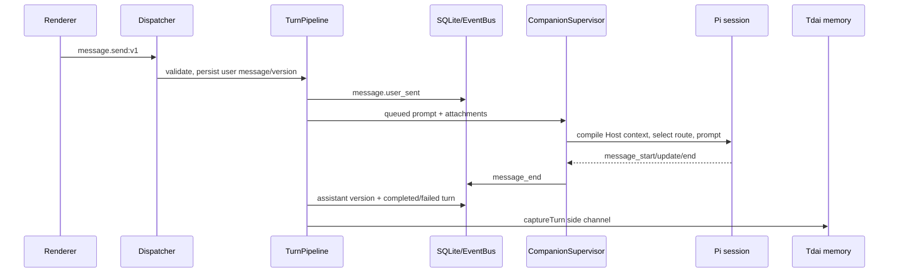

# Host runtime reference

## Responsibility and authority

`@bear-harness/host-runtime` is the instance-scoped host for a Companion character. It owns the canonical SQLite state, the RPC boundary used by renderers, the in-process Pi Companion session, provider/model selection, roleplay and character presentation state, memory integration, commission execution, artifacts, and event/audit projections. The package is private and is published to consumers through the package-root export in [`package.json`](../../packages/host-runtime/package.json).

Authority is deliberately split:

- **Host code is authoritative for application state.** `Dispatcher` validates protocol requests and responses; `composition.ts` maps RPC endpoints to domain services; the Companion can only call the allowlisted Host tools installed by the supervisor. The supervisor does not enable built-in filesystem, shell, edit, or write tools ([`supervisor.ts`](../../packages/host-runtime/src/companion/supervisor.ts)).
- **The character package is authoritative for declarations.** `CharacterLoader` supplies valid scenes, expressions, roleplay events, media, choice sets, skills, and plugin trust. The host rejects scene, expression, roleplay-event, media, or choice IDs not declared by that package.
- **The model is authoritative only for model output and explicit model tool requests.** A model may request an allowlisted scene/expression/media/choice/tool action, but the Host validates and persists the resulting state or rejects it.
- **The user is authoritative at explicit approval boundaries.** Work proposals become commissions and cannot launch until the exact draft hash is approved. Assistant-suggested memory becomes a candidate requiring a user decision; direct user capture goes to the memory backend.
- **Executors are workers, not state authorities.** `CommissionService` accepts executor events, validates them against the run state machine, then persists evidence/status and publishes events.

## Public entrypoints and exports

The package root [`src/index.ts`](../../packages/host-runtime/src/index.ts) exports:

- `HostRuntime`, `createHostRuntime`, `HostRuntimeOptions`, and `RuntimeProductConfig` for construction and lifecycle.
- `Dispatcher`, `RpcError`, `RpcHandler`, and `RpcResponse` for protocol dispatch.
- Character and Companion services/types (`CharacterLoader`, `CharacterBehaviorService`, `CompanionSupervisor`, `FirstMeetingMachine`, and `TurnPipeline`), plus their exported character, host-tool, onboarding, runtime-state, and turn contracts. `RoleplayService` itself is an internal composition dependency rather than a package-root export.
- `CommissionService`, `ArtifactStore`, `FileOpsService`, materials/codec services, and executor adapters/router.
- `MemoryBackend` contracts, `ModelRegistry`, `ProviderCatalog`, and the credential boundary (`CredentialStore`, `CredentialVault`).
- Diagnostics/trace contracts and factories, including `createDiagnostics`.
- `Database`, `EventBus`, `HostEvent`, and event listener types.

The export map exposes only built `dist/index.js`/`dist/index.d.ts`; source files are not package-root API. Services that are exported but are not wired to RPC (for example materials and file operations) are direct host-side extension APIs, not renderer channels.

## Construction and dependency composition

`new HostRuntime(options)` and `createHostRuntime(options)` are equivalent (`createHostRuntime` simply calls the constructor). Required options are:

- `dataDir`: root for `storage`, `artifacts`, `companion-runtime`, and session files.
- `characterRoot`: injected directory containing `<characterId>/character.yaml` packages.
- `productConfig.defaultCharacterId`.
- `credentialVault`: platform encryption boundary passed to `CredentialStore`.

Optional options are `protocolViolationMode` (`throw` or `isolate`), `memoryScope`, partial Tdai configuration, Electron/system proxy resolution, an artifact custom-scheme URL factory, a desktop update service, protected deletion roots, remote moderation settings, audit directory, and logger. `BEAR_CONFIG_DIR`, when set, overrides the injected `characterRoot` for compatibility with the legacy loader.

Construction does the following in [`runtime.ts`](../../packages/host-runtime/src/runtime.ts):

1. Opens one `Database` at `<dataDir>/storage`, applies `MIGRATIONS`, and asserts the schema contract before creating dependent services.
2. Creates the `EventBus`, content-addressed `ArtifactStore`, credential-backed `ProviderCatalog`, `CharacterLoader`, `ConversationRepository`, `CompanionSupervisor`, roleplay/draft/behavior services, story/canon services, onboarding/settings/model services, and the Tdai-backed memory runtime.
3. Builds `TurnPipeline` and registers an `onTurnCommitted` side channel. Capture failures publish `diagnostics.memory_capture_failed` and do not block an already-persisted reply.
4. Builds `ContextPackCompiler`, which combines package/canon context, memory backend recall, and best-effort system context; the supervisor uses it before prompting Pi.
5. Seeds the Pi ACP profile, registers the `product-managed` (`PiAcpAdapter`) and `codex` (`CodexAdapter`) executor controllers, and constructs `CommissionService` over the executor router.
6. Installs the supervisor Host-tool handler. History/canon/memory/work proposals are handled in `HostRuntime`/composition; character UI and roleplay tools are delegated to `CharacterBehaviorService`.
7. Constructs hash-chained `AuditStore` and deterministic-plus-optional-remote `ModerationService`, then starts event-to-audit wiring immediately. Filesystem deletion protection is intentionally deferred to `start()`.
8. Creates `Dispatcher` with request/response validation policy and a protocol-violation callback that publishes `diagnostics.protocol_violation`, then calls `wireHostHandlers` to register all RPC handlers.

The composition object in [`composition.ts`](../../packages/host-runtime/src/composition.ts) is the explicit dependency seam. It contains the ORM, event bus, onboarding, turn pipeline, models/settings, memory scope/backend, commission/artifact/story/canon services, supervisor/provider/character services, draft and roleplay services, default character ID, conversation session directory, and optional artifact URL/update/audit integrations.

## Lifecycle

### Construction

Construction is synchronous apart from the services' later lazy/async work. Database migrations and schema assertion happen during construction. Character seeding is triggered by `wireHostHandlers`, so a missing default/active package can fail construction while handlers are being registered.

### `start()`

`HostRuntime.start()` is transactional and retry-safe. It:

1. Loads persisted proxy settings and applies non-direct proxy configuration before host network activity.
2. Subscribes to `settings.changed` for live proxy re-application.
3. Installs warn-only filesystem deletion sentinels for protected roots and schedules best-effort audit retention pruning.
4. Starts Tdai memory, optionally warms a local embedding model, resolves the active character, checks plugin trust, configures validated Pi resources, and starts the supervisor.
5. Marks the runtime started only after every step succeeds. A failed attempt rolls back the supervisor bridge, filesystem sentinels, proxy subscription, and owned `HF_ENDPOINT`; memory remains available for a retry and is closed by terminal `close()`.

The supervisor's `start()` marks the Companion running and installs an owner-tagged global `bearHostCall` bridge; Pi sessions are initialized lazily on the first prompt. `stop()` removes or restores only the bridge owned by that supervisor, preserving a newer instance's bridge. Character activation, plugin-trust confirmation, and draft publishing stop and restart the supervisor after updating the runtime configuration. Character import only installs/seeds the package. Provider custom-upsert, Pi-config import, and base-URL override also stop and restart the supervisor; API-key, OAuth, and logout operations do not.

### `close()`

`close()` closes the memory runtime, then (once) stops the supervisor, uninstalls filesystem protection, unsubscribes audit/turn/story/proxy listeners, restores an owned `HF_ENDPOINT`, disposes character behavior/provider resources, and closes the database. It is terminal teardown; a failed `start()` is the supported path for retrying before `close()`.

## RPC composition and error boundary

`wireHostHandlers(dispatcher, context)` registers the protocol endpoint groups in the following owning areas:

| RPC area | Owning service/handler |
| --- | --- |
| `character.*` | `CharacterLoader`, `CharacterDraftService`, canon sync, supervisor restart, plugin trust |
| `roleplay.*` | `RoleplayService` and `CharacterBehaviorService` |
| `onboarding.*` | `FirstMeetingMachine` |
| `conversation.*`, `message.*` | `ConversationRepository`, `TurnPipeline` |
| `memory.*` | `MemoryBackend`, SQLite candidate/decision/presentation tables, capture helpers |
| `story.*`, `canon.*` | `StoryService`, `CanonHubService` |
| `provider.*` | `ProviderCatalog` and credential store |
| `model.*` | `ModelRegistry` |
| `commission.*`, `run.*` | `CommissionService` and `ExecutorRouter` |
| `artifact.*` | `ArtifactStore` and optional renderer URL factory |
| `settings.*` | `AppSettingsStore`, onboarding decisions, event bus |
| `update.check` | optional host-shell update service |
| `audit.*` | optional `AuditStore` read/export |
| `events.subscribe`, `snapshot.get` | `EventBus` and composed services |

The dispatcher first looks up the shared protocol contract, rejects unknown or unregistered channels as `handler_not_registered`, validates request bodies as `invalid_request/request_validation_failed`, invokes the handler, and validates response data. Domain exceptions are converted to `{ ok: false, error: { kind, reason } }`. Response schema violations either throw (development/default) or return `internal/response_validation_failed` (`isolate` mode), while always invoking the diagnostic callback.

The composition handlers also apply ownership checks. Most character-scoped operations resolve the active companion from the singleton `active_character` row and seed it if necessary. Conversation operations require the active companion ID. History search requires onboarding's `conversation_history_read_enabled` decision and excludes the current conversation. Memory capture verifies conversation ownership and, for Pi entries, resolves the entry from the current session rather than trusting an arbitrary entry ID.

## Conversation and turn pipeline

The persisted conversation projection is intentionally separate from Pi session storage:

- `conversations` belongs to a companion and stores title/scene/archive timestamps.
- `conversation_sessions` maps a conversation to a Pi session ID/file and active leaf.
- `branches` tracks adopted/forked narrative branches.
- `messages` is a minimal Host projection with `user`, `assistant`, or `system` role.
- `message_versions` stores content and adopted/user-edited state.
- `turns` links user and assistant messages and constrains status to `pending`, `streaming`, `completed`, `failed`, or `aborted`.
- `scene_state` and `conversation_directives` hold presentation and correction context.

A normal `message.send` path is:



`TurnPipeline` enforces one active turn per conversation and requires a running supervisor. It transactionally writes the user message/version before sending the prompt and returns an asynchronous receipt. `CompanionSupervisor` serializes prompts, initializes one session per conversation, chooses the configured model, compacts when needed, compiles context, and streams updates. If an image route differs from the main route, it uses a multimodal model to produce an explicitly untrusted image observation and removes the image from the main prompt.

On `message_end`, the pipeline projects the latest assistant text into the Host message/version tables, inserts a completed or failed turn, updates the conversation, publishes `message.assistant_committed`, and invokes the Tdai capture sink. Abort, regenerate, version switch, edit, continue, correction, and branch operations are explicit pipeline transitions; user edits create a new branch, while assistant edits create an adopted user-edited version.

## Character, roleplay, and presentation authority

Character package install/activation/publish is handled by `CharacterLoader` and draft services. The active package is persisted through `active_character`; package identity/canon and trust metadata are represented by `companion_packages` and `companion_identity`. Activation and plugin trust confirmation restart the supervisor with `piResources(character, trust.trusted)`. Skills remain declarative context; executable plugins require current package trust.

There are two intentionally different presentation paths:

### Host lifecycle reactions (not model decisions)

`CharacterBehaviorService` subscribes to the EventBus at construction. For package-declared `host.event_reactions`, events such as `message.user_sent`, `message_end`, abort, and assistant commit cause deterministic Host-side expression updates. The service validates the package expression, persists `scene_state`, and publishes `character.visual_state_changed`. A model-selected or roleplay expression suppresses the mapped successful `message_end` reaction for the current turn only: a successful end consumes the marker and skips `result_ready` once, a failed end consumes it without applying `result_ready`, and `message.aborted` consumes it before applying the configured abort reaction. Later lifecycle events use their normal mappings.

These reactions are coupled to Host lifecycle events and cannot be selected by an untrusted renderer or arbitrary model text. They are visual state only; they do not imply that a scene/media tool was called.

### Model-decided scene/media/choice tools

The supervisor injects allowlisted `host_get_state`, `host_set_scene`, `host_set_expression`, `host_get_roleplay_state`, `host_trigger_roleplay_event`, `host_play_media`, and `host_present_choices` tools. A model may call them explicitly. The Host validates scene/expression IDs against the active package; media and choice IDs against roleplay declarations; locked media against the roleplay projection; and persists/publishes the resulting state/event. `host_play_media` presents declared media but does not itself change `scene_state`. `host_trigger_roleplay_event` queues an event and commits its declared effects only with the completed assistant reply; direct `roleplay.trigger:v1` is a user-driven canonical-branch operation and applies immediately.

Roleplay persistence uses `roleplay_events` (event ID, branch/conversation/source version, effects) and `roleplay_unlocks` (companion/unlockable primary key). User roleplay triggers are restricted to the adopted `main` branch. The model cannot directly write these tables or invent package declarations.

## Commission, run, permission, and artifact flow

A model's `host_propose_work` call requires a real trigger user message. The handler creates a draft through `CommissionService`; it does not launch work. The commission table records the draft JSON, trigger, status, and approval hash. Approval stores the exact hash in `approvals`; only the approved draft can launch a run. `CommissionService` enforces the run FSM and active-run limit, and publishes transitions after canonical DB writes.

The RPC flow is:

1. `commission.draft` or model `host_propose_work` validates the trigger message and hashes canonical draft fields (`reads`, `writes`, `networkAllowed`, `toolNames`, title, description).
2. `commission.approve` requires the exact displayed hash; `reject` moves an eligible draft to a terminal rejection/cancel path.
3. `commission.launch` creates/enqueues a run for an executor profile. `ExecutorRouter` resolves the persisted profile row, checks its profile type, and associates it with trusted registered controller code.
4. Executor events (`started`, evidence, `needs_user`, completed, failed, cancelled) are accepted by `CommissionService`, which validates state, persists evidence/run state, and emits events. Permission requests become `needs_user` and are answered with `run.respondPermission`; steering, interrupt, resume, and cancel are separate run controls.
5. On completion, declared write paths are scanned with file/symlink/size/count limits; valid files enter the content-addressed `ArtifactStore`, are hash/MIME/size checked, marked verified, and linked to the run. `artifact.list/read/url` expose metadata, base64 content, or a renderer custom-scheme URL after Host-side lookup. The artifact URL factory is absent on web-like hosts, so `artifact.url` returns an empty URL rather than fabricating one.

Schema tables `commissions`, `approvals`, `runs`, `run_manifests`, `evidence`, `artifacts`, and `artifact_adoptions` make this boundary inspectable and preserve relationships through foreign keys. The executor never directly changes Host status or evidence.

## Memory and Tdai integration

`HostRuntime` creates `TencentDbRuntime` using the configured default character, installation/user memory scope, provider/model services, and merged embedding configuration. Persisted `app_settings.memory_vector_service` overrides/extends the injected Tdai config:

- disabled/`none` leaves the base configuration unchanged;
- local selects built-in model paths for `bge-base-zh`/`multilingual-e5`, accepts a trimmed custom path, or lets Tdai choose its default;
- remote supplies base URL, API key, model, and dimensions.

`ContextPackCompiler` uses the memory backend for turn context and best-effort system context. `onTurnCommitted` sends user/assistant text plus session metadata to `captureTurn`; errors are diagnostic-only. RPC search/list/forget/edit operate against the scoped backend. Memory scope includes installation, user, and active companion IDs.

Explicit user capture (`memory.capture`) resolves a current Pi branch entry, with a legacy adopted Host version fallback, then writes provenance (`explicit` for user capture, `inferred` for assistant tool) and metadata to the backend. Assistant `host_remember` creates a pending SQLite candidate instead of silently creating relationship memory. Approve/reject writes `memory_decisions`; approval writes `relationship_memory_entries` and also the backend. `memory_presentation` supplies per-installation/user/companion pin/exclude/replacement overlays for backend records.

## Providers and model routing

`ProviderCatalog` is the host wrapper around pi-ai's `ModelRuntime`. It lazily creates the runtime under `<dataDir>/companion-runtime`, loads encrypted credentials through `CredentialStore`, applies provider filtering, and exposes provider listing, API-key/session credentials, custom providers/base URLs, and OAuth interactions. Provider configuration changes restart the supervisor in the composition handlers.

`ModelRegistry` persists enabled models in `configured_models`, model defaults per companion in `model_route_settings`, and per-conversation selections in `conversation_model_selections`. `model.enable` verifies the provider catalog's model and records image capability; manual vision routes require an image-capable model. The supervisor asks the registry for the route separately for text and image-required prompts, then selects an available pi-ai model. A route may fall back to an already selected/first available model if the configured route is unavailable.

## Persistence, events, snapshot, audit, and security

The schema in [`storage/schema.ts`](../../packages/host-runtime/src/storage/schema.ts) is the persistence map for the host. In addition to conversation/turn, character, memory, commission, executor, artifact, provider/model, story/canon, onboarding, and roleplay tables, `schema_migrations` records applied migration checksums and `app_settings` is a singleton row.

`EventBus` writes each event to `events` before notifying listeners, maintains a monotonically increasing sequence, supports `afterSeq` replay, and is the source for `events.subscribe:v1`. `snapshot.get:v1` composes the active character, onboarding, conversations, roleplay, character runtime state, commissions, artifacts, story changes, model pool/routes, settings, and current event sequence. Persisted scene state is parsed and checked against the active package's allowed scene/expression IDs before it enters the snapshot.

Audit wiring appends commission/run/permission/fs-operation/memory/config events to a hash-chained JSONL store. `audit.list` and `audit.export` expose entries/chain verification. `start()` installs warn-only protected-root deletion sentinels and prunes audit segments best-effort. Moderation is created with local rules plus an optional remote policy; remote moderation failures are configured to fail open. Provider credentials remain behind the injected `CredentialVault`; API keys are not taken from ambient environment in `ProviderCatalog`.

Network proxy settings are persisted and applied before non-direct host traffic. A `systemProxyResolver` can supply Electron PAC-aware resolution; settings changes hot-reload the proxy. `update.check:v1` delegates to the optional host-shell update service and returns a disabled response when absent. No package-global update download/install authority is implemented here.

## Extension seams

- Implement `CredentialVault` to bind provider credentials to the platform secure-storage boundary.
- Supply `systemProxyResolver`, `artifactProtocolUrlFactory`, `updateService`, audit logger, moderation endpoint, or custom `memoryConfig` at construction.
- Add executor controller implementations through `ExecutorRouter.register`; persisted profile rows remain the profile authority.
- Provide a `CompanionModelRuntimeSource`/provider catalog implementation compatible with pi-ai's `Models` interface.
- Add character package scenes, expressions, skills, roleplay events/media/choice sets, canon, and trusted plugins through the character/package services rather than bypassing Host tables.
- Use `HostCompositionContext` and `wireHostHandlers` to add a protocol endpoint only when the shared protocol contract and response validation are also updated.
- Subscribe to EventBus or implement `EventListener` for projections; use sequence replay and snapshots rather than assuming listeners never miss events.

## Known issues / findings

These are implementation findings, not proposed behavior:

1. **Resolved: `start()` is retry-safe after a partial failure.** `HostRuntime.start()` commits `started` only after all startup work succeeds and rolls back its subscriptions, filesystem sentinels, supervisor bridge, and owned process environment on failure.
2. **Resolved: turn capture uses the current active character namespace.** The `onTurnCommitted` sink resolves `CharacterLoader.getActiveCharacterId(...)` when a turn settles, so capture follows the active companion instead of freezing the product default.
3. **Approved memory scope is persisted inconsistently.** `RPC.memory.candidateApprove` writes `relationshipMemoryEntries.scope` from `candidate.suggestedScope` but records the backend memory metadata from `decidedScope ?? candidate.suggestedScope`. An edited user scope can disagree between SQLite relationship memory and Tdai recall metadata.
4. **Candidate rejection does not verify ownership/existence before writing its decision.** `memory.candidateReject` updates only rows matching the active companion and pending status, but then unconditionally inserts a `memory_decisions` row for the supplied ID. A nonexistent, already-decided, or other-companion ID can produce an orphan decision rather than a not-found/conflict response.
5. **Commission/run listing is not active-companion scoped in composition.** `commission.list` calls `s.commissions.list()` without filtering by `getCompanionId`; `run.list` selects the newest ten rows from `runs` without joining through a conversation/active companion. In a runtime containing multiple character packages, these RPCs can expose records outside the active character boundary. `snapshot.get` similarly projects all listed commissions and artifacts. The service-level approval/launch checks remain the authoritative mutation boundary, but list/read visibility is broader than other character-scoped handlers.
6. **Executor profile contracts disagree.** [`executors/router.ts`](../../packages/host-runtime/src/executors/router.ts) accepts the profile type `native-full` in `ExecutorProfileType`/`PROFILE_TYPES`, while [`storage/schema.ts`](../../packages/host-runtime/src/storage/schema.ts) constrains `executor_profiles.profile_type` to `product-managed` or `codex`, and `HostRuntime` registers only those two controllers. `native-full` cannot currently be represented by the declared SQLite contract.
7. **Resolved: model-selected-expression suppression is current-turn state.** `CharacterBehaviorService` consumes the marker on every `message_end`; successful ends skip the mapped reaction once, failed ends clear the marker without applying `result_ready`, and aborts clear it before applying their configured reaction.
8. **Resolved: process-global ownership is bounded to runtime lifetime.** `CompanionSupervisor` tags its bridge with a unique owner token and restores/removes only its own bridge. `HostRuntime` restores `HF_ENDPOINT` only when its owned value is still installed, while preserving newer runtime owners.
10. **Resolved: moderation timeout coverage uses scheduler-independent behavior.** The timeout test advances Vitest fake timers and asserts the expected fail-open result instead of imposing an exact wall-clock lower bound.

## Verification commands and test strategy

The package manifest provides these commands (run from the repository root):

```sh
npm --prefix packages/host-runtime run typecheck
npm --prefix packages/host-runtime run build
npm --prefix packages/host-runtime run test:unit
npm --prefix packages/host-runtime run test:coverage
```

`test:unit` and `test:coverage` first build `packages/protocol`, then invoke Vitest. The existing tests are organized around the observable boundaries this module owns: dispatcher and database contracts, conversation/turn/companion runtime, character loader/behavior/onboarding/roleplay/continuity, memory context and TencentDB backends, provider credentials/custom providers/model registry, executor controls/adapters/IPC schemas, commissions, artifact and filesystem security, moderation/network proxy, and diagnostics/audit/trace. Focused checks for a change should exercise the RPC envelope plus the persisted event/snapshot transition; executor changes should additionally exercise permission and terminal FSM states; character changes should cover package allowlists and the distinction between event reactions and model tools.

`db:generate` is available as a schema migration-generation command, not a substitute for runtime verification:

```sh
npm --prefix packages/host-runtime run db:generate
```
