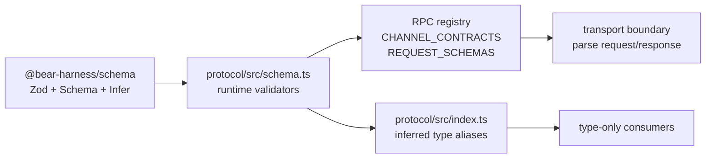

# Protocol and schema reference

This document describes the wire contract implemented by [`@bear-harness/protocol`](../../packages/protocol/) and the small shared schema utility package [`@bear-harness/schema`](../../packages/schema/). The spelling of this directory (`refernece`) is intentional and is part of the requested path.

## Scope and source of truth

`packages/protocol/src/schema.ts` is the runtime source of truth for the Host RPC contract. It defines Zod validators for requests, response payloads, events, snapshots, and domain values. The module is transport-neutral: it imports only `Schema` and `z` from `@bear-harness/schema` and does not use Electron, DOM, or Node APIs.

`packages/protocol/src/index.ts` is a type-only facade. It imports both dependencies with `import type`, and re-exports `z.infer<typeof schema.X>` aliases. Its own module-level comment explicitly says that schema.ts owns the contract and index.ts mirrors it. A type-only consumer should use `@bear-harness/protocol`; a runtime validator consumer should use the `@bear-harness/protocol/schema` subpath.

The layering is therefore:



Do not create a second hand-written interface for a wire shape. Add or change the Zod schema, then update the type facade when the type is meant to be public.

## Shared schema package

[`packages/schema/src/index.ts`](../../packages/schema/src/index.ts) intentionally has a very small API:

- `z`: the Zod 4 namespace, re-exported for package consumers.
- `Schema`: `z.ZodType`, a generic schema constraint used by protocol helpers.
- `Infer<T extends Schema>`: a convenience alias for `z.infer<T>`.
- `toJsonSchema(schema)`: converts a Zod schema to a Draft 2020-12 JSON Schema via `z.toJSONSchema(schema, { target: "draft-2020-12" })`.

It has no application/domain contracts. Its only runtime dependency is `zod` 4.4.3. Keeping this package small lets other packages share Zod and JSON-schema conversion without importing the protocol registry or domain-specific validators.

## Runtime and public exports

`@bear-harness/protocol` exports declarations from `dist/index.d.ts` and an import target of `dist/index.js`; `@bear-harness/protocol/schema` exports the corresponding `dist/schema.d.ts` and `dist/schema.js`. The root index is intended to erase to an empty runtime module because all of its imports and exports are type-only. Runtime users must not expect `RPC`, schema factories, or `z` from the package root.

The protocol facade exports selected inferred aliases for the shared envelopes, RPC helper types, events, snapshots, onboarding/character, conversation/message, memory/canon/story, provider/model, commission/run, artifact, and settings domains. It does not mirror every runtime schema; the missing aliases are called out in the findings below. It also exports `RequestSchemaRegistry`, `Channel`, `AnyRpcEndpoint`, `DeclaredRpcEndpoint`, `RequestOf`, `ResponseOf`, and `EnvelopeOf`.

`IpcError` is the one notable manually written facade interface (`kind` plus `reason`); it mirrors the fields in `IpcResponse` but is not itself declared as `z.infer`. Keep it synchronized if the error body changes.

## RPC endpoint registry

### Shape and lookup

An endpoint is created by the local `endpoint(channel, request, response)` helper and has:

```ts
{
  kind: "rpc",
  channel: `${string}:v1`,
  request: Schema,
  response: Schema
}
```

`RPC` is a nested `as const` object. Its tree is the authoritative runtime and type-level registry; business code should use a typed path such as `RPC.message.send`, not reconstruct a channel string. `DeclaredRpcEndpoint` recursively extracts endpoint leaves from that tree. `RequestOf<E>` and `ResponseOf<E>` infer the request and response payload from an endpoint, while `EnvelopeOf<E>` wraps the response in `IpcEnvelope` for callers that model transport responses.

`flattenRpc` recursively walks object values. An object with `kind === "rpc"` is recorded by its channel; other objects are traversed. Duplicate channels throw immediately. `CHANNEL_CONTRACTS` is an immutable (`Object.freeze`) channel-to-endpoint lookup for inbound transport validation. `REQUEST_SCHEMAS` is an immutable compatibility view derived from `CHANNEL_CONTRACTS`, containing only channel-to-request-schema entries. It is not a response registry and does not replace `CHANNEL_CONTRACTS`.

### Current endpoint inventory

The request and response names below are the actual schemas wired into `RPC`.

| Group | Endpoints |
| --- | --- |
| Snapshot/events | `snapshot.get` (`SnapshotGetRequest` → `SnapshotResponse`); `events.subscribe` (`EventSubscribeRequest` → `EventSubscribeResponse`) |
| Character | `character.get` (`CharacterGetRequest` → `CharacterResponse`); `character.list` (`CharacterListRequest` → `CharacterListResponse`); `character.activate` (`CharacterActivateRequest` → `CharacterResponse`); `character.import` (`CharacterImportRequest` → `CharacterResponse`); `character.pluginTrustGet` (`CharacterPluginTrustGetRequest` → `CharacterPluginTrustResponse`); `character.pluginTrustConfirm` (`CharacterPluginTrustConfirmRequest` → `CharacterPluginTrustResponse`); `character.draftCreate` (`CharacterDraftCreateRequest` → `CharacterDraftResponse`); `character.draftGet` (`CharacterDraftGetRequest` → `CharacterDraftResponse`); `character.draftPatch` (`CharacterDraftPatchRequest` → `CharacterDraftResponse`); `character.draftUploadAssets` (`CharacterDraftUploadAssetsRequest` → `CharacterDraftResponse`); `character.draftListRevisions` (`CharacterDraftListRevisionsRequest` → `CharacterDraftListRevisionsResponse`); `character.draftRestoreRevision` (`CharacterDraftRestoreRevisionRequest` → `CharacterDraftResponse`); `character.draftValidate` (`CharacterDraftValidateRequest` → `CharacterDraftResponse`); `character.draftPublish` (`CharacterDraftPublishRequest` → `CharacterDraftPublishResponse`) |
| Roleplay/onboarding | `roleplay.get` (`RoleplayGetRequest` → `RoleplayResponse`); `roleplay.trigger` (`RoleplayTriggerRequest` → `RoleplayResponse`); `roleplay.reset-unlocks` (`RoleplayResetUnlocksRequest` → `EmptyResponse`); `onboarding.get` (`OnboardingGetRequest` → `OnboardingResponse`); `onboarding.submit` (`OnboardingSubmitRequest` → `OnboardingResponse`) |
| Conversation | `conversation.list` (`ConversationListRequest` → `ConversationListResponse`); `conversation.create` (`ConversationCreateRequest` → `ConversationCreateResponse`); `conversation.select` (`ConversationSelectRequest` → `ConversationSelectResponse`); `conversation.rename` (`ConversationRenameRequest` → `EmptyResponse`); `conversation.archive` (`ConversationArchiveRequest` → `EmptyResponse`); `conversation.delete` (`ConversationDeleteRequest` → `EmptyResponse`); `conversation.search` (`ConversationSearchRequest` → `ConversationSearchResponse`) |
| Message | `message.send` (`MessageSendRequest` → `MessageSendResponse`); `message.regenerate` (`MessageRegenerateRequest` → `MessageSendResponse`); `message.switchVersion` (`MessageSwitchVersionRequest` → `EmptyResponse`); `message.edit` (`MessageEditRequest` → `EmptyResponse`); `message.continue` (`MessageContinueRequest` → `EmptyResponse`); `message.correct` (`MessageCorrectRequest` → `EmptyResponse`); `message.branch` (`MessageBranchRequest` → `MessageBranchResponse`); `message.abort` (`MessageAbortRequest` → `EmptyResponse`) |
| Memory | `memory.search` (`MemorySearchRequest` → `MemorySearchResponse`); `memory.list` (`MemoryListRequest` → `MemoryListResponse`); `memory.capture` (`MemoryCaptureRequest` → `MemoryCaptureResponse`); `memory.forget` (`MemoryForgetRequest` → `EmptyResponse`); `memory.edit` (`MemoryEditRequest` → `EmptyResponse`); `memory.exclude` (`MemoryExcludeRequest` → `EmptyResponse`); `memory.candidates.list` (`MemoryCandidatesListRequest` → `MemoryCandidatesListResponse`); `memory.candidate.approve` (`MemoryCandidateApproveRequest` → `EmptyResponse`); `memory.candidate.reject` (`MemoryCandidateRejectRequest` → `EmptyResponse`) |
| Story/canon | `story.listChanges:v1` (`StoryListChangesRequest` → `StoryListChangesResponse`); `story.applyChange:v1` (`StoryApplyChangeRequest` → `StoryApplyChangeResponse`); `story.revertChange:v1` (`StoryRevertChangeRequest` → `EmptyResponse`); `story.reset:v1` (`StoryResetRequest` → `StoryResetResponse`); `story.listProposals:v1` (`StoryListProposalsRequest` → `StoryListProposalsResponse`); `story.resolveProposal:v1` (`StoryResolveProposalRequest` → `StoryResolveProposalResponse`). Canon provides `canon.listSources:v1` (`CanonListSourcesRequest` → `CanonListSourcesResponse`), `canon.addSource:v1` (`CanonAddSourceRequest` → `CanonAddSourceResponse`), `canon.search:v1` (`CanonSearchRequest` → `CanonSearchResponse`), `canon.removeSource:v1` (`CanonRemoveSourceRequest` → `EmptyResponse`), `canon.listModules:v1` (`CanonListModulesRequest` → `CanonListModulesResponse`), `canon.upsertModule:v1` (`CanonUpsertModuleRequest` → `CanonUpsertModuleResponse`), and `canon.deleteModule:v1` (`CanonDeleteModuleRequest` → `EmptyResponse`). |
| Provider | `provider.list:v1` (`ProviderListRequest` → `ProviderListResponse`); `provider.customUpsert:v1` (`ProviderCustomUpsertRequest` → `EmptyResponse`); `provider.importPiConfig:v1` (`ProviderImportPiConfigRequest` → `ProviderImportPiConfigResponse`); `provider.overrideBaseUrl:v1` (`ProviderOverrideBaseUrlRequest` → `EmptyResponse`); `provider.setApiKey:v1` (`ProviderSetApiKeyRequest` → `EmptyResponse`); `provider.login:v1` (`ProviderLoginRequest` → `ProviderLoginResponse`); `provider.loginStatus:v1` (`ProviderLoginStatusRequest` → `ProviderLoginResponse`); `provider.loginAnswer:v1` (`ProviderLoginAnswerRequest` → `ProviderLoginResponse`); `provider.logout:v1` (`ProviderLogoutRequest` → `EmptyResponse`) |
| Model | `model.pool.get:v1` (`ModelPoolGetRequest` → `ModelPoolGetResponse`); `model.enable:v1` (`ModelEnableRequest` → `ModelEnableResponse`); `model.disable:v1` (`ModelDisableRequest` → `EmptyResponse`); `model.defaults.get:v1` (`ModelDefaultsGetRequest` → `ModelDefaultsGetResponse`); `model.defaults.setReply:v1` (`ModelDefaultsSetReplyRequest` → `ModelDefaultsSetReplyResponse`); `model.defaults.setVision:v1` (`ModelDefaultsSetVisionRequest` → `ModelDefaultsSetVisionResponse`); `model.route.get:v1` (`ModelRouteGetRequest` → `ModelRouteGetResponse`); `model.route.set:v1` (`ModelRouteSetRequest` → `ModelRouteSetResponse`) |
| Commission/run | `commission.list:v1` (`CommissionListRequest` → `CommissionListResponse`); `commission.draft:v1` (`CommissionDraftRequest` → `CommissionDraftResponse`); `commission.approve:v1` (`CommissionApproveRequest` → `EmptyResponse`); `commission.reject:v1` (`CommissionRejectRequest` → `EmptyResponse`); `commission.launch:v1` (`CommissionLaunchRequest` → `CommissionLaunchResponse`); `run.list:v1` (`RunListRequest` → `RunListResponse`); `run.steer:v1` (`RunSteerRequest` → `EmptyResponse`); `run.interrupt:v1` (`RunInterruptRequest` → `RunResponse`); `run.resume:v1` (`RunResumeRequest` → `RunResponse`); `run.cancel:v1` (`RunCancelRequest` → `RunResponse`); `run.respondPermission:v1` (`RunRespondPermissionRequest` → `RunResponse`) |
| Artifact/settings/update/audit | `artifact.list:v1` (`ArtifactListRequest` → `ArtifactListResponse`); `artifact.read:v1` (`ArtifactReadRequest` → `ArtifactReadResponse`); `artifact.url:v1` (`ArtifactUrlRequest` → `ArtifactUrlResponse`); `settings.get:v1`/`settings.set:v1` (`SettingsGetRequest`/`SettingsSetRequest` → `SettingsResponse`); `update.check:v1` (`UpdateCheckRequest` → `UpdateCheckResponse`); `audit.list:v1` (`AuditListRequest` → `AuditListResponse`); `audit.export:v1` (`AuditExportRequest` → `AuditExportResponse`) |

Every channel literal in the registry ends in `:v1`; the exact spelling, including camel-cased segments such as `pluginTrustGet`, `respondPermission`, and `setReply`, is part of the wire contract.

### Safely adding or changing an RPC

1. Define or update the request and response Zod schemas in `packages/protocol/src/schema.ts`. Reuse shared IDs and bounded primitives rather than duplicating them.
2. Add one `endpoint("name:v1", RequestSchema, ResponseSchema)` leaf under the appropriate `RPC` group. The `:v1` template type and runtime duplicate check protect the channel registry.
3. Add inferred aliases to `packages/protocol/src/index.ts` for every new public request/response/domain type. Also add any omitted existing aliases needed by consumers; see findings below.
4. Decide whether the transport response is a success payload or `EmptyResponse`; the endpoint’s `response` is the payload schema, not the `IpcResponse` envelope.
5. Update both sides of any transport dispatch/handler table outside this package to use the exact registry channel and to parse with the endpoint’s request/response schemas. Do not hand-maintain a second channel list.
6. Preserve existing `:v1` shapes for compatible changes. A breaking rename, required field, enum removal, or incompatible response should use a new versioned channel rather than silently changing an existing v1 contract. The source provides the `:v1` convention but no migration layer.
7. Build the shared schema package before the protocol package in a clean checkout, then inspect emitted declarations/runtime output. The protocol package’s `file:../schema` dependency and package exports make the schema package’s `dist` output a prerequisite when package resolution is used.

## Envelopes and error boundary

`IpcResponse(data)` creates a strict discriminated union:

- success: `{ ok: true, data: <response payload> }`
- failure: `{ ok: false, error: { kind, reason } }`

`IpcErrorKind` is limited to `invalid_request`, `not_found`, `conflict`, `unavailable`, and `internal`. `reason` is a localizable string capped at 4096 characters. The schema source explicitly says wire errors must not expose raw paths, SQL, secrets, or provider error text. Handlers therefore need to map internal exceptions into these categories and safe reasons; Zod validation does not perform that mapping automatically.

`EmptyResponse` is a strict empty object and is used for command acknowledgements. The `RPC` registry stores the un-enveloped payload schema. The transport layer must apply/validate `IpcResponse` around the payload; `CHANNEL_CONTRACTS[channel].response` is not an envelope schema.

## Events and snapshots

`EventSeq` is a non-negative safe integer through `Number.MAX_SAFE_INTEGER`. `DomainEvent` contains `seq`, a `kind` string capped at 128 characters, and an unconstrained `payload: z.unknown()`. The source comment defines the lifecycle boundary: an event is published after the Host commits the state change. `events.subscribe` accepts an optional `afterSeq` cursor and returns at most 100 events.

`snapshot.get` accepts `{}`. `SnapshotResponse` carries a required `eventSeq` and optional projections for onboarding, character, conversation, memory, provider, model, commission, run, artifact, story, character runtime, roleplay, and settings. Optional sections allow a boot response to omit unavailable or irrelevant projections. The individual projections are bounded: for example, conversation messages use the same `Message` shape as conversation selection, model uses `ModelSnapshot`, and character runtime maps conversation IDs to `{ sceneId, visualState }`.

The snapshot cursor and event sequence are the ordering primitives exposed by this package; consumers should retain the returned `eventSeq` when coordinating subsequent event reads. The schema does not validate that a snapshot’s nested IDs and defaults cross-reference one another.

## CharacterDisplay and character authoring

`CharacterResponse` wraps a `CharacterDisplay`. The display contract is a complete UI-facing character projection:

- Identity and localization: `id`, non-empty bounded `name`, and `language`.
- `character`: subtitle, scene title, greeting, composer placeholder, correction labels, required `first_meeting` onboarding flow, and optional work-presentation labels.
- `theme`: radius values, named colors, and body/heading fonts.
- `scenes`: bounded scene list with IDs, labels, descriptions, and optional media backgrounds.
- `visual`: default scene/expression IDs, avatar URL, and expression URL/label records.
- `roleplay`: bounded variables, media, unlockables, and choice sets.

Onboarding is a discriminated flow of 1–12 `acknowledge`, `text`, or `choice` steps. IDs use the lower-case identifier pattern `[a-z][a-z0-9_]*`; copy is bounded to 4096 characters. Text steps carry answer keys and min/max lengths; choices require 2–12 values. Work labels are non-blank after trimming. Roleplay media accepts image, animation, audio, and video, but the refinement rejects `presentation: "ambient"` unless `kind: "audio"`. Media URLs are bounded strings (not URL objects), up to 20,000,000 characters; avatar/background/poster/caption fields use the same media URL bound.

Character authoring also has import, plugin trust, and revisioned draft contracts. Imports cap at 500 files; file paths cap at 512 characters and base64 content at 8,000,000. Draft patches carry `expectedRevision`, and a refinement requires 1–100 file entries. Asset uploads carry an expected revision and bounded MIME/base64 fields. Publish returns both the draft and the resulting `CharacterDisplay`.

## Domain contracts

### Conversation, message, memory, story, and canon

Conversation and branch/message IDs are non-empty strings capped at 64 characters. Conversation lists cap at 100 entries; search accepts a query up to 1000 characters and returns at most 8 hits. Messages allow up to 20 versions and 65,536 characters per content/text field. Sends allow at most 10 attachments, with each attachment’s base64 bounded using the exported 10 MiB attachment-byte-derived limit.

Memory entries expose scope (`self`, `relationship`, or `scene`), bounded text and timestamps, and finite importance. Direct capture requires a conversation ID and Pi session entry ID; capture responses identify the backend memory and creator (`user_capture` or `assistant_tool`). Search/list, forget, edit, exclusion, and candidate approval/rejection are separate contracts. Candidate statuses and source kinds are closed unions.

Story changes distinguish global/branch scope and explicit/event/confirmed sources. Proposals are conversation/branch-scoped and resolve to an optional change. Canon sources/chunks and modules support source ingestion, bounded search, hierarchical modules, and package/user origins; source content is capped at 1 MiB and module instructions at 16 KiB.

### Provider and configured model

`ProviderInfo` reports auth type, credential status, up to 1000 available models, cost data (including up to 20 tiers), and unavailable reasons. Login responses represent running, waiting-input, completed, or failed OAuth flow and may include auth/device URLs or prompts. API-key and custom-provider requests accept credential/base-URL material as bounded strings.

`ModelRoute` pairs provider/model IDs. Configured models add labels, provider name, image capability, and creation time. Defaults distinguish an optional reply route from vision `auto` or `manual` mode; conversation routes can be absent or selected. `ModelSnapshot` combines pool, defaults, and an optional conversation route. Enabling requires non-empty IDs, while the base `ModelRoute` validator used by disable only applies maximum lengths.

### Commission and run

`ActionDraft` describes a proposed operation with title/description, bounded read/write paths, network permission, tool names, and a hash. `Commission` tracks the trigger message, optional conversation, draft, and status from `draft` through approval/queue/run/needs-user/completed/failed/cancelled. Drafting accepts the action details; approval requires the commission ID and approved hash; launching requires an executor profile and returns run/commission/profile/status identifiers.

`Run` tracks commission, executor, status, and optional start/completion timestamps. Status includes `enqueued`, `running`, `needs_user`, `completed`, `failed`, `cancelled`, `interrupted`, and `forced_termination`. Steer/interrupt/resume/cancel/permission requests are run-ID based; steering is a bounded non-empty instruction and permission responses carry request and option IDs. Run lists are capped at 10.

### Artifact and settings

Artifacts expose logical name, MIME, byte count (safe integer through uint32 max), hash, lifecycle status, optional producer run, and creation time. Listing is bounded at 100; reading returns bounded base64 (64,000,000 characters); URL generation returns a bounded string and may be empty when the desktop custom-scheme handler is unavailable.

Settings contain relationship/conversation-history flags, proxy mode (`direct`, `auto`, `manual`) with optional URL/bypass list, vector-memory service configuration (`none`, `remote`, `local`, optional model/dimensions/local model/path/API key), and an optional model-download mirror endpoint. `settings.set` takes a patch object whose fields are optional but whose nested objects use the full strict nested shapes.

## Bounds, strictness, and security limits

The schema establishes a defensive baseline at the wire boundary:

- Most objects are `z.strictObject`, so unknown keys are rejected rather than silently accepted.
- Shared limits include 4096-character strings, 1024-character paths, arrays of 100, safe integers, and explicit attachment/file/artifact payload limits. Individual domains tighten these limits.
- IDs, enums, status values, and discriminated unions constrain the accepted vocabulary where the contract needs it.
- Error reasons are bounded and typed; internal diagnostic material must be removed before constructing an error envelope.
- Base64, provider credentials, proxy/vector URLs, and other sensitive or large values are accepted only within explicit size limits, but the schema does not encrypt, redact, authorize, or persist them.

Validation is necessary but not sufficient for security. In particular, path strings are length-bounded but are not checked for traversal or allowed roots; URL-like strings are length-bounded but are not parsed or restricted by scheme; `DomainEvent.payload` is deliberately `unknown`; and plugin trust fields are descriptive data, not an authorization decision. Those checks belong at the owning handler/storage boundary.

## Build, declaration, and compatibility workflow

Both packages use `tsc -p tsconfig.json` for `build` and `tsc -p tsconfig.json --noEmit` for `typecheck`. Both target ES2023 with NodeNext module/module resolution, compile `src/**/*.ts` from `rootDir: src` to `outDir: dist`, emit declarations, use strict checking, and preserve verbatim module syntax. Protocol additionally enables `noUncheckedIndexedAccess`, `forceConsistentCasingInFileNames`, and `composite`; schema has the same core strict/declaration settings without those three additional options.

The protocol package declares `@bear-harness/schema` as `file:../schema`. Because the package manifests resolve imports through each package’s `dist` export targets and neither package’s tsconfig declares a project reference, a clean build should produce schema `dist` before protocol `dist`. A schema source change can affect both runtime validators and generated declarations consumed by protocol. Do not commit a hand-edited `dist` contract in place of rebuilding from `src`.

A focused verification sequence for a contract change is:

```sh
npm run build --workspace @bear-harness/schema
npm run build --workspace @bear-harness/protocol
npm run typecheck --workspace @bear-harness/schema
npm run typecheck --workspace @bear-harness/protocol
```

The build commands verify emitted JavaScript/declarations; the typecheck commands verify the source contract without emission. This reference intentionally does not prescribe a project-wide gate or formatter. When changing a boundary, also exercise the relevant runtime `safeParse` path or package consumer, especially for strict-object rejection, discriminated unions, and the registry lookup.

## Known issues / findings

These are concrete observations from the current source, not planned behavior:

1. **The type facade is incomplete relative to the runtime registry.** `schema.ts` and `RPC` expose character import/plugin-trust types, conversation rename/archive/delete/search types, memory exclusion/candidate types, canon request/response types, provider mutation/import types, update/audit types, and several run request types. `index.ts` does not re-export all of them. For example, it exports `RunSteerRequest`, `RunCancelRequest`, and `RunRespondPermissionRequest`, but not `RunInterruptRequest` or `RunResumeRequest`; it exports artifact response types but not `ArtifactReadRequest` or `ArtifactUrlRequest`. A consumer restricted to `@bear-harness/protocol` cannot name every registered endpoint’s request/response type without importing the runtime schema and applying `z.infer` itself.
2. **The envelope is not attached to endpoint entries.** `RPC.*.response` is the payload validator, while `IpcResponse` is a separate factory. A transport implementation that assumes the registry response validator accepts `{ok,data}` will validate the wrong shape. Conversely, `EnvelopeOf<E>` is only a TypeScript convenience and does not create a runtime envelope validator.
3. **Event payloads are not domain-validated here.** `DomainEvent.payload` is `z.unknown()`. Event kind-specific validation, if required, must be added at the producer/consumer boundary; the generic event subscription schema cannot catch malformed payloads.
4. **Cross-field consistency is mostly outside Zod.** `CharacterDisplay.visual.defaultSceneId` and `defaultExpressionId` are not checked against the corresponding records; unlockable `media` IDs and choice `event` IDs are not checked against declared media/events; roleplay variable `initial` is not checked against its declared `type`; and onboarding submission does not encode the selected step’s answer kind. Handlers or package validators must enforce these relationships if they are safety or correctness requirements.
5. **Several response/provider IDs allow empty strings.** `ProviderInfo.id`, `ProviderList`-related provider IDs, `ModelRoute.providerId`/`modelId`, and `Commission`/`Run`/`Artifact` identifiers use `.max(...)` without `.min(1)` in their base response schemas. Requests often add non-empty constraints, but response validation alone can still accept empty identifiers. Treat this as a contract weakness when adding consumers or tightening the schema.
6. **Sensitive and URL-like fields are shape-only.** Settings and provider schemas permit bounded API keys, proxy/vector URLs, custom base URLs, and import JSON. There is no URL scheme/host policy, secret redaction, or authorization check in this package. The error comment prohibits leaking secrets, but the schema itself cannot enforce that policy.
7. **Some collections and records have weaker bounds than the shared defaults.** For example, `z.record` fields such as visual expressions, expression labels, roleplay values, and character-runtime projections do not carry an explicit entry-count cap; `CharacterTheme` color/font strings are not given the common maximum. This is not necessarily a bug, but it is an important review point before accepting untrusted package data.
8. **Versioning is naming-only.** The `${string}:v1` endpoint constraint and channel strings communicate a version, but there is no migration, negotiation, or compatibility adapter in the protocol package. A breaking change must therefore be represented by a new channel/contract and coordinated consumers rather than relying on a runtime migration mechanism.
