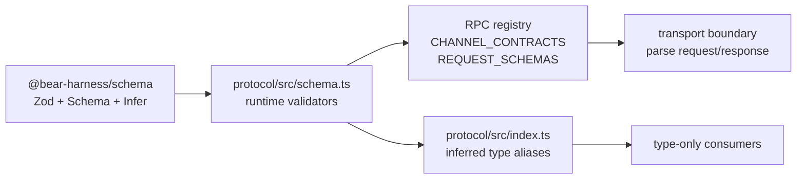

# Protocol and schema reference

This document describes the wire contract implemented by [`@bear-harness/protocol`](../../packages/protocol/) and the small shared schema utility package [`@bear-harness/schema`](../../packages/schema/). The spelling of this directory (`refernece`) is intentional and is part of the requested path.

## Scope and source of truth

`packages/protocol/src/schema.ts` is the runtime source of truth for the Host RPC contract. It defines Zod validators for requests, response payloads, events, snapshots, and domain values. The module is transport-neutral: it imports only `Schema` and `z` from `@bear-harness/schema` and does not use Electron, DOM, or Node APIs.

`packages/protocol/src/index.ts` is a type-only facade. It imports both dependencies with `import type`, and re-exports `z.infer<typeof schema.X>` aliases. Its own module-level comment explicitly says that schema.ts owns the contract and index.ts mirrors it. A type-only consumer should use `@bear-harness/protocol`; a runtime validator consumer should use the `@bear-harness/protocol/schema` subpath.

The layering is therefore:



Do not create a second hand-written interface for a wire shape. Add or change the Zod schema, then update the type facade when the type is meant to be public.

## Shared schema package

[`packages/schema/src/index.ts`](../../packages/schema/src/index.ts) intentionally has a very small API:

- `z`: the Zod 4 namespace, re-exported for package consumers.
- `Schema`: `z.ZodType`, a generic schema constraint used by protocol helpers.
- `Infer<T extends Schema>`: a convenience alias for `z.infer<T>`.
- `toJsonSchema(schema)`: converts a Zod schema to a Draft 2020-12 JSON Schema via `z.toJSONSchema(schema, { target: "draft-2020-12" })`.

It has no application/domain contracts. Its only runtime dependency is `zod` 4.4.3. Keeping this package small lets other packages share Zod and JSON-schema conversion without importing the protocol registry or domain-specific validators.

## Runtime and public exports

`@bear-harness/protocol` exports declarations from `dist/index.d.ts` and an import target of `dist/index.js`; `@bear-harness/protocol/schema` exports `dist/schema.d.ts` and `dist/schema.js`. The root index erases to an empty runtime module because its imports and exports are type-only. Runtime validators, `RPC`, `CHANNEL_CONTRACTS`, and `REQUEST_SCHEMAS` come from the `/schema` subpath.

The type facade mirrors the shared envelopes and RPC helpers plus the current onboarding/character, conversation/message/conversation-attachment, memory/canon, provider/model, external-agent/run, settings, update, and audit domains. It also exports `RequestSchemaRegistry`, `Channel`, `AnyRpcEndpoint`, `DeclaredRpcEndpoint`, `RequestOf`, `ResponseOf`, and `EnvelopeOf`.

`IpcError` is the one notable manually written facade interface (`kind` plus `reason`); it mirrors the failure body in `IpcResponse`.

## RPC endpoint registry

### Shape and lookup

An endpoint is created by the local `endpoint(channel, request, response)` helper and has:

```ts
{
  kind: "rpc",
  channel: `${string}:v1`,
  request: Schema,
  response: Schema
}
```

`RPC` is a nested `as const` object. Its tree is the authoritative runtime and type-level registry; business code should use a typed path such as `RPC.message.send`, not reconstruct a channel string. `DeclaredRpcEndpoint` recursively extracts endpoint leaves from that tree. `RequestOf<E>` and `ResponseOf<E>` infer the request and response payload from an endpoint, while `EnvelopeOf<E>` wraps the response in `IpcEnvelope` for callers that model transport responses.

`flattenRpc` recursively walks object values. An object with `kind === "rpc"` is recorded by its channel; other objects are traversed. Duplicate channels throw immediately. `CHANNEL_CONTRACTS` is an immutable (`Object.freeze`) channel-to-endpoint lookup for inbound transport validation. `REQUEST_SCHEMAS` is an immutable compatibility view derived from `CHANNEL_CONTRACTS`, containing only channel-to-request-schema entries. It is not a response registry and does not replace `CHANNEL_CONTRACTS`.

### Current endpoint inventory

The current top-level groups and client leaf names are:

| Group | Client leaves |
| --- | --- |
| `snapshot` | `get` → `snapshot.get:v1` |
| `character` | `get`, `list`, `activate`, `packageGet`, `packageUpdate`, `import`, `pluginTrustGet`, `pluginTrustConfirm`, `draftCreate`, `draftGet`, `draftPatch`, `draftUploadAssets`, `draftListRevisions`, `draftRestoreRevision`, `draftValidate`, `draftPublish` |
| `roleplay` | `get`, `trigger`, `dismissMedia`, `resetUnlocks` |
| `events` / `onboarding` | `events.subscribe`; `onboarding.get`, `onboarding.submit` |
| `conversation` | `list`, `create`, `select`, `activeGet`, `rename`, `archive`, `delete`, `search` |
| `conversationAttachment` | `list` → `conversationAttachment.list:v1`; `discard` → `conversationAttachment.discard:v1`; `read` → `conversationAttachment.read:v1`; `url` → `conversationAttachment.url:v1`; `startUpload`, `cancelUpload`, `appendChunk`, `completeUpload` use the same exact camel-cased channel segment |
| `message` | `send`, `regenerate`, `switchVersion`, `edit`, `continue`, `correct`, `branch`, `abort` |
| `memory` | `search`, `list`, `capture`, `forget`, `edit`, `exclude`, `configureLocalEmbedding`, `candidatesList`, `candidateApprove`, `candidateReject` |
| `canon` | `listSources`, `addSource`, `search`, `removeSource`, `listModules`, `upsertModule`, `deleteModule` |
| `provider` | `list`, `customUpsert`, `importPiConfig`, `overrideBaseUrl`, `setApiKey`, `login`, `loginStatus`, `loginCancel`, `loginAnswer`, `logout`, `remove` |
| `model` | `poolGet`, `enable`, `disable`, `defaultsGet`, `defaultsSetReply`, `defaultsSetVision`, `routeGet`, `routeSet` |
| `externalAgent` | `discoverCodex` → `externalAgent.discoverCodex:v1`; `connectCodex` → `externalAgent.connectCodex:v1`; `status` → `externalAgent.status:v1` |
| `run` | `list` → `run.list:v1`; `steer`, `interrupt`, `resume`, `cancel`, `respondPermission` use the same exact leaf segment |
| `settings` | `get`, `set`, `capabilitiesGet` |
| `update` / `audit` | `update.check`, `update.discard`, `update.apply`; `audit.list`, `audit.export` |

Client leaf names are not a general channel-construction rule: for example, `roleplay.resetUnlocks` maps to `roleplay.reset-unlocks:v1`, and nested memory/model channels use dotted segments. The exact channel literals in `RPC` are authoritative. There is no proposal/approval or renderer-file registry.

### Safely adding or changing an RPC

1. Define or update the request and response Zod schemas in `packages/protocol/src/schema.ts`. Reuse shared IDs and bounded primitives rather than duplicating them.
2. Add one `endpoint("name:v1", RequestSchema, ResponseSchema)` leaf under the appropriate `RPC` group. The `:v1` template type and runtime duplicate check protect the channel registry.
3. Add inferred aliases to `packages/protocol/src/index.ts` for every new public request/response/domain type. Also add any omitted existing aliases needed by consumers; see findings below.
4. Decide whether the transport response is a success payload or `EmptyResponse`; the endpoint’s `response` is the payload schema, not the `IpcResponse` envelope.
5. Update both sides of any transport dispatch/handler table outside this package to use the exact registry channel and to parse with the endpoint’s request/response schemas. Do not hand-maintain a second channel list.
6. Preserve existing `:v1` shapes for compatible changes. A breaking rename, required field, enum removal, or incompatible response should use a new versioned channel rather than silently changing an existing v1 contract. The source provides the `:v1` convention but no migration layer.
7. Build the shared schema package before the protocol package in a clean checkout, then inspect emitted declarations/runtime output. The protocol package’s `file:../schema` dependency and package exports make the schema package’s `dist` output a prerequisite when package resolution is used.

## Envelopes and error boundary

`IpcResponse(data)` creates a strict discriminated union:

- success: `{ ok: true, data: <response payload> }`
- failure: `{ ok: false, error: { kind, reason } }`

`IpcErrorKind` is limited to `invalid_request`, `not_found`, `conflict`, `unavailable`, and `internal`. `reason` is a localizable string capped at 4096 characters. The schema source explicitly says wire errors must not expose raw paths, SQL, secrets, or provider error text. Handlers therefore need to map internal exceptions into these categories and safe reasons; Zod validation does not perform that mapping automatically.

`EmptyResponse` is a strict empty object and is used for command acknowledgements. The `RPC` registry stores the un-enveloped payload schema. The transport layer must apply/validate `IpcResponse` around the payload; `CHANNEL_CONTRACTS[channel].response` is not an envelope schema.

## Events and snapshots

`EventSeq` is a non-negative safe integer through `Number.MAX_SAFE_INTEGER`. `DomainEvent` contains `seq`, a bounded `kind`, and bounded JSON `payload`. Known event kinds are validated against `EventPayloadSchemas` at publish and renderer-consumption time; unknown forward-compatible kinds remain bounded opaque events. An event is published after the Host commits the state change. `events.subscribe` accepts an optional `afterSeq` and returns at most 100 events.

`snapshot.get` accepts `{}`. `SnapshotResponse` carries required `eventSeq` and optional onboarding, character, conversation, memory, provider, model, run, character-runtime, roleplay, and settings projections. Conversation attachment summaries are carried by native Pi timeline message entries rather than by a separate snapshot projection.

The snapshot cursor and event sequence are the ordering primitives. Consumers retain `eventSeq`, ignore duplicate events, and refetch authoritative projections after a sequence gap.

## CharacterDisplay and character authoring

`CharacterResponse` wraps a `CharacterDisplay`. The display contract is a complete UI-facing character projection:

- Identity and localization: `id`, non-empty bounded `name`, and `language`.
- `character`: subtitle, scene title, greeting, composer placeholder, correction labels, required `first_meeting` onboarding flow, and optional work-presentation labels.
- `theme`: radius values, named colors, and body/heading fonts.
- `scenes`: bounded scene list with IDs, labels, descriptions, and optional media backgrounds.
- `visual`: default scene/expression IDs, avatar URL, and expression URL/label records.
- `roleplay`: bounded variables, media, unlockables, and choice sets.

Onboarding is a discriminated flow of 1–12 `acknowledge`, `text`, or `choice` steps. IDs use the lower-case identifier pattern `[a-z][a-z0-9_]*`; copy is bounded to 4096 characters. Text steps carry answer keys and min/max lengths; choices require 2–12 values. Work labels are non-blank after trimming. Roleplay media accepts image, animation, audio, and video, but the refinement rejects `presentation: "ambient"` unless `kind: "audio"`. Media URLs are bounded strings (not URL objects), up to 20,000,000 characters; avatar/background/poster/caption fields use the same media URL bound.

Character authoring also has import, plugin trust, and revisioned draft contracts. Imports cap at 500 files; file paths cap at 512 characters and base64 content at 8,000,000. Draft patches carry `expectedRevision`, and a refinement requires 1–100 file entries. Asset uploads carry an expected revision and bounded MIME/base64 fields. Publish returns both the draft and the resulting `CharacterDisplay`.

## Domain contracts

### Conversation, message, attachments, memory, and canon

Conversation IDs are non-empty bounded strings. The active conversation response is the direct native Pi projection: `piSessionId`, a bounded `PiTimeline`, `PiLiveState`, and conversation metadata. Timeline user and assistant entries may carry up to ten `ConversationAttachmentSummary` values.

Attachments are immutable, conversation-scoped roots with kind `file`, `folder`, or `generated`, a bounded display name, byte count, file count, and optional originating Pi entry. `MessageSendRequest` sends `attachmentIds`, not bytes or renderer paths; text may be empty only when at least one ID is present. A Host send nonce makes each unbound draft single-use, and accepted attachments are bound to the persisted user entry.

`ConversationAttachmentReadRequest` is a strict union:

- semantic mode: `{ mode: "semantic", conversationId, attachmentId, relativePath?, query?, cursor? }`; `relativePath` and `query` are mutually exclusive;
- byte mode: `{ mode: "bytes", conversationId, attachmentId, relativePath?, offset, length }`; `length` is 1–1,048,576 bytes.

The response is the matching union. Semantic reads return bounded folder entries, extracted `content`, search `hits`, an error code, and/or an opaque `nextCursor`. Byte reads return `{ mode: "bytes", relativePath, mime, base64, nextOffset, eof }`. Callers must discriminate on `mode`; adding byte fields to a semantic request or semantic fields to a byte request is rejected. `conversationAttachment.url` separately requests an operation-scoped `preview` or `download` capability.

Chunked upload uses `startUpload` → one or more `appendChunk` calls → `completeUpload`, with `cancelUpload` for an abandoned session. The Host persists immutable CAS snapshots; desktop trusted imports may additionally retain an in-memory live-source grant for delegation, but that grant is not a wire field and disappears on restart.

Memory entries expose scope (`self`, `relationship`, or `scene`), bounded text and timestamps, and finite importance. Direct capture requires a conversation ID and Pi session entry ID; search/list, forget, edit, exclusion, local embedding setup, and candidate approval/rejection are separate contracts.

Canon sources/chunks and modules support bounded ingestion, search, hierarchical modules, and package/user origins.

### Provider and configured model

`ProviderInfo` reports auth type, credential status, up to 1000 available models, cost data (including up to 20 tiers), and unavailable reasons. Login responses represent running, waiting-input, completed, or failed OAuth flow and may include auth/device URLs or prompts. API-key and custom-provider requests accept credential/base-URL material as bounded strings.

`ModelRoute` pairs provider/model IDs. Configured models add labels, provider name, image capability, and creation time. Defaults distinguish an optional reply route from vision `auto` or `manual` mode; conversation routes can be absent or selected. `ModelSnapshot` combines pool, defaults, and an optional conversation route. Enabling requires non-empty IDs, while the base `ModelRoute` validator used by disable only applies maximum lengths.

### External agents and runs

There is no proposal or approval RPC. The role starts work directly through its Host `host_delegate_agent` tool with an agent (`pi` or `codex`), one to ten attachment IDs, an optional workspace attachment ID, and a bounded instruction. This tool calls `ExternalAgentRunService`; it is not a renderer-launch endpoint.

Pi is always available as profile `pi-default` and each delegation launches an independent native Pi ACP worker/session rather than reusing the conversational companion session. Codex is used only when explicitly selected and connected. `externalAgent.discoverCodex` reports candidate path, canonical path, version, SHA-256, and `usable | version_mismatch | not_found | rejected`; the current usable pin is `0.147.0`. `connectCodex` requires an exactly matching discovered canonical path/version/hash plus non-empty `codexHome` and returns `{ profileId, version, hash }`. `status` always reports Pi and returns either the connected Codex profile/version/hash or `no_codex_found`/`version_mismatch`. The Host re-verifies the pinned Codex version and binary hash at every launch.

`Run` contains conversation ID, trigger Pi entry ID, executor profile, title, status, and optional timestamps. Status is `enqueued`, `running`, `needs_user`, `completed`, `failed`, `cancelled`, `interrupted`, or `forced_termination`. The renderer-facing run RPCs only list and control an already-created run: steer, interrupt, resume, cancel, or answer a permission request. Run lists are capped at ten.

Selected desktop paths can remain ephemeral live inputs while the process is alive; other inputs are materialized from immutable snapshots. Runs are deliberately unsandboxed, so edits to a live source affect the user's source and have no Bear rollback. Files written under the assigned output directory are captured as immutable generated conversation attachments when the run completes.

### Settings

Settings contain relationship/conversation-history flags, proxy mode (`direct`, `auto`, `manual`) with optional URL/bypass list, vector-memory service configuration (`none`, `remote`, `local`, optional model/dimensions/local model/path/API key), and a model-download source. `settings.set` takes a patch whose nested values use the strict full nested shapes. `settings.capabilitiesGet` reports Host capabilities used by setup UI.

## Bounds, strictness, and security limits

The schema establishes a defensive wire boundary:

- Most objects are `z.strictObject`; unknown keys are rejected.
- Shared limits cover strings, paths, arrays, safe integers, upload chunks, attachment roots, semantic text, and byte-read ranges. Individual domains tighten these limits.
- IDs, enums, status values, and discriminated unions constrain vocabulary.
- Cross-field refinements enforce timeline/message, memory timestamp, run timestamp, canon offset, onboarding, and character-display invariants.
- Timestamp fields are parseable bounded strings and remain opaque on the wire.
- Provider/model/run/attachment/profile IDs and hash fields reject empty values where emptiness is not meaningful.
- Bounded records cap onboarding answers, visual records, draft files, character-runtime projections, and roleplay values.
- Base64, credentials, proxy/vector URLs, and other sensitive values are shape-limited, but the schema itself does not encrypt, authorize, or persist them.

### Schema shape bounds versus Host security ownership

Validation is necessary but not sufficient:

- Path and URL strings are bounded shapes, not filesystem or capability authorization.
- The Host composition layer verifies companion ownership of conversation, message, run, and conversation-attachment IDs before access. The attachment service resolves relative paths only within immutable attachment records and owns sendability, cursor, upload, and byte-range rules.
- The desktop main process, not the protocol schema, owns trusted picker/drop path import and `bear-attachment` capability authorization.
- Breaking changes require a versioned channel; the contract gate detects duplicate or unversioned channels.

## Build, declaration, and compatibility workflow

Both packages use `tsc -p tsconfig.json` for `build` and `tsc -p tsconfig.json --noEmit` for `typecheck`. Both target ES2023 with NodeNext module/module resolution, compile `src/**/*.ts` from `rootDir: src` to `outDir: dist`, emit declarations, use strict checking, and preserve verbatim module syntax. Protocol additionally enables `noUncheckedIndexedAccess`, `forceConsistentCasingInFileNames`, and `composite`; schema has the same core strict/declaration settings without those three additional options.

The protocol package declares `@bear-harness/schema` as `file:../schema`. Because the package manifests resolve imports through each package’s `dist` export targets and neither package’s tsconfig declares a project reference, a clean build should produce schema `dist` before protocol `dist`. A schema source change can affect both runtime validators and generated declarations consumed by protocol. Do not commit a hand-edited `dist` contract in place of rebuilding from `src`.

A focused verification sequence for a contract change is:

```sh
npm run build --workspace @bear-harness/schema
npm run build --workspace @bear-harness/protocol
npm run typecheck --workspace @bear-harness/schema
npm run typecheck --workspace @bear-harness/protocol
```

The build commands verify emitted JavaScript/declarations; the typecheck commands verify the source contract without emission. This reference intentionally does not prescribe a project-wide gate or formatter. When changing a boundary, also exercise the relevant runtime `safeParse` path or package consumer, especially for strict-object rejection, discriminated unions, and the registry lookup.

## Current findings

1. **Endpoint entries carry payload validators, not envelopes.** `RPC.*.response` validates success data; `IpcResponse` creates the runtime envelope validator and `EnvelopeOf<E>` is only a TypeScript convenience.
2. **Attachment reads are intentionally mode-strict.** Semantic extraction/search and exact byte ranges share one endpoint but are disjoint request/response unions. UI/store helpers verify the returned mode before exposing it.
3. **Direct execution has no launch RPC.** The conversational role owns `host_list_attachments`, `host_read_attachment`, and `host_delegate_agent`; the public external-agent endpoints configure Codex and the run endpoints control existing runs.
4. **Generated files are attachments.** The wire never exposes internal CAS/provenance records as a renderer domain. `ArtifactStore` remains a Host-internal content store used beneath conversation attachments.
5. **Sensitive and URL-like fields are shape-only.** Host handlers own path, credential, network, and desktop capability policy.
6. **Versioning is enforced.** Every endpoint channel is a unique `:v1` literal; there is no migration or negotiation layer.
