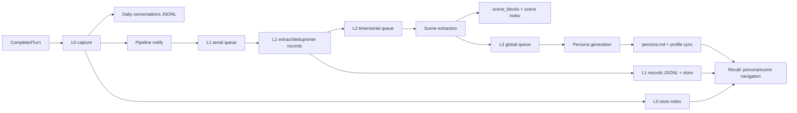

# `@bear-harness/tdai-core`

## Scope and provenance

`@bear-harness/tdai-core` is the host-neutral memory package used by the Bear integrations. Its manifest identifies the vendored upstream package as `@tencentdb-agent-memory/memory-tencentdb@0.3.6`, sourced from [TencentDB-Agent-Memory](https://github.com/TencentCloud/TencentDB-Agent-Memory), under MIT. The package carries the upstream license in [`LICENSE`](../../packages/tdai-core/LICENSE) and records the provenance and source-handling rule in [`package.json`](../../packages/tdai-core/package.json).

The manifest's `sourcePolicy` is operational policy, not a guarantee that every local file is byte-for-byte upstream: source under `src/` is treated as vendored and excluded from the root Biome pass, and package-local TypeScript validation plus the upstream synchronization process are the required maintenance path. Do not make opportunistic style or behavior edits in vendored algorithms. For an upstream update, record the upstream version/source, review the complete diff (including Bear adapters), preserve the MIT notices, then run the package checks described below.

Two layers should be kept distinct when changing this package:

- **Memory core / upstream-shaped code:** L0 recording, L1 records and extraction, scene/profile persistence, stores, embedding, recall, and the L0→L1→L2→L3 scheduler under [`src/core`](../../packages/tdai-core/src/core) and [`src/utils`](../../packages/tdai-core/src/utils).
- **Bear integration boundary:** the host-neutral `TdaiCore` facade and interfaces in [`src/core/tdai-core.ts`](../../packages/tdai-core/src/core/tdai-core.ts) and [`src/core/types.ts`](../../packages/tdai-core/src/core/types.ts), plus the standalone AI-SDK runner in [`src/adapters/standalone/llm-runner.ts`](../../packages/tdai-core/src/adapters/standalone/llm-runner.ts). These translate host events into the core contracts; they are not a reason to make host assumptions inside memory algorithms.

There is no `src/pipeline/index.ts` or `src/recall/index.ts` in this checkout. The nearest implementation entrypoints are [`src/utils/pipeline-factory.ts`](../../packages/tdai-core/src/utils/pipeline-factory.ts), [`src/utils/pipeline-manager.ts`](../../packages/tdai-core/src/utils/pipeline-manager.ts), and [`src/core/hooks/auto-recall.ts`](../../packages/tdai-core/src/core/hooks/auto-recall.ts). This document uses those files for the requested pipeline and recall behavior.

## Package surface

The package is ESM (`type: module`), private, and exports only the root entrypoint. The build emits declarations and JavaScript under `dist`; the package export maps `.` to `dist/index.js` and `dist/index.d.ts`. The TypeScript build is strict, NodeNext, and targets ES2023/ES2024 libraries; see [`tsconfig.json`](../../packages/tdai-core/tsconfig.json).

[`src/index.ts`](../../packages/tdai-core/src/index.ts) exposes:

- `TdaiCore` and `TdaiCoreOptions`.
- `buildFtsQuery` for SQLite FTS5 query construction.
- Host/configuration result types (`Logger`, `RuntimeContext`, `HostAdapter`, `LLMRunner*`, `CompletedTurn`, `RecallResult`, `CaptureResult`, and search parameter types).
- Store contracts (`IMemoryStore`, `EmbeddingProviderInfo`, L0/L1 rows and search results, profile-sync types, capabilities).
- Embedding contracts and configuration types (`EmbeddingService`, OpenAI/local config, call options, and the dynamic-import type).

`parseConfig` is implemented in [`src/config.ts`](../../packages/tdai-core/src/config.ts) but is not re-exported by the package root. A consumer using only the declared package export must supply an already-resolved `MemoryTdaiConfig`; importing internal files is outside the package's declared export surface.

## Host-neutral integration contract

A host supplies one [`HostAdapter`](../../packages/tdai-core/src/core/types.ts) with:

- `hostType`: `openclaw`, `hermes`, or `standalone`.
- `getRuntimeContext()`: user/session identity, platform, workspace, and the memory `dataDir`.
- `getLogger()`: `info`, `warn`, `error`, and optional `debug`.
- `getLLMRunnerFactory()`: creates text-only or tool-enabled [`LLMRunner`](../../packages/tdai-core/src/core/types.ts) instances.

`RuntimeContext` is the source of truth for `userId`, `sessionId`, `sessionKey`, `platform`, and `dataDir`. `CompletedTurn` supplies the original user text, assistant text, raw turn messages, session key/ID, start time, and optionally the message count captured before prompt injection. Keep the session key stable across reconnects: it is used for L0/L1 grouping, cursors, pipeline state, and filtering.

The facade is constructed and initialized as follows:

```ts
const core = new TdaiCore({ hostAdapter, config: resolvedConfig });
await core.initialize();
const recall = await core.handleBeforeRecall(userText, sessionKey);
const capture = await core.handleTurnCommitted(completedTurn);
await core.handleSessionEnd(sessionKey); // one session only
await core.destroy();                    // process shutdown
```

The public methods are:

- `handleBeforeRecall(userText, sessionKey)`: performs bounded recall and returns dynamic `prependContext` plus stable `appendSystemContext` where available.
- `handleTurnCommitted(turn)`: records L0, indexes it when possible, notifies the pipeline, and returns capture counts.
- `searchMemories({ query, limit?, type?, scene? })`: searches L1 and returns formatted text, count, and effective strategy.
- `searchConversations({ query, limit?, sessionKey? })`: searches L0 and returns formatted text and count.
- `handleSessionEnd(sessionKey)`: flushes only that session's pending L1 work; it does not destroy the shared scheduler.
- `getLLMRunnerFactory`, `getVectorStore`, `getEmbeddingService`, `getScheduler`, `isSchedulerStarted`, and `setInstanceId`: migration/status hooks.

`initialize()` creates directories and starts asynchronous store initialization. If extraction is enabled it creates the scheduler and wires L1/L2/L3 runners after store initialization, including degraded-mode wiring when store initialization fails. Callers should await `initialize()` before serving requests. `destroy()` waits for store initialization, destroys a started scheduler, drains tracked background L0 embedding tasks (up to five seconds), closes the store and embedding service, and clears the per-data-directory store cache. The facade intentionally distinguishes process shutdown (`destroy`) from per-session completion (`handleSessionEnd`).

## L0/L1/L2/L3 pipeline



### L0 capture

[`performAutoCapture`](../../packages/tdai-core/src/core/hooks/auto-capture.ts) calls [`recordConversation`](../../packages/tdai-core/src/core/conversation/l0-recorder.ts) under an atomic checkpoint cursor. The recorder takes the incremental position slice when the host supplies `originalUserMessageCount`, otherwise uses a per-session timestamp cursor; it sanitizes injected metadata, strips assistant code blocks, filters low-value messages, and appends one JSON object per line to `conversations/YYYY-MM-DD.jsonl`. `sessionKey` and `sessionId` are fields, not filename components.

The same filtered messages are written to the store's L0 index when a store exists. SQLite-style stores advertise `supportsDeferredEmbedding`: metadata/FTS is written synchronously and embeddings are computed in a tracked background task; remote stores embed inline or use server-side embedding. L0 indexing is deliberately non-blocking on failures: JSONL capture and scheduler notification can still succeed when a vector write or embedding call fails.

### L1 extraction and persistence

The pipeline manager buffers per-session rounds. A threshold trigger (`everyNConversations`) or idle timer enqueues one L1 task; warm-up can use `1 → 2 → 4 → ... → everyN`. The L1 serial queue reads new L0 rows from the store, or JSONL fallback, groups by `sessionId`, invokes the L1 extractor, applies optional conflict deduplication, writes records, and advances the runner checkpoint cursor. Failed L1 work is restored to the buffer and retried after 30 seconds up to five consecutive attempts; the state is not advanced on failure.

L1 record writes are dual persistence: local `records/YYYY-MM-DD.jsonl` is the durable fallback, and `IMemoryStore.upsertL1` is attempted for indexed search. Dedup uses vector candidates when available, FTS when not, and otherwise stores all memories rather than doing an O(N) JSONL scan; see [`l1-dedup.ts`](../../packages/tdai-core/src/core/record/l1-dedup.ts) and [`l1-writer.ts`](../../packages/tdai-core/src/core/record/l1-writer.ts).

### L2 scene extraction

After a successful L1, the scheduler advances a downward-only per-session L2 timer, honoring `l2DelayAfterL1` and the minimum interval. A max-interval timer provides eventual polling for active sessions; cold sessions stop periodic polling until a new L1 run. L2 reads incremental L1 records by `updatedAfter` cursor from the store or JSONL, runs [`SceneExtractor`](../../packages/tdai-core/src/core/scene/scene-extractor.ts), updates scene blocks/index/navigation, and optionally synchronizes profiles to a remote store. It returns the latest record timestamp cursor.

### L3 persona generation

L2 completion triggers one global, deduplicated L3 queue. [`createL3Runner`](../../packages/tdai-core/src/utils/pipeline-factory.ts) checks [`PersonaTrigger`](../../packages/tdai-core/src/core/persona/persona-trigger.ts), pulls a remote profile baseline when supported, runs [`PersonaGenerator`](../../packages/tdai-core/src/core/persona/persona-generator.ts), syncs profile changes, and marks persona generation in the checkpoint. If another L2 completes while L3 is running, one pending rerun is retained.

### Scheduling and checkpoint lifecycle

[`MemoryPipelineManager`](../../packages/tdai-core/src/utils/pipeline-manager.ts) owns per-session buffers, timers, serial L1/L2/L3 queues, retries, stale-session GC, and state persistence. [`CheckpointManager`](../../packages/tdai-core/src/utils/checkpoint.ts) stores runner state (capture/L1 cursors) separately from pipeline state (conversation counts/L2 timing), serializes read-modify-write operations per checkpoint path, and writes through a temporary file plus rename. On startup, `TdaiCore` restores checkpoint pipeline states before starting queues; pending states are re-armed. On scheduler destruction, pending work is flushed within two seconds when possible and state is persisted even after timeout for next-start recovery.

## Stores, encoders, embedding, and recall

### `IMemoryStore` contract

[`IMemoryStore`](../../packages/tdai-core/src/core/store/types.ts) is the backend extension point. It covers synchronous-or-async lifecycle (`init`, `isDegraded`, capabilities, `close`), L1/L0 upsert/delete/query/search, optional deferred L0 embedding, optional native hybrid search, optional profile pull/sync/delete, full reindex, and FTS availability. Implementations must return empty/false on ordinary backend failures unless a method explicitly documents otherwise; callers use capability flags to degrade.

### SQLite backend

[`VectorStore`](../../packages/tdai-core/src/core/store/sqlite.ts) uses Node's `node:sqlite` `DatabaseSync`, `sqlite-vec`, WAL mode, manual transactions, and FTS5. L1 metadata and vectors live in `l1_records`/`l1_vec`; L0 metadata and vectors live in `l0_conversations`/`l0_vec`. The database is `<dataDir>/vectors.db`. Vector upsert is delete-plus-insert because `vec0` does not support `ON CONFLICT`. `buildFtsQuery` uses `@node-rs/jieba` search segmentation when available and a Unicode-token fallback otherwise.

SQLite records embedding provider/model/dimensions metadata. A provider/model/dimension change sets `needsReindex`; integration code should call `IMemoryStore.reindexAll(embedFn, onProgress)` after the new embedding service is ready. With dimensions `0` (the resolved `provider="none"` default), vector-table creation is deferred and recall should use FTS.

### Tencent Cloud VectorDB backend

[`TcvdbMemoryStore`](../../packages/tdai-core/src/core/store/tcvdb.ts) uses `TcvdbClient`, server-side dense embeddings, optional local BM25 sparse vectors, native hybrid search, scalar filters, and profile collections. It prefixes collections with the configured database and creates L1, L0, and profile collections. It initializes asynchronously and marks itself degraded after initialization failure. `factory.ts` requires `tcvdb.url`, `tcvdb.apiKey`, and a non-empty database; the store factory supplies a no-op embedding service because VectorDB owns dense embedding.

### BM25 sparse encoding

[`BM25LocalEncoder`](../../packages/tdai-core/src/core/store/bm25-local.ts) wraps `@tencentdb-agent-memory/tcvdb-text`. `encodeTexts` is for document upserts and `encodeQueries` is for searches; both return an empty list and warn on encoder failure. It is enabled by default and defaults to Chinese parameters; set `bm25.enabled=false` or `language="en"` deliberately when integrating another corpus.

### Embedding providers

[`EmbeddingService`](../../packages/tdai-core/src/core/store/embedding.ts) provides `embed`, `embedBatch`, dimensions/provider identity, readiness, warmup, and optional close.

- Remote providers use an OpenAI-compatible `/embeddings` POST. Required fields are API key, base URL, model, and positive dimensions. Inputs are truncated to `maxInputChars`, batches are split at 256, vectors are sanitized and L2-normalized, and the default per-call timeout is 10 seconds. The implementation has no effective retries (`MAX_RETRIES = 0`); 4xx errors other than 429 are non-retryable and all errors are surfaced to the caller.
- Local providers use `node-llama-cpp`, dynamically imported only when a local service is explicitly constructed. The default `embeddinggemma-300m` GGUF emits 768 dimensions; warmup downloads/loads in the background, and calls before readiness throw `EmbeddingNotReadyError`. The local implementation truncates to 512 characters and normalizes vectors.
- `NoopEmbeddingService` returns zero-dimensional vectors for server-side embedding backends.

The config parser currently resolves `provider="none"` to disabled embedding, and treats `provider="local"` as disabled at the user-config entrypoint. The internal factory still contains the local implementation and honors a direct local config; do not assume local models are available through ordinary parsed plugin configuration without checking the current parser and adapter path.

### Recall and active search

[`performAutoRecall`](../../packages/tdai-core/src/core/hooks/auto-recall.ts) races the inner recall against `recall.timeoutMs` (default five seconds); timeout resolves `undefined` and logs a warning so the user turn is not blocked. It sanitizes gateway-injected metadata and skips L1 search for cleaned queries shorter than two characters. Recall reads `persona.md` (L3, with scene navigation removed) and the scene index (L2 navigation) independently; missing files are normal for a new data directory.

L1 search strategy is `keyword`, `embedding`, or `hybrid`:

- Keyword uses store FTS/BM25 and returns no O(N) JSONL fallback.
- Embedding generates a query vector and performs vector search; unavailable resources downgrade to keyword.
- Hybrid uses native store hybrid search when advertised, otherwise runs FTS and vector search in parallel and merges ranks with RRF (`k=60`).

Recall puts changing L1 snippets in `prependContext` and stable persona/scene navigation plus the tools guide in `appendSystemContext`. Per-memory and total-character budgets are applied after formatting; truncation adds a search-tool hint when enough room remains. `searchMemories` and `searchConversations` expose similar behavior for agent-callable search paths, with FTS/vector ranking and formatted responses.

## Configuration and operational choices

Always pass the result of `parseConfig(raw)` when constructing the facade; it supplies defaults and validates embedding strategy fields. The most operationally important resolved defaults in [`config.ts`](../../packages/tdai-core/src/config.ts) are:

| Group | Defaults and integration meaning |
| --- | --- |
| `capture` | enabled; `excludeAgents=[]`; retention disabled (`0`); retention values 1–2 days are rejected unless `allowAggressiveCleanup=true`. |
| `extraction` | enabled; dedup enabled; max 20 memories/session; optional model override. |
| `persona` | trigger every 50 new memories; max 15 scenes; 3 persona backups; 10 scene backups; optional model. |
| `pipeline` | L1 every 5 conversations; warm-up enabled; L1 idle 600s; L2 delay 10s; L2 minimum 900s; max 3600s; inactive window 24h. |
| `recall` | enabled; max 5 results; threshold 0.3; `hybrid`; timeout 5000ms; character budgets disabled (`0`). |
| `embedding` | provider `none`, disabled effectively, dimensions `0`; remote providers require endpoint/key/model/dimensions and invalid configs disable embeddings without throwing. |
| `storeBackend` | `sqlite`; `tcvdb` additionally requires URL, API key, database, and matching remote setup. |
| `bm25` | enabled, Chinese (`zh`). |
| `llm` | standalone override disabled; OpenAI-compatible defaults are OpenAI base URL, `gpt-4o`, 4096 output tokens, 120s timeout. |
| `offload` | disabled, local mode, 0 retention, 50 MB log cap; it is an additional context-compression configuration, not a replacement for L0–L3 memory. |

For a remote embedding provider, set `embedding.provider`, `baseUrl`, `apiKey`, `model`, and `dimensions`; set `sendDimensions=false` for servers that reject the OpenAI Matryoshka field. For VectorDB, configure `storeBackend="tcvdb"` and `tcvdb` credentials/database; its collection embedding model is `tcvdb.embeddingModel`. Treat API keys and backend tokens as secrets and do not place them in logs or committed config.

## Standalone/local-model operation

When `llm.enabled=true` for an OpenClaw host, `TdaiCore` creates a dedicated [`StandaloneLLMRunnerFactory`](../../packages/tdai-core/src/adapters/standalone/llm-runner.ts) from `llm.baseUrl`, `apiKey`, `model`, `maxTokens`, and `timeoutMs`. For non-OpenClaw hosts, the facade uses the supplied runner factory; host adapters decide how credentials and model defaults are provided. L1 receives a text-only runner (`enableTools=false`); L2/L3 receive a tool-enabled runner (`enableTools=true`).

The standalone runner uses the AI SDK and OpenAI-compatible chat completions. Tool-enabled runs expose `read_file`, `write_to_file`, and `replace_in_file` and cap tool-loop steps at 20. Paths are intended to be relative to `workspaceDir`, which must be the memory data directory for L2/L3 file mutations. A host implementing `LLMRunner` must preserve the timeout/error contract and must not expose tools for text-only extraction/dedup.

Local embeddings are a separate optional concern from standalone LLM calls. `node-llama-cpp` is an optional peer dependency, dynamically imported, and should be installed/configured only for a deliberate offline embedding deployment. Start warmup at an application lifetime where a model download is acceptable; `createEmbeddingService` intentionally does not warm up automatically. On shutdown, await `EmbeddingService.close()` through `TdaiCore.destroy()`.

## Persistence and integration expectations

The memory data directory must be stable for the life of a user/profile and unique for separate stores. Initialization creates `conversations/`, `records/`, `scene_blocks/`, `.metadata/`, and `.backup/` under it. Normal artifacts include:

- `conversations/YYYY-MM-DD.jsonl`: sanitized L0 messages.
- `records/YYYY-MM-DD.jsonl`: L1 memory records and the JSONL fallback source.
- `scene_blocks/`, scene index/navigation, and `persona.md`: L2/L3 profile material.
- `.metadata/recall_checkpoint.json`: split runner/pipeline cursors and counters.
- `vectors.db`: SQLite L0/L1 indexes when SQLite is selected.
- Store manifest metadata under `.metadata` for the initial store binding and config drift diagnostics.

The host must provide session identity consistently, invoke `handleBeforeRecall` before prompt construction, provide the completed turn after the turn ends, call `handleSessionEnd` only for the session ending, and call `destroy` once at process shutdown. Do not share one facade across unrelated `dataDir` values. `initStores` caches one async store initialization promise per exact data-directory string; call `resetStores(dataDir)` only after resources are closed when implementing hot restart.

## Error and security boundaries

- Store initialization failures are converted to degraded operation: vector/FTS recall and conflict detection may disappear, while JSONL capture/extraction fallback remains available. Backend methods should preserve the empty/false fault-tolerance contract.
- Recall has a hard timeout and returns no injected context on timeout. Embedding failures are logged and can downgrade a search path; L0/L1 durable writes are not supposed to depend on vector success.
- L1/L2/L3 runner errors are isolated by their queues. L1 retries with a cap; L2 re-arms a max interval on failure; L3 logs failure and can rerun after a concurrent L2 completion. Checkpoint persistence is the recovery boundary.
- Standalone file tools reject paths that lexically escape `workspaceDir`, reject empty replacement needles, and return structured errors for file failures. `workspaceDir` is nevertheless a trust boundary: the current `resolveSandboxedPath` check is lexical and does not resolve symlinks.
- Remote embedding and LLM calls send bearer credentials over configured endpoints. qclaw proxy mode sends a `Remote-URL` header; TCVDB supports an optional CA PEM path. Validate endpoint, proxy, certificate, and secret handling in the host deployment.

## Extension points and safe updates

1. **Host integration:** implement `HostAdapter`, `RuntimeContext`, `LLMRunnerFactory`, and `Logger`; keep host-specific imports out of core algorithms.
2. **Storage:** implement `IMemoryStore`, accurately report `StoreCapabilities`, support `MaybePromise` methods, and define `supportsDeferredEmbedding` only when `updateL0Embedding` is safe after metadata upsert.
3. **Embedding:** implement `EmbeddingService`, return stable provider/model identity, normalize or otherwise document vector shape, and make readiness/warmup/close behavior explicit.
4. **Pipeline:** use the factory's runner signatures (`L1Runner`, `L2Runner`, `L3Runner`) and persist only the state namespace owned by the scheduler.
5. **Recall:** preserve stable-vs-dynamic context separation and the configured timeout/budget behavior when adding retrieval sources.

For an upstream sync, first compare the upstream `0.3.6` source against this vendored tree, then re-apply or re-review Bear-specific facade/adapter changes. Re-check store schema and embedding dimensions before deployment. If provider/model/dimensions changed, use the store's `needsReindex` result and run a deliberate reindex; never silently query vectors generated by an incompatible model.

## Verification commands

These are the package's declared validation commands; this documentation task does not run them:

```sh
npm run typecheck --workspace @bear-harness/tdai-core
npm run build --workspace @bear-harness/tdai-core
```

For an integration smoke test, construct a fake `HostAdapter` and `LLMRunnerFactory` with a temporary `dataDir`, call `initialize()`, exercise one recall and one completed-turn capture, inspect the returned counts and created files, call `handleSessionEnd`, and finally call `destroy()`. A backend-specific smoke test should also verify SQLite FTS-only mode, remote embedding dimension compatibility, or TCVDB collection initialization before enabling that backend in production.

## Known issues / findings

- **Config flags are not enforced by the facade.** `TdaiCore.handleBeforeRecall()` calls `performAutoRecall()` without checking `cfg.recall.enabled`, and `handleTurnCommitted()` calls `performAutoCapture()` without checking `cfg.capture.enabled` ([`tdai-core.ts`](../../packages/tdai-core/src/core/tdai-core.ts), [`auto-recall.ts`](../../packages/tdai-core/src/core/hooks/auto-recall.ts), [`auto-capture.ts`](../../packages/tdai-core/src/core/hooks/auto-capture.ts)). Hosts that invoke these methods unconditionally must gate disabled features themselves; changing config alone does not stop those paths.
- **Configuration comments and resolved defaults disagree.** `PipelineConfig` comments in [`pipeline-manager.ts`](../../packages/tdai-core/src/utils/pipeline-manager.ts) describe a 60-second L1 idle timeout and 90-second L2 delay, while [`parseConfig`](../../packages/tdai-core/src/config.ts) resolves 600 seconds and 10 seconds. Treat parser output as the current behavior and update comments/upstream sync deliberately before changing timing.
- **Report default is inconsistent.** `ReportConfig` documents reporting as enabled by default, but `parseConfig` resolves `report.enabled` to `false` when omitted ([`config.ts`](../../packages/tdai-core/src/config.ts)). Integrators should not infer reporting behavior from the interface comment.
- **Local embedding is internally present but externally disabled by the parser.** `EmbeddingConfig` and `createEmbeddingService` support `provider="local"`, while `parseConfig` deliberately rewrites a user `provider="local"` to disabled `provider="none"` and records `configError` ([`config.ts`](../../packages/tdai-core/src/config.ts), [`embedding.ts`](../../packages/tdai-core/src/core/store/embedding.ts)). This is an integration-policy inconsistency; changing it affects optional peer installation, model downloads, and vector dimensions.
- **Standalone path containment is not complete.** `resolveSandboxedPath` checks `resolved.startsWith(path.resolve(workspaceDir))` but does not add a path separator and does not resolve symlinks ([`llm-runner.ts`](../../packages/tdai-core/src/adapters/standalone/llm-runner.ts)). A sibling path with the workspace as a string prefix, or a symlink inside the workspace pointing out, can bypass the intended boundary. Treat tool-enabled standalone runs as trusted until this guard is hardened.
- **Store initialization cache keys are raw directory strings.** `initStores` caches by the exact `pluginDataDir` string ([`pipeline-factory.ts`](../../packages/tdai-core/src/utils/pipeline-factory.ts)). Equivalent relative/absolute or symlinked paths can create multiple stores over the same physical data, while two facades using the same string share one store. Normalize data directories at the host boundary and close/reset deliberately.
- **The package root omits the config parser and concrete store/embedding classes.** `src/index.ts` exports types and `TdaiCore`, but not `parseConfig`, `VectorStore`, `TcvdbMemoryStore`, or concrete embedding services. Consumers must use the resolved-config contract or internal imports, both of which increase coupling during an upstream sync.
- **TCVDB vector index dimensions are implementation constants.** [`tcvdb.ts`](../../packages/tdai-core/src/core/store/tcvdb.ts) defines dense indexes at 1024 dimensions while `tcvdb.embeddingModel` is configurable. Verify the selected server model's output dimension before deployment; the config does not validate this relationship.
- **Background L0 indexing is intentionally best effort.** SQLite deferred embedding can still be running when a caller observes a successful capture; `TdaiCore.destroy()` drains registered tasks but uses a five-second hard timeout ([`auto-capture.ts`](../../packages/tdai-core/src/core/hooks/auto-capture.ts), [`tdai-core.ts`](../../packages/tdai-core/src/core/tdai-core.ts)). A timeout can leave metadata-only rows and missing vectors; plan reindex/retry operations rather than treating `l0VectorsWritten` as final vector completeness.
