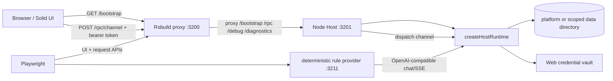

# WebDev module reference

`apps/web-dev` is the browser-based development application. It runs the same host-runtime-facing application contracts as the desktop client, but puts the Host in a Node process and serves the Solid renderer through an Rsbuild development server. It is a local development and E2E harness, not a production web deployment.

## Responsibility and boundaries

The module has two cooperating processes:

- **Loopback Host** — [`server/index.ts`](../../apps/web-dev/server/index.ts) creates the host runtime, owns the data directory and credential vault, and exposes the bootstrap, RPC, debug, and renderer-diagnostics HTTP routes.
- **Browser UI/proxy** — [`src/index.tsx`](../../apps/web-dev/src/index.tsx) bootstraps the renderer and creates the HTTP `HostTransport`. Rsbuild serves the compiled/dev assets and proxies Host paths to the loopback Host; the proxy is configured in [`rsbuild.config.ts`](../../apps/web-dev/rsbuild.config.ts).

The package is private and ESM (`type: module`). Its runtime dependencies include the companion client/UI, Host runtime, product configuration, i18n, and protocol packages. The development toolchain is Rsbuild/Solid plus Playwright ([`package.json`](../../apps/web-dev/package.json)).

This arrangement differs from Electron in process shape and delivery, not in the core Host contract: WebDev has a browser origin and a separately started Node Host, while the desktop variant supplies its own packaged application shell. WebDev's data-directory tests explicitly preserve the platform directory convention used by Electron's `userData`; an explicit E2E directory is the isolation escape hatch ([`server/data-directory.spec.ts`](../../apps/web-dev/server/data-directory.spec.ts)). Do not interpret the browser server as a deployable internet-facing service.

## Public entrypoints and API

### Package commands

From the repository root:

```sh
npm run dev --workspace @bear-harness/web-dev
npm run build --workspace @bear-harness/web-dev
npm run typecheck --workspace @bear-harness/web-dev
npm run test:unit --workspace @bear-harness/web-dev
npm run test:e2e:web
```

The package scripts are the source of truth for the supported entrypoints: `dev` runs `scripts/dev.mjs`, `build` runs `scripts/build.mjs`, `typecheck` checks separate server and renderer projects, `test:unit` runs the data-directory unit file, and `test:e2e` runs Playwright ([`package.json`](../../apps/web-dev/package.json)).

### HTTP routes

The Host binds only to `127.0.0.1` on `BEAR_WEB_DEV_HOST_PORT` (default `3201`). The browser normally talks to the UI origin on `BEAR_WEB_DEV_PORT` (default `3200`); Rsbuild proxies the paths below to the Host.

| Route | Auth | Behavior |
| --- | --- | --- |
| `GET /bootstrap` | None | Returns `{ product, token, debugEnabled }`. The token is generated once per Host process. |
| `POST /rpc/<channel>` | `x-bear-web-dev-token` required | JSON-decodes the body and dispatches the decoded channel to `runtime.dispatch`. `character.import:v1` receives a 36 MiB body allowance; other routes use the 64 KiB default. |
| `GET /debug/channels` | Token required; debug mode required | Returns the sorted keys of `REQUEST_SCHEMAS`. |
| `POST /diagnostics/renderer-fault` | Token required | Reads a fault payload and writes it to stderr with a WebDev prefix; responds `204`. |
| Any other route | Valid token | Returns JSON `404`; requests with a missing or invalid token are rejected with JSON `401` before route matching. |

The route implementation is in [`server/index.ts`](../../apps/web-dev/server/index.ts). The RPC channel is URI-decoded from the path. The renderer transport in [`src/http-client.ts`](../../apps/web-dev/src/http-client.ts) URI-encodes the channel, sends JSON, attaches the token, and returns the JSON response. Relative URLs are intentional: browser requests reach the UI origin first and are then proxied to the loopback Host.

## Architecture and data/control flow



Host startup performs these steps before listening: resolve repository root, choose the data directory, create it with mode `0700`, generate a 32-byte random hexadecimal token, construct `createHostRuntime` with the character root and product config, and call `runtime.start()` ([`server/index.ts`](../../apps/web-dev/server/index.ts)). Provider environment overrides/custom setup are then dispatched through the same RPC contracts before `server.listen` binds the loopback port.

Renderer startup uses top-level `await`: it requires `#root`, loads bootstrap, builds the authenticated HTTP transport and companion client, installs renderer-fault reporting, and renders `CompanionApp`. The debug panel is rendered only when `debugEnabled` is true ([`src/index.tsx`](../../apps/web-dev/src/index.tsx)).

## Bootstrap and security model

The token is an in-memory per-Host-process bearer credential generated with `randomBytes(32)` and returned by the unauthenticated bootstrap route. Bootstrap is intentionally unauthenticated so a fresh browser can learn the token; all Host operations after that check the exact `x-bear-web-dev-token` value before route dispatch. Responses set `cache-control: no-store` and JSON content type.

The security boundary is therefore **loopback binding plus possession of the bootstrap token**, not user authentication. Any local process able to reach the loopback port can request `/bootstrap` and then invoke the available RPC surface. The Host does not add CORS, account authentication, TLS, rate limiting, or CSRF protection. This is acceptable for a local development harness only; exposing either port beyond loopback or forwarding it through a shared proxy would invalidate the intended trust model.

The Host constructs [`createWebCredentialVault`](../../apps/web-dev/server/credential-vault.ts) over the selected data directory. The vault uses an AES-256-GCM key, stores its generated key as `security/web-vault.key` with restrictive file mode, or derives a key from `BEAR_WEB_DEV_MASTER_KEY`; it reports machine-level security. This protects persisted credential blobs at rest, but does not protect an RPC caller that has obtained the loopback token. The debug panel's API-key action passes `sessionOnly: true`, clears its input after success, and uses the same authenticated transport ([`src/DebugPanel.tsx`](../../apps/web-dev/src/DebugPanel.tsx)).

## HTTP RPC transport and error behavior

`createHttpTransport` maps a `HostTransport.invoke` call to `POST /rpc/<encoded channel>`. It sends `content-type: application/json`, the bearer token header, and `JSON.stringify(params)`. Any non-2xx response becomes a generic `web-dev transport failed: <status>` error; successful responses are returned as unvalidated JSON ([`src/http-client.ts`](../../apps/web-dev/src/http-client.ts)). Contract validation is consequently performed by the companion client/runtime path rather than by this thin transport.

The server limits request-body accumulation before JSON parsing. The route catches body, JSON, and dispatch exceptions together and returns status `400` with `{ ok: false, error: { kind: "invalid_request", reason: "invalid json" } }`. This keeps malformed requests from escaping as process errors, but the message is imprecise for an oversized body or a runtime/dispatch exception. A maintainer debugging a failure should inspect Host stderr and the RPC result rather than rely on that reason string alone.

Renderer faults are deliberately best-effort: `installRendererFaultReporting` posts the serialized fault with the token, while the client does not await or surface that fetch's result. The server attempts to parse/log it and always returns `204`, including when the body cannot be parsed.

## Debug surface

The dev launcher defaults `BEAR_WEB_DEV_DEBUG` to `1` unless the caller supplied a value; the Host enables debug routes only when the value is exactly `"1"`. In debug mode, `WebDevDebugPanel` adds a `Web Dev` toggle. Opening it lazily loads the registered channel list. Raw invocation parses the editor JSON, finds the channel in `CHANNEL_CONTRACTS`, validates the request schema, invokes through the authenticated transport, and pretty-prints the result. The panel also lists providers through the companion client and can set a provider API key for the session ([`src/DebugPanel.tsx`](../../apps/web-dev/src/DebugPanel.tsx)).

The debug channel list exposes every key in `REQUEST_SCHEMAS`; it is not an allowlist of safe read-only operations. The panel's schema lookup prevents unknown channels from being invoked through its UI, but any caller with the token can still submit arbitrary `/rpc` paths and is subject to Host/runtime validation. Keep debug mode local and treat provider credentials and returned data as sensitive.

## Data-directory and process isolation

`server/index.ts` calls `webDevDataDirectory(productConfig.dataDirectoryName)` and creates the result recursively with `0700`. With no override, the helper uses the platform location (`~/Library/Application Support/<name>` on macOS, `%APPDATA%/<name>` on Windows, and `$XDG_CONFIG_HOME` or `~/.config` on Linux), matching the desktop convention. With `BEAR_WEB_DEV_DATA_DIR`, the base is the explicit resolved path.

`scripts/dev.mjs` adds a second isolation layer when that override is present: it passes `BEAR_WEB_DEV_DATA_SCOPE=<launcher pid>`, and `webDevDataDirectory` resolves the final path as `<override>/.process-<scope>`. Playwright sets `BEAR_WEB_DEV_DATA_DIR` to `test-results/web-dev-data-<runner pid>`, so each dev launcher gets a distinct child directory. This process-scoped behavior addresses the readiness/state-isolation failure mode where an E2E run could reuse state from another Host process. The direct unit tests cover both distinct scopes and platform-directory behavior.

Remaining concern: process-scoped directories are not removed by the launcher or Playwright config. Repeated E2E/dev runs can leave stale credentials and application state under `test-results`; cleanup is an operational responsibility. Also, normal manual development without an explicit override intentionally reuses the platform data directory, so a browser session can observe state created by Electron or a previous WebDev run.

## Dev and build lifecycle

### `npm run dev`

[`scripts/dev.mjs`](../../apps/web-dev/scripts/dev.mjs) first loads the repository `.env` when present, then synchronously builds `product-config`, `protocol`, `companion-client`, `host-runtime`, and `companion-ui`. A failed dependency build exits immediately.

It selects an available loopback Host port starting at `3201`, then a distinct UI port starting at `3200`, probing at most 20 consecutive ports and reserving the Host port while selecting the UI port. It starts `server/index.ts` with the selected ports (and optional data scope), waits up to 30 seconds for a valid JSON `/bootstrap`, then starts `npx --no-install rsbuild dev`. A second bootstrap wait verifies that the UI proxy is serving the Host response before printing `web-dev UI ready: http://127.0.0.1:<uiPort>`.

The launcher owns both children. An unexpected child exit causes both to receive `SIGTERM`; launcher `SIGINT`/`SIGTERM` follows the same shutdown path. The readiness check verifies status/content type and that the payload contains a string token and object product, rather than merely checking that a TCP port is open.

The port probe is a check-then-bind sequence, so another process can claim a probed port before the child binds. The Host does not use `strictPort`/retry handling in this file, while Rsbuild is configured with `strictPort: true`; a race or provider port conflict can therefore fail startup after the probe. Treat selected ports as ephemeral and use the readiness output/configured environment, not hard-coded defaults.

### `npm run build`

[`scripts/build.mjs`](../../apps/web-dev/scripts/build.mjs) rebuilds the same five workspace dependencies and then runs `rsbuild build`, writing the renderer output under `dist`. This builds browser assets; it does not package a server or create a production web service. `server/index.ts` remains a Node development Host entrypoint and must be run with the repository's expected Node/TypeScript setup.

## Deterministic provider and Playwright E2E

[`playwright.config.ts`](../../apps/web-dev/playwright.config.ts) loads the repository `.env` if present, derives WebDev, Host, and provider ports from `BEAR_E2E_WEB_PORT` (`3200`), `BEAR_E2E_HOST_PORT` (`3201`), and `BEAR_E2E_PROVIDER_PORT` (`3211`), and targets `http://127.0.0.1:<webPort>`. It runs one worker, uses a 30-second test timeout and web-server startup timeout, forbids focused tests, disables retries, and writes artifacts under `test-results/web-dev`.

Playwright starts two non-reused servers:

1. `npm run dev --workspace @bear-harness/web-dev`, with debug enabled, process-isolated data, and the `BEAR_CUSTOM_PROVIDER_ID`, `BEAR_CUSTOM_PROVIDER_NAME`, `BEAR_CUSTOM_BASE_URL`, `BEAR_CUSTOM_MODEL_ID`, and `BEAR_CUSTOM_API_KEY` variables cleared. Clearing those variables prevents a developer's `.env` custom provider from changing the deterministic test contract; other provider override/credential variables are not cleared by this configuration.
2. `node e2e/rule-provider-server.ts`, an OpenAI-compatible loopback server whose health endpoint gates readiness.

The rule provider returns stable marker text for the E2E prompts, recognizes image/tool/memory/context scenarios, records prompts and tool calls, and supports both regular JSON and streamed SSE chat completions. Its `/trace/tools` and `/trace/prompts` endpoints let tests inspect what the Host sent. E2E helpers configure the provider through authenticated RPC (`provider.customUpsert`, `provider.setApiKey`, `model.enable`, and reply defaults), complete onboarding, and then reload the UI ([`e2e/helpers.ts`](../../apps/web-dev/e2e/helpers.ts)). This makes browser journeys deterministic without requiring a live model or provider credential.

The provider server also binds loopback, but unlike WebDev's launcher it uses a fixed configured port and does not probe alternatives. A stale process or occupied port produces a readiness failure rather than an automatic relocation. Its trace endpoints have no application token because they are test-only loopback endpoints; do not run this harness on a reachable interface.

## Lifecycle and extension points

- Add a Host capability by registering its protocol request schema/runtime handler in the protocol/Host-runtime packages, after which it appears in `/debug/channels` and can be selected by the debug panel. The debug panel imports `CHANNEL_CONTRACTS` from the shared protocol registry, so adding the endpoint to that registry makes typed debug invocation available; there is no separate renderer channel map.
- Add renderer behavior in `src/index.tsx` or the companion UI; preserve bootstrap-before-render so the product config and token exist before constructing the client.
- Add a development-only diagnostic route in `server/index.ts` only behind the token check, and add its path to Rsbuild's proxy map if the browser must call it.
- Add deterministic E2E behavior to the rule provider and tests rather than depending on a live external model. Keep provider setup explicit and clear custom environment variables in Playwright.
- Keep all new local-only endpoints loopback-bound and document whether their payloads can contain credentials, prompts, or user data.

## Known issues / findings

1. **Local bearer-token model is intentional but broad.** `/bootstrap` gives the token to any loopback client, and possession authorizes all RPC/debug calls. There is no user identity or capability split. This is a development-only boundary, not production authentication.
2. **Request errors are collapsed.** The RPC catch block labels oversized bodies, malformed JSON, schema/dispatch exceptions, and other thrown failures as `invalid json`; this can obscure the root cause and is a debugging concern.
3. **Bootstrap/transport responses are only partly validated.** `loadBootstrap` casts JSON to `WebDevBootstrap` without runtime shape checks, and `createHttpTransport` returns successful JSON without validating the response contract. A proxy returning an unexpected 2xx payload can fail later in UI code.
4. **Port selection has a race.** `availablePort` probes before child startup. Another process can bind between those operations; Rsbuild's strict UI port then fails rather than retrying. The deterministic provider has the additional fixed-port collision risk noted above.
5. **E2E data isolation is addressed but not cleaned.** Supplying `BEAR_WEB_DEV_DATA_DIR` now scopes state by launcher process, preventing concurrent runs from sharing state. Neither launcher nor Playwright removes old `.process-*` directories, so stale data accumulates.
6. **Manual WebDev state is intentionally persistent.** Without `BEAR_WEB_DEV_DATA_DIR`, WebDev uses the platform data path. This matches the desktop convention but means manual runs are not isolated from prior WebDev/Electron state.
7. **Diagnostics are intentionally lossy.** Renderer-fault reporting is fire-and-forget from the browser, and the server discards the payload after writing one stderr line. It is useful for local diagnosis, not durable crash/telemetry collection.
8. **Production deployment is out of scope.** `build` produces Rsbuild assets after rebuilding workspace packages; it does not bundle, supervise, authenticate, or deploy `server/index.ts`. A maintainer must not expose the dev Host or its proxy as a public service.
